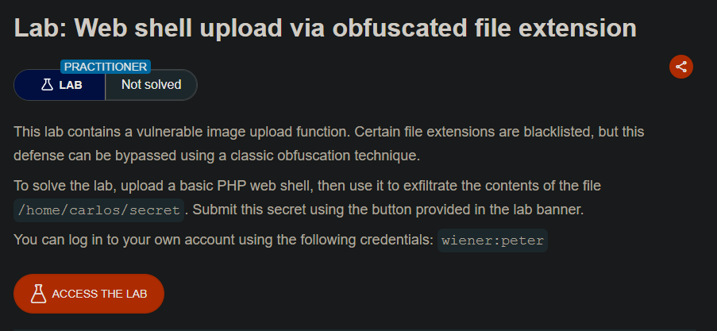
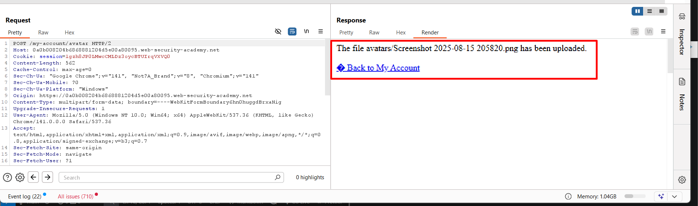

>>-Phòng thí nghiệm này chứa một chức năng tải lên hình ảnh dễ bị tấn công. Một số phần mở rộng tệp bị đưa vào danh sách đen, nhưng biện pháp phòng thủ này có thể bị bỏ qua do một lỗi cơ bản trong cấu hình danh sách đen này.

>>-Để giải bài lab, hãy tải lên một web shell PHP cơ bản, sau đó sử dụng nó để trích xuất nội dung của tệp `/home/carlos/secret`. Gửi bí mật này bằng nút được cung cấp trong banner bài lab.

>>-Bạn có thể đăng nhập vào tài khoản của mình bằng thông tin đăng nhập sau: `wiener:peter`

## LAB 7: Web shell upload via obfuscated file extension

