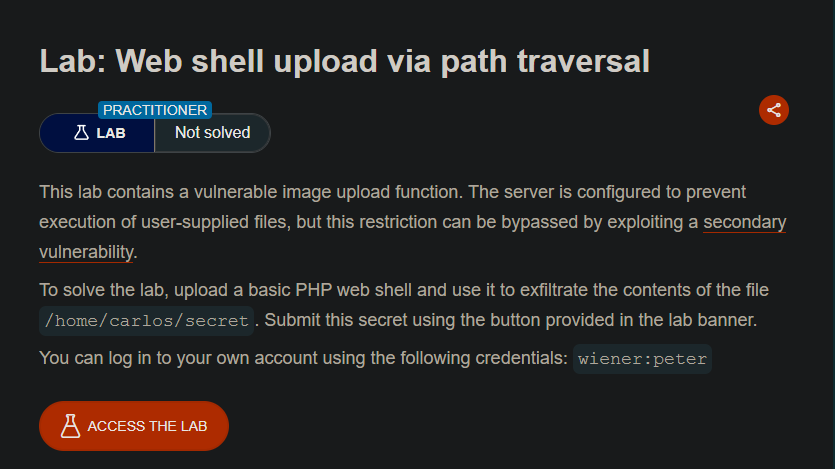
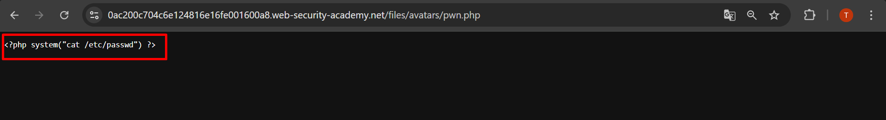
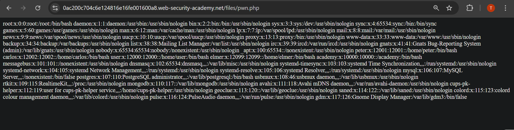
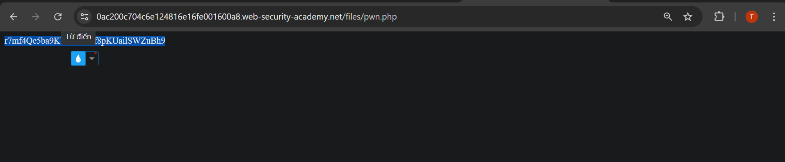
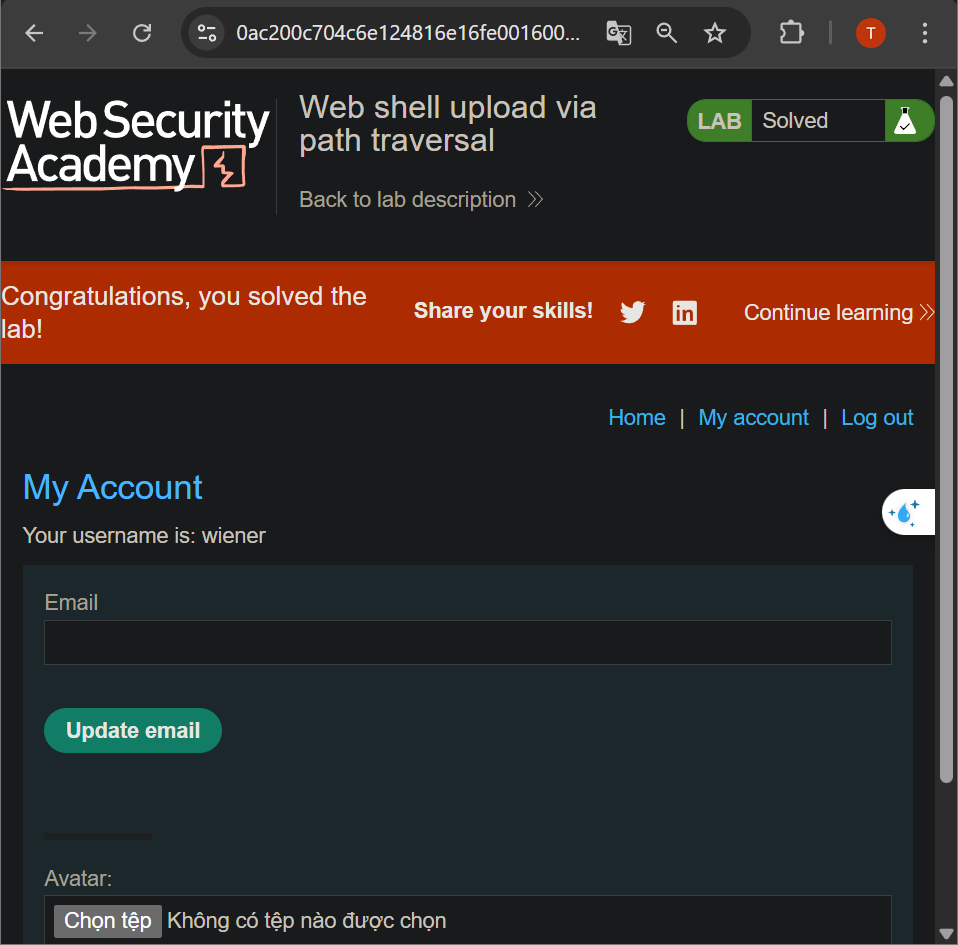
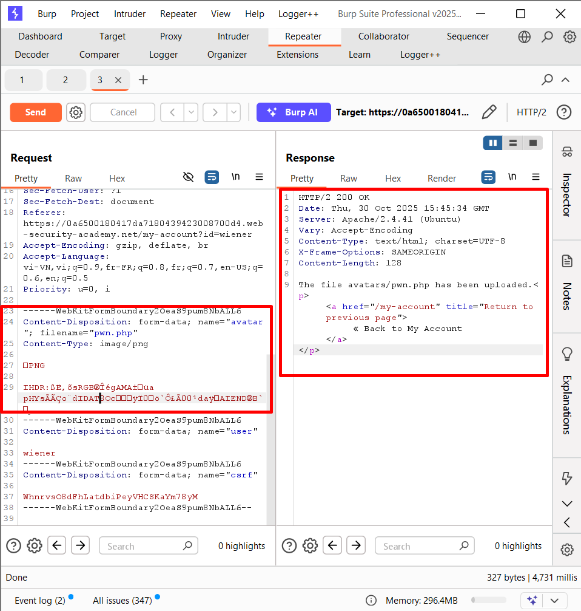
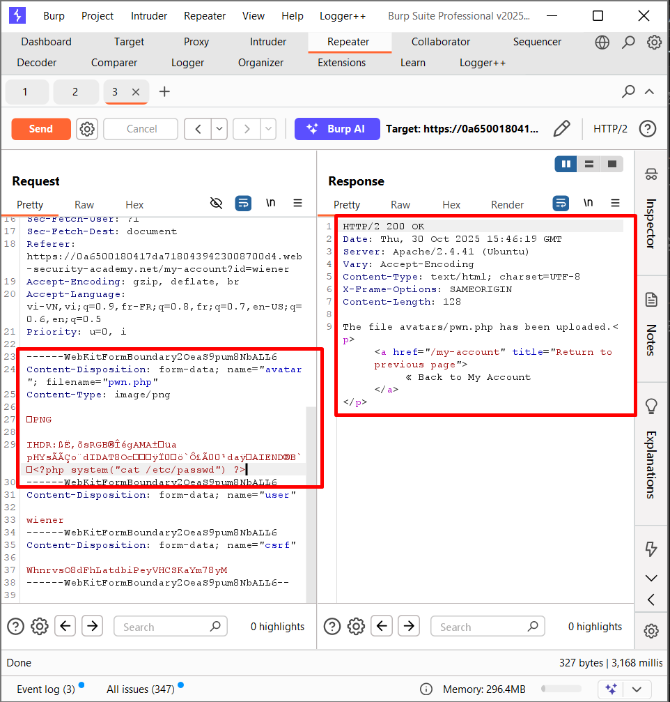
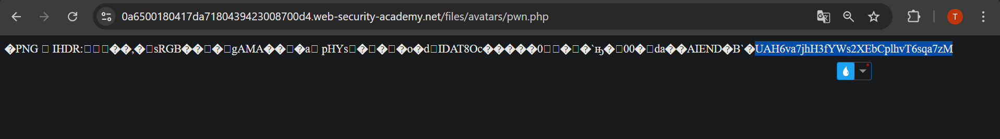
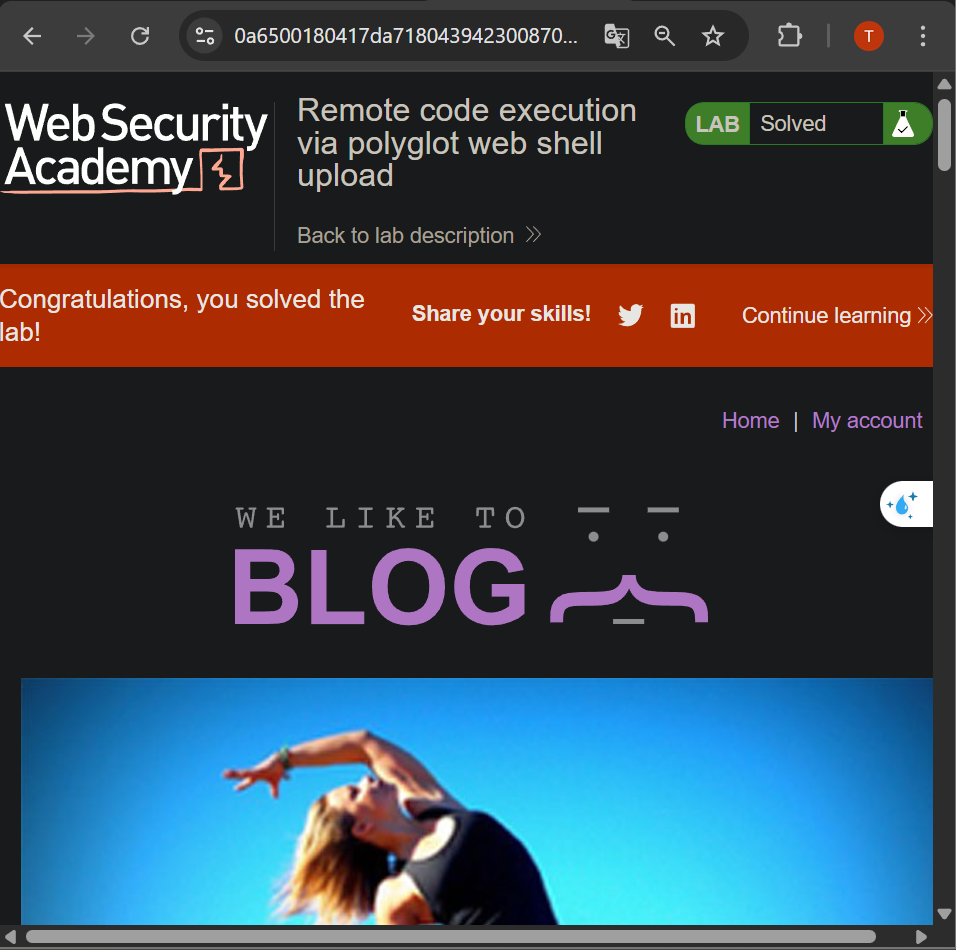

## LAB 7: Web shell upload via obfuscated file extension

>>-Phòng thí nghiệm này chứa một chức năng tải lên hình ảnh dễ bị tấn công. Một số phần mở rộng tệp bị đưa vào danh sách đen, nhưng biện pháp phòng thủ này có thể bị bỏ qua do một lỗi cơ bản trong cấu hình danh sách đen này.

>>-Để giải bài lab, hãy tải lên một web shell PHP cơ bản, sau đó sử dụng nó để trích xuất nội dung của tệp `/home/carlos/secret`. Gửi bí mật này bằng nút được cung cấp trong banner bài lab.

>>-Bạn có thể đăng nhập vào tài khoản của mình bằng thông tin đăng nhập sau: `wiener:peter`

---

Gửi một file ảnh hợp lệ

---

---

Khi gửi một file `webshell` với định dạng `php` thì  server từ chối

---

---
 
Gửi file `.htaccess` cũng bị từ chối
 
---

---
 
Sử dụng cả `.png` và `php` nếu server cho phép sử lí cả 2 định dạng

>>Upload thành công
 
---

---
 
Nhưng khi vào thì chỉ thấy server sử lí hình ảnh còn không sử lí `php`
 
---

---
 
`pwn.php.php` --> Xem server có kiểm tra kiểu `trim` đi `.php` không
 
---

---
 
`pwn.p.phphp` --> Xem có `trim` đệ quy không
 
---

---
 
Dùng `\0` nếu phần nhận thông tin thì vẫn coi `\0` là một kí tự còn phần sử lí đuôi file thì lại coi `\0` là kí tự kết thúc
>>200 OK
 
---

---
 
Khi vào file `pwn.php` thì thấy mất đoạn payload `php`
>>Server đã thực thi đoạn code `php`
 
---

---
 
Chỉnh sửa file `pwn.php` để đọc file `/etc/passwd`
 
---

---
 
>>Đọc thành công file `/etc/passwd`
 
---

---
 
Chỉnh để đọc file `/home/carlos/secret`
 
---

---
## LAB 5: Web shell upload via path traversal
__Tải web shell lên bằng cách lợi dụng lỗ hổng path traversal__

   
>>Phòng thí nghiệm này chứa một chức năng tải lên hình ảnh dễ bị tấn công. Máy chủ được cấu hình để ngăn chặn việc thực thi các tệp do người dùng cung cấp, nhưng hạn chế này có thể bị bỏ qua bằng cách khai thác lỗ hổng thứ cấp .

>>Để giải bài tập, hãy tải lên một web shell PHP cơ bản và sử dụng nó để trích xuất nội dung của tệp `/home/carlos/secret`. Gửi bí mật này bằng nút được cung cấp trong banner bài tập.

>>Bạn có thể đăng nhập vào tài khoản của mình bằng thông tin đăng nhập sau:`wiener:peter`

---
 
Gửi một file `php` lên thì `200 OK` ngay 
 
---

---
 
Nhưng khi vào file thì thấy chỉ hiển thị nội dung của file
--> Trong thư mục chứa ảnh không có quyền chạy `php`
--> Phải upload file vào một thư mục có quyền chạy `php`

---

---
 
Thử upload bằng `Path Traversal` nhưng server có vẻ như `trim` đi `../`

---

---
 
Mã hóa `../` --> Đã upload được vào thư mục `/file`

---

---
 
Thử truy cập vào file và thấy trả về nội dung của `/etc/passwd`
 
---

---
 
Thay đổi nội dung của `pwn.php` và lấy nội dung từ `/home/carlos/secret`
 
---

## LAB9 9:  Remote code execution via polyglot web shell upload

__Thực thi mã từ xa bằng cách tải lên web shell đa hình__

---
 
>>Phòng thí nghiệm này chứa một hàm tải lên hình ảnh dễ bị tấn công. Mặc dù hàm này kiểm tra nội dung của tệp để xác minh đó là hình ảnh thật, nhưng vẫn có thể tải lên và thực thi mã phía máy chủ.

>>Để giải bài lab, hãy tải lên một web shell PHP cơ bản, sau đó sử dụng nó để trích xuất nội dung của tệp `/home/carlos/secret`. Gửi bí mật này bằng nút được cung cấp trong banner bài lab.

>>Bạn có thể đăng nhập vào tài khoản của mình bằng thông tin đăng nhập sau:`wiener:peter`
 
---

---
 
Gửi một file `webshell` lên"\
Nhưng bị từ chối
 
---

---
 
Gửi với định dạng `.php.jpg` xem server có cho phép xử lí cả 2 loại không\
Nhưng vẫn bị từ chối
-->Vấn đề không ở tên file mà ở nội dung của file
 
---

---
 
Gửi 1 file với nội dung của file ảnh nhưng tên lại có định dạng `php`
>>`200 OK`
 
---

---
 
Chèn mã `php` vào trong nội dung của file ảnh

---

---
 
Truy cập đến file ảnh và thấy được nội dung của file `/etc/passwd`
 
---

---
 
Thay đổi payload và đọc nội dung của file `/home/carlos/secret`
 
---
