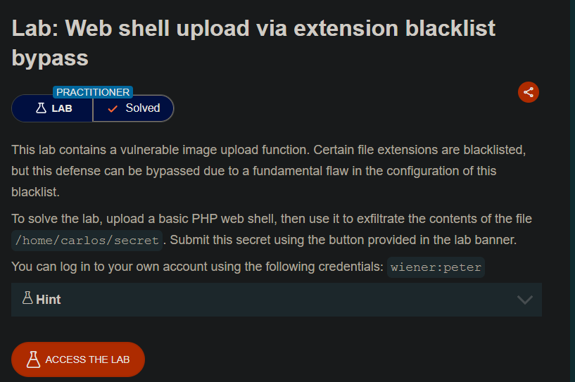
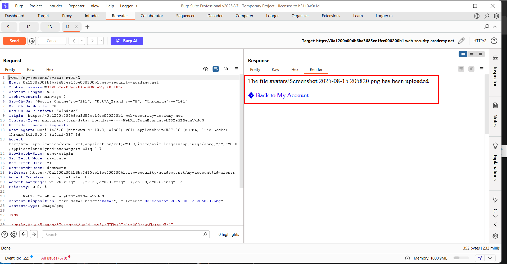
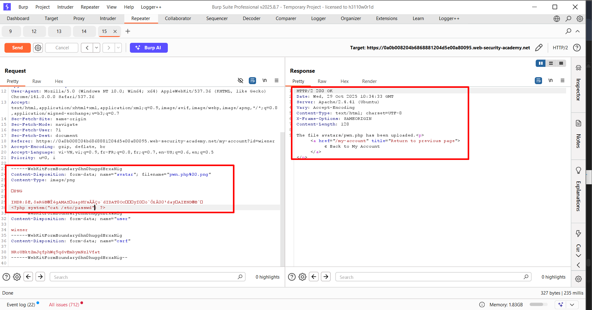
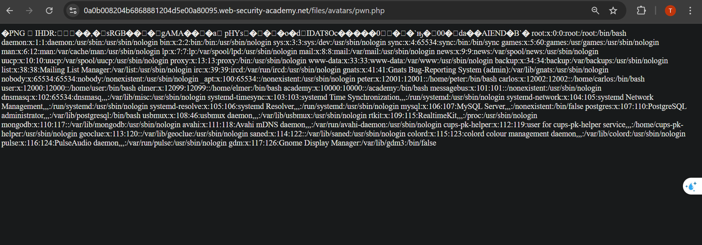
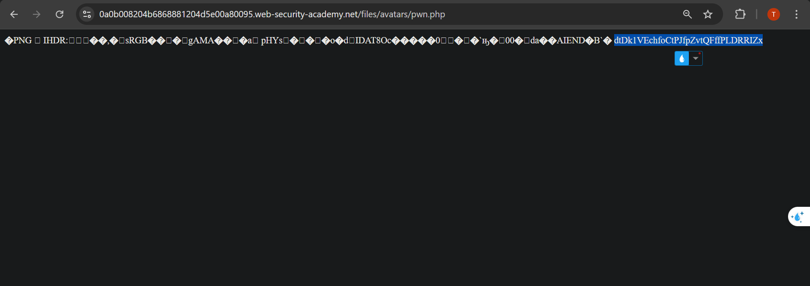

## LAB 7: Web shell upload via obfuscated file extension

>>-Phòng thí nghiệm này chứa một chức năng tải lên hình ảnh dễ bị tấn công. Một số phần mở rộng tệp bị đưa vào danh sách đen, nhưng biện pháp phòng thủ này có thể bị bỏ qua do một lỗi cơ bản trong cấu hình danh sách đen này.

>>-Để giải bài lab, hãy tải lên một web shell PHP cơ bản, sau đó sử dụng nó để trích xuất nội dung của tệp `/home/carlos/secret`. Gửi bí mật này bằng nút được cung cấp trong banner bài lab.

>>-Bạn có thể đăng nhập vào tài khoản của mình bằng thông tin đăng nhập sau: `wiener:peter`

---

Gửi một file ảnh hợp lệ

---

---

Khi gửi một file `webshell` với định dạng `php` thì  server từ chối

---

---
 
Gửi file `.htaccess` cũng bị từ chối
 
---

---
 
Sử dụng cả `.png` và `php` nếu server cho phép sử lí cả 2 định dạng

>>Upload thành công
 
---

---
 
Nhưng khi vào thì chỉ thấy server sử lí hình ảnh còn không sử lí `php`
 
---

---
 
`pwn.php.php` --> Xem server có kiểm tra kiểu `trim` đi `.php` không
 
---

---
 
`pwn.p.phphp` --> Xem có `trim` đệ quy không
 
---

---
 
Dùng `\0` nếu phần nhận thông tin thì vẫn coi `\0` là một kí tự còn phần sử lí đuôi file thì lại coi `\0` là kí tự kết thúc
>>200 OK
 
---

---
 
Khi vào file `pwn.php` thì thấy mất đoạn payload `php`
>>Server đã thực thi đoạn code `php`
 
---

---
 
Chỉnh sửa file `pwn.php` để đọc file `/etc/passwd`
 
---

---
 
>>Đọc thành công file `/etc/passwd`
 
---

---
 
Chỉnh để đọc file `/home/carlos/secret`
 
---
