## Lab 1: CSRF vulnerability with no defenses

__Lỗ hổng CSRF mà web không có bất kỳ biện pháp phòng thủ nào__


Thay đổi email của nạn nhân

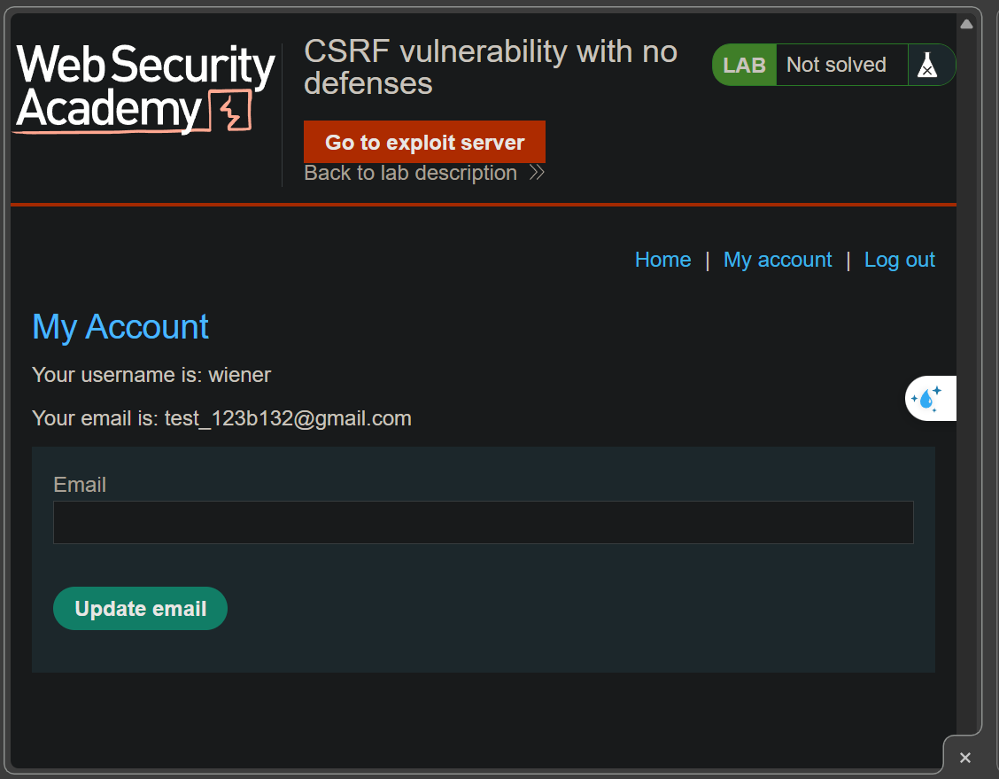

Đổi email một lần để lấy request chuẩn

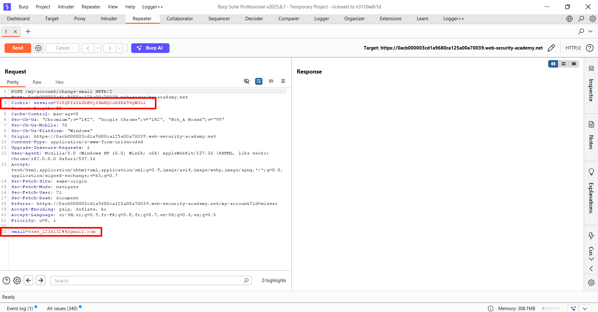

Xem kĩ request thì thấy chỉ có duy nhất `Cookie session` và không có bất kì xác thực nào chứng minh rằng đúng người yêu cầu


Gen mã *HTML* thực hiện việc tấn công `CSRF`

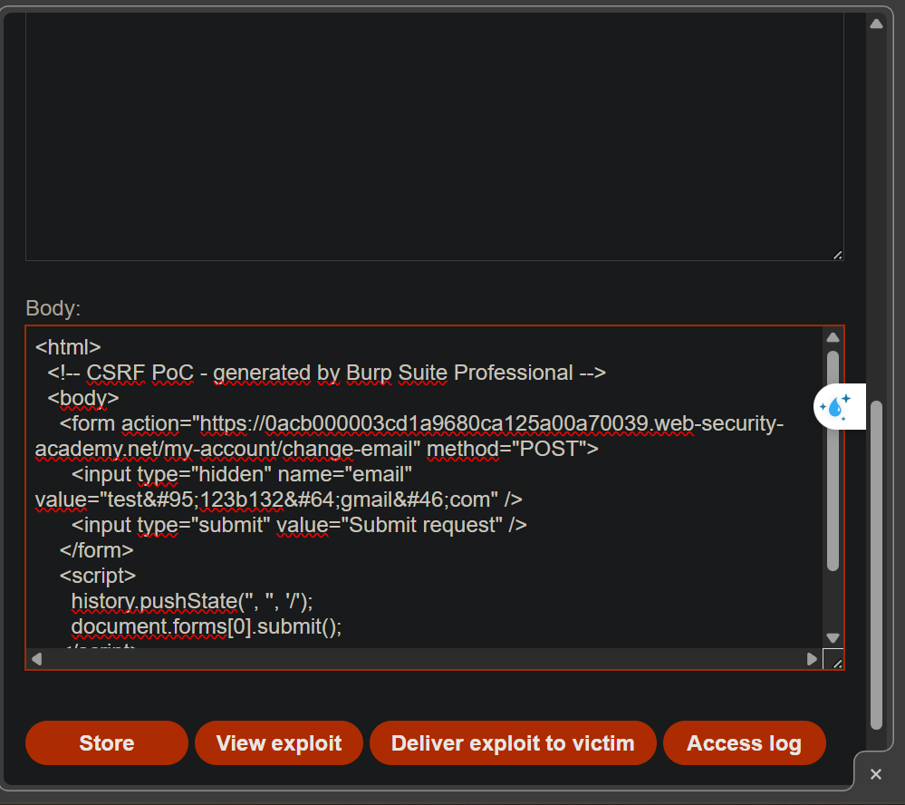

Lưu code vào sever kiểm soát\
Vì lab nói rằng không thể có 2 mail trùng nhau\
--> Trước khi gửi cho victim cần thay đổi email tránh bị trùng với tài khoản của mình


## Lab 2: CSRF where token validation depends on request method

__CSRF trong đó việc kiểm tra token phụ thuộc vào loại phương thức request (GET/POST)__

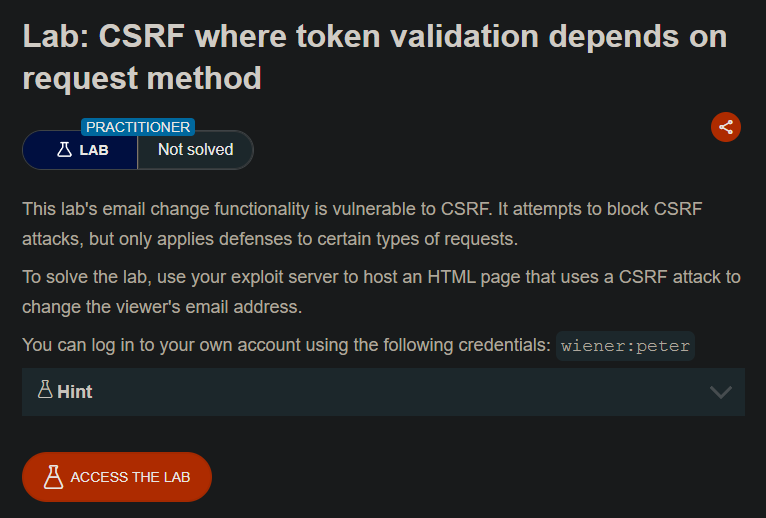

Lab yêu cầu đổi emai của nạn nhân

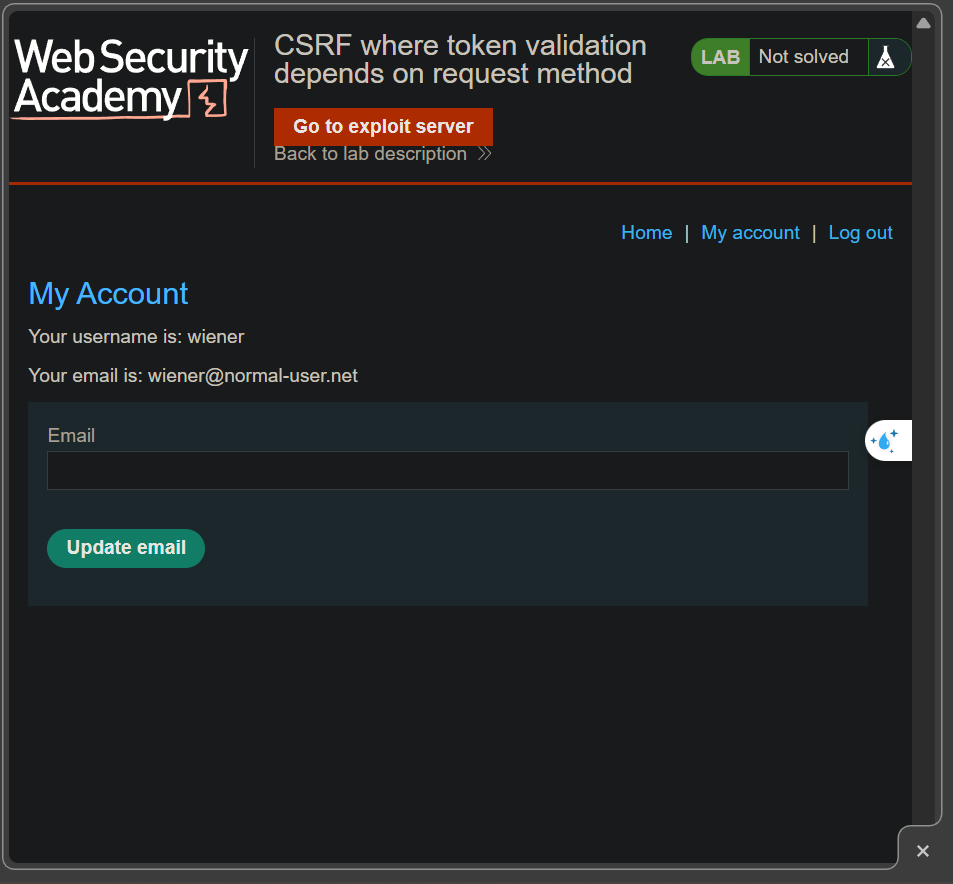

Đăng nhập vào `wiener:peter`

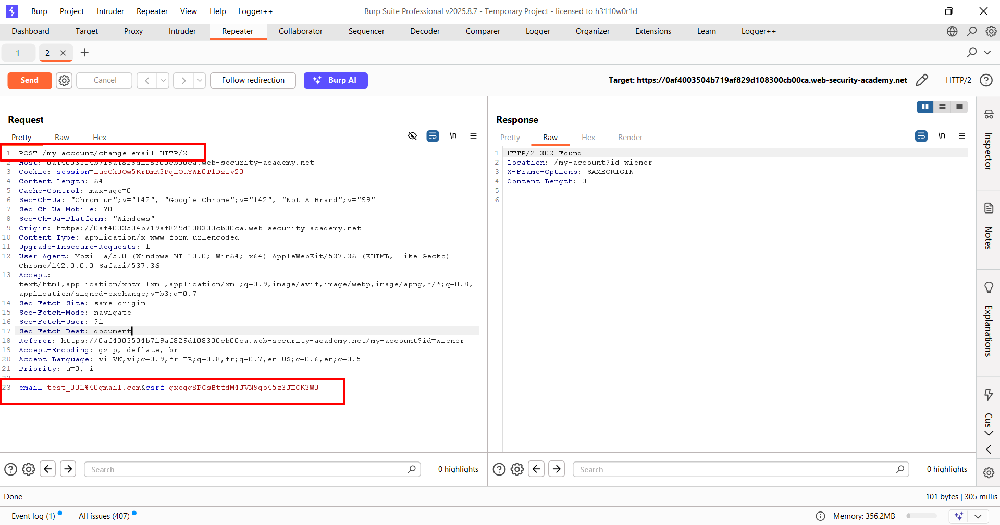

Đổi email thành `test_001@gmail.com` để lấy request chuẩn
--> Request đã bao gồm cả mã `CSRF`


Đổi request method thành GET\
--> Server vẫn trả về `302`


Kiểm tra thấy tài khoản đã được đổi email

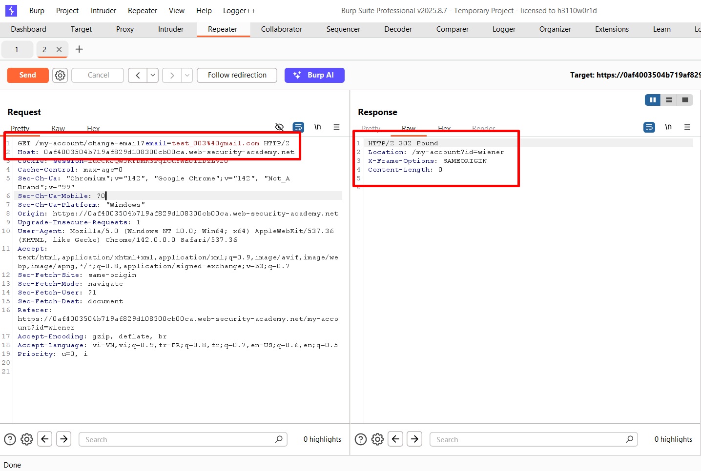

Khi xóa đi tham số `csrf` thì server vẫn chấp nhận với method `GET`


Kiểm tra tài khoản và thấy email đã được đổi ngay khi không có mã `CSRF`


Tạo mã *HTML* để có thể lưu trữ trên máy chủ mình kiểm soát


Sang server kiểm soát và lưu trữ đoạn `HMTL`

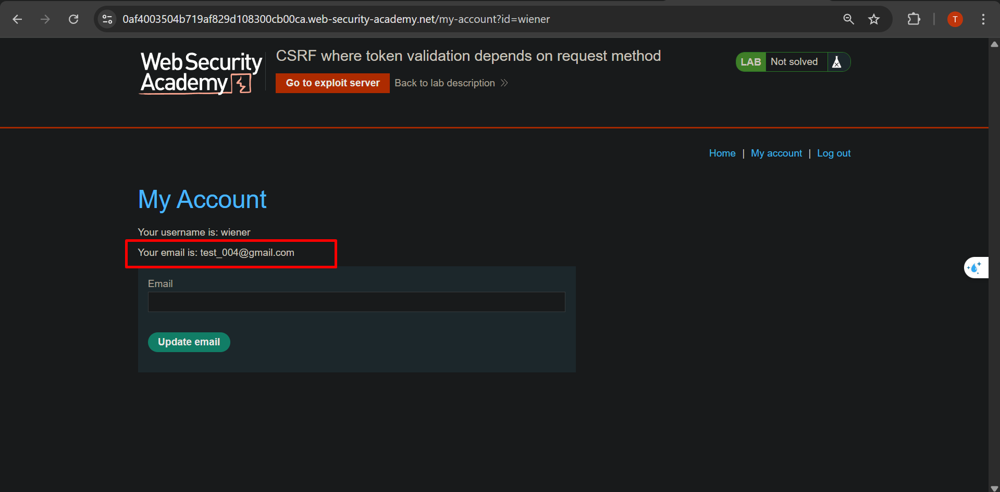

Thử truy câp bằng link của server\--> Email đã tự động được đổi


Đổi email và gửi cho victim\--> Solve lab\
Lab chỉ xác thực `CSRF` cho method `POST` còn `GET` thì không cần mã `CSRF` vẫn có thể thực hiện được hành động tương tự

## Lab 3: CSRF where token validation depends on token being present

__CSRF xảy ra khi web chỉ kiểm tra xem token có tồn tại hay không, chứ không kiểm tra token đó đúng hay sai__


Lab yêu cầu đổi email của victim thông qua lỗ hổng CSRF


Loggin vào tài khoản `wiener`


Đổi email 1 lần để có được request đổi email

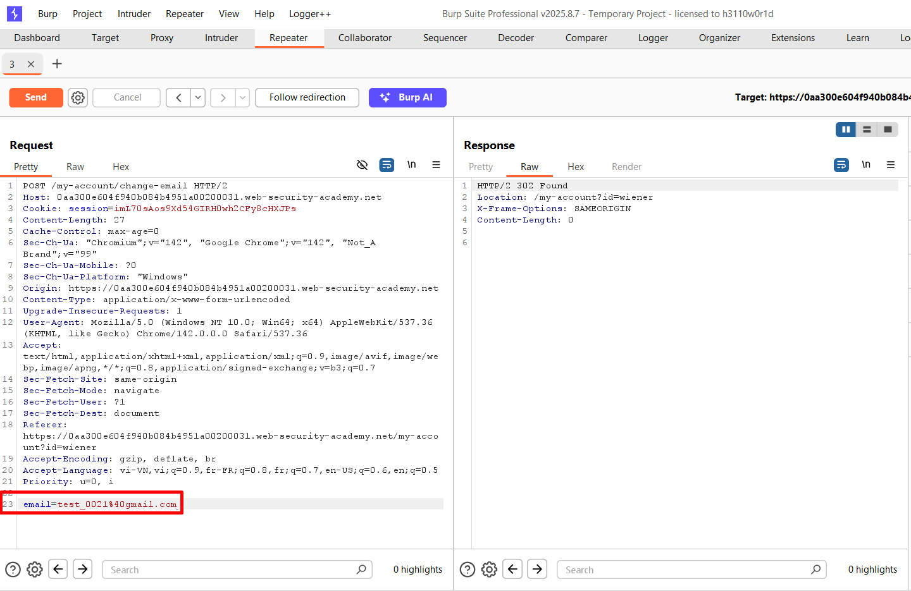

Khi xóa đi tham số `csrf` thì server vẫn trả về `302`


Kiểm tra thì thấy email đã được đổi


Tạo mã HTML để lưu trữ lên máy chủ ta kiểm soát

```HTML
<html>
  <!-- CSRF PoC - generated by Burp Suite Professional -->
  <body>
    <form action="https://0aa300e604f940b084b4951a00200031.web-security-academy.net/my-account/change-email" method="POST">
      <input type="hidden" name="email" value="test&#95;0021&#64;gmail&#46;com" />
      <input type="submit" value="Submit request" />
    </form>
    <script>
      history.pushState('', '', '/');
      document.forms[0].submit();
    </script>
  </body>
</html>
```
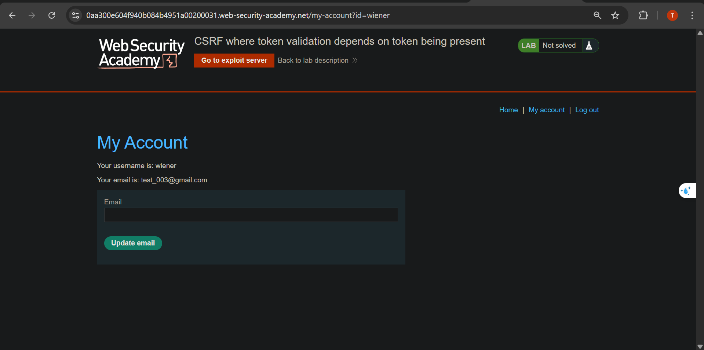

Khi truy cập bằng link đó thì email đã tự động được đổi


Sửa email và gửi cho victim\--> Solve lab\


Khi để lại tham số `CSRF` nhưng đã chỉnh sửa thì thấy server vẫn kiểm tra\
--> Lab này chỉ kiểm tra tham số `CSRF` khi nó có mặt, còn khi không có thì nó không kiểm tra luôn

## Lab 4: CSRF where token is not tied to user session

__CSRF xảy ra khi token không gắn với phiên đăng nhập của người dùng__

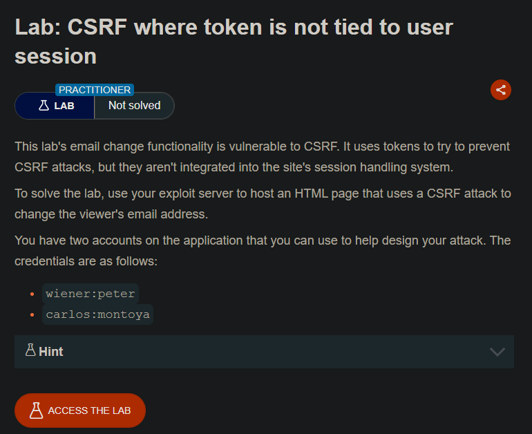

Lab yêu cầu đổi email của victim thông qua lỗ hổng *CSRF*

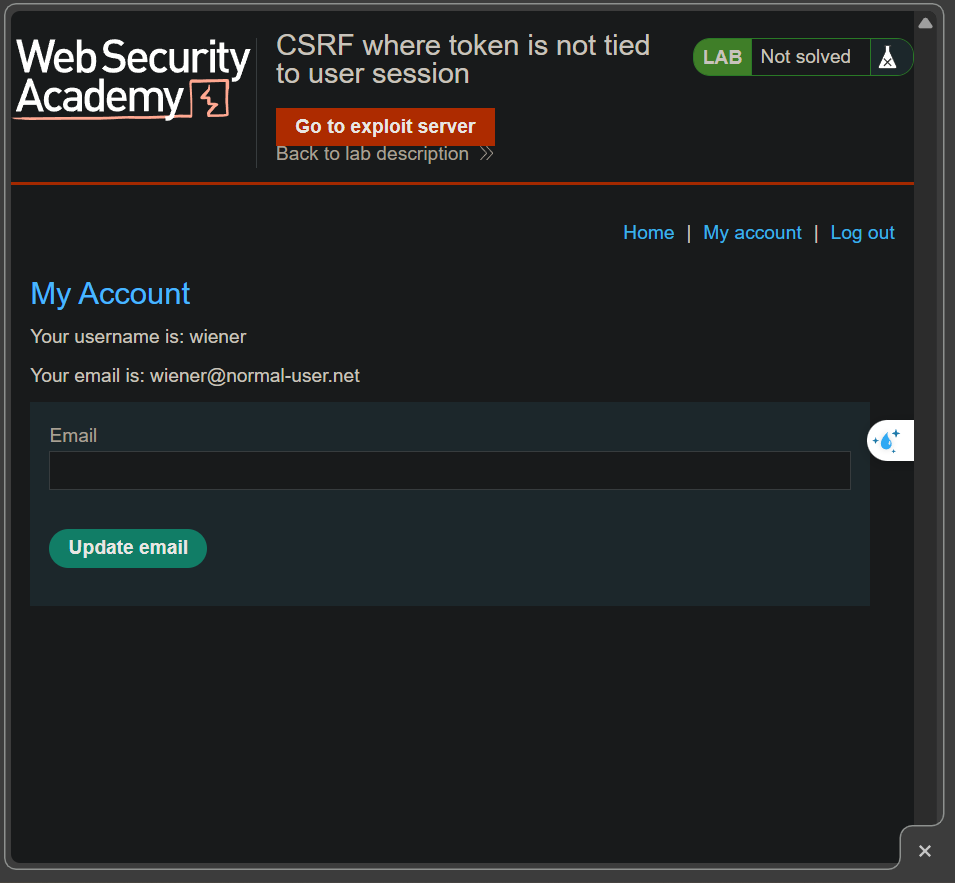

Đăng nhập vào tài khoản `wiener`

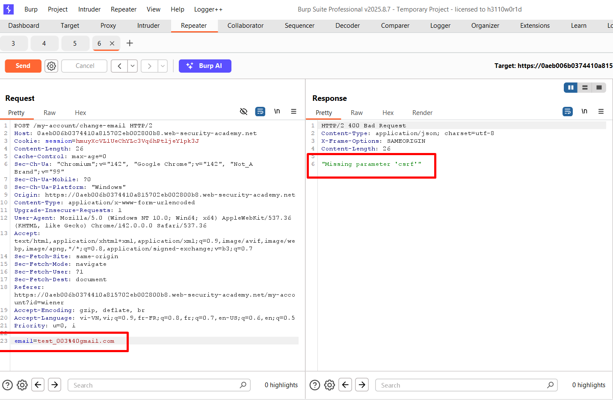

Khi đổi email nhưng xóa đi trường `CSRF` thì server nói rằng `"Missing parameter 'csrf'"`


Ý tường: lấy `CSRF login` của wiener và nhập vào trường `CSRF change email` của carlos\
--> Server `"Invalid CSRF token"`--> __False__

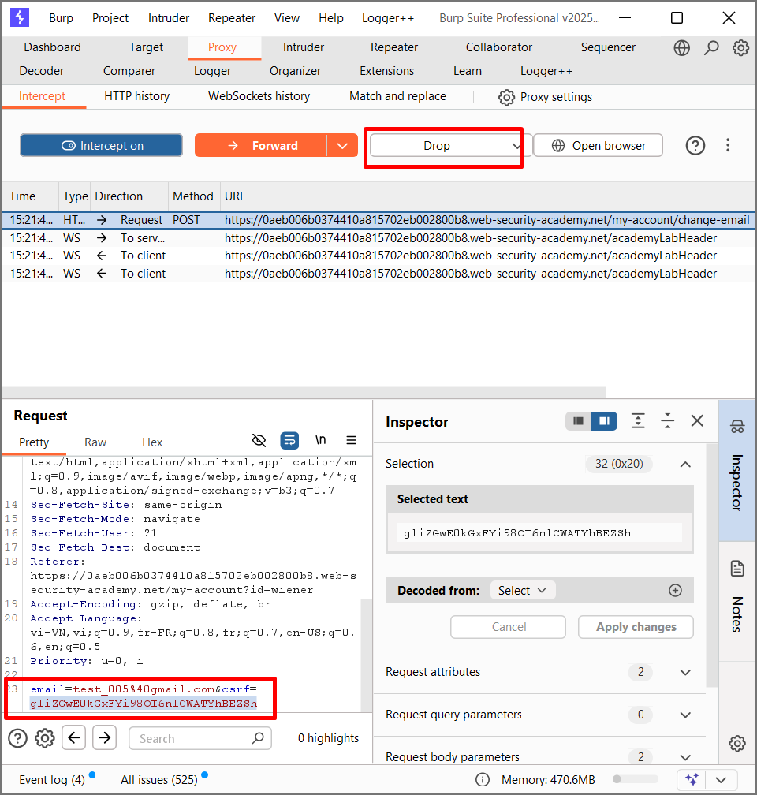

Bật `Intercept` và lấy một lần request đổi email, nhưng khi gặp được request đó thì lấy mã `CSRF` và bỏ yêu cầu đó\--> Có được mã `CSRF` hợp lệ

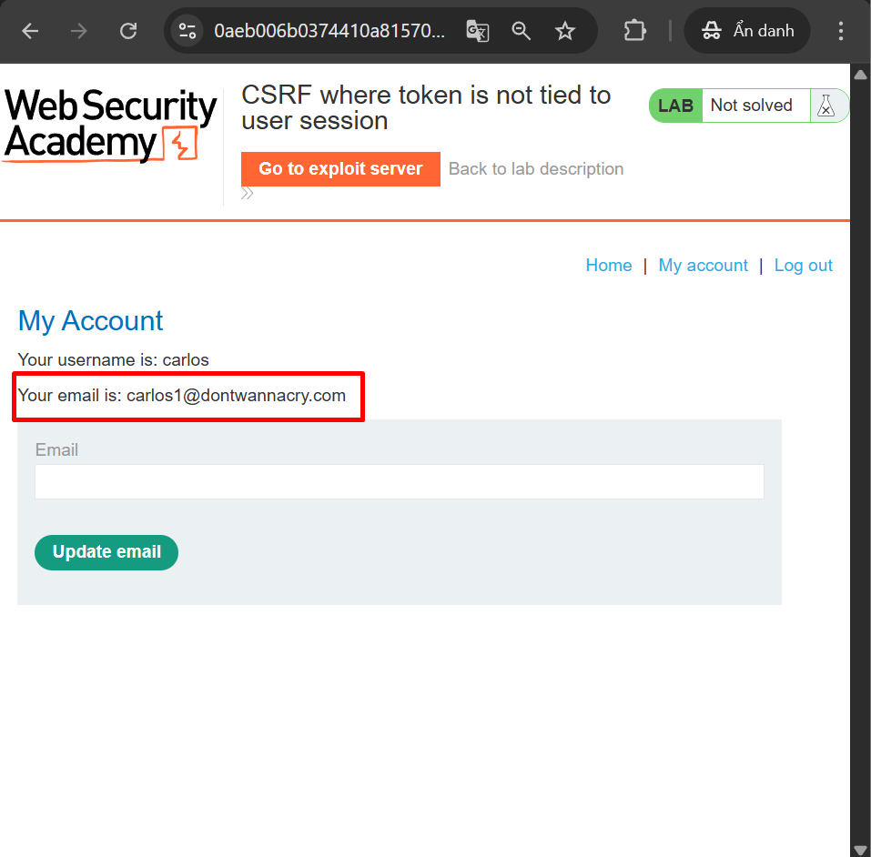

Email của carlos ban đầu là: `carlos1@dontwannacry.com`

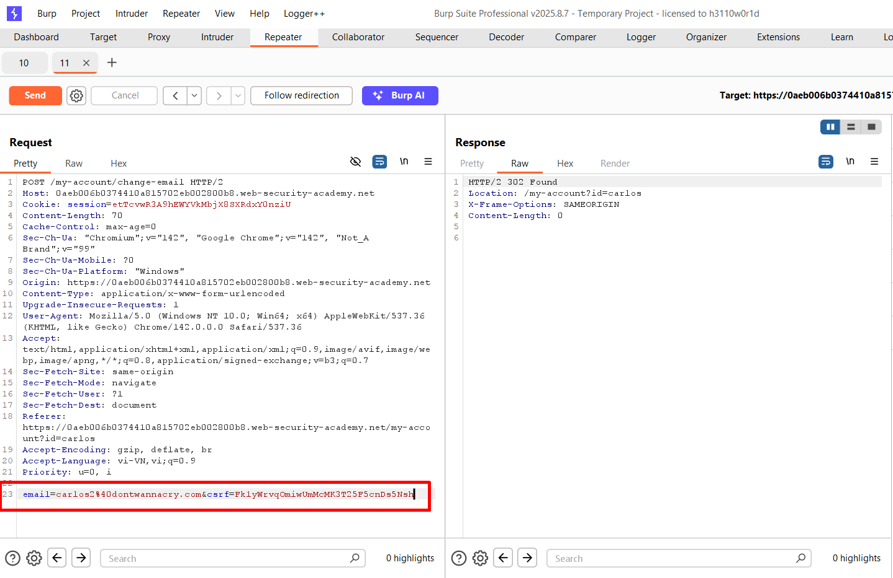

Lấy request đổi email của carlos và điền tham số `CSRF` vừa lấy được vào\--> server trả về `300`


Lúc này email của carlos đã được cập nhật: `carlos2@dontwannacry.com`


Làm lại bước như trước để lấy được mã `CSRF` hợp lệ và tạo mã *HTML* để lưu trữ


Gửi cho victim\--> Solve lab\--> Lab cho thấy mã `CSRF` không được liên kết với `Session Cookie` --> dẫn đến việc lấy `CSRF` của tài khoản này dùng được cho tài khoản khác

## Lab 5: CSRF where token is tied to non-session cookie

__CSRF xảy ra khi token được gắn với một cookie KHÔNG phải cookie phiên__


Khi đổi email server không chỉ có 1 `session cookie` mà còn có cả `csrfKey`


Bật `Intercept` và lấy 2 trường `csrf` và `csrfKey`


Sử dụng cặp `csrf` và `csrfKey` vừa lấy được đưa vào request đổi email của `carlos`--> Server trả về `300`


Qua kiểm tra thì thấy email của `carlos` đã được thay đổi


Tạo mã HTML để lưu trữ, vì có cả `csrfKey` nên phải nghĩ cách set cho nó

```HTML
<html>
  <!-- CSRF PoC - generated by Burp Suite Professional -->
  <body>
    <form action="https://0a0f006504e3c02380ef1c5d00d40095.web-security-academy.net/my-account/change-email" method="POST">
      <input type="hidden" name="email" value="test_1000a22_&#64;carlos&#45;montoya&#46;net" />
      <input type="hidden" name="csrf" value="ubDXn0VZuMttxghOLimw91hNxB3dDuVv" />
      <input type="submit" value="Submit request" />
    </form>
    
  </body>
</html>
```

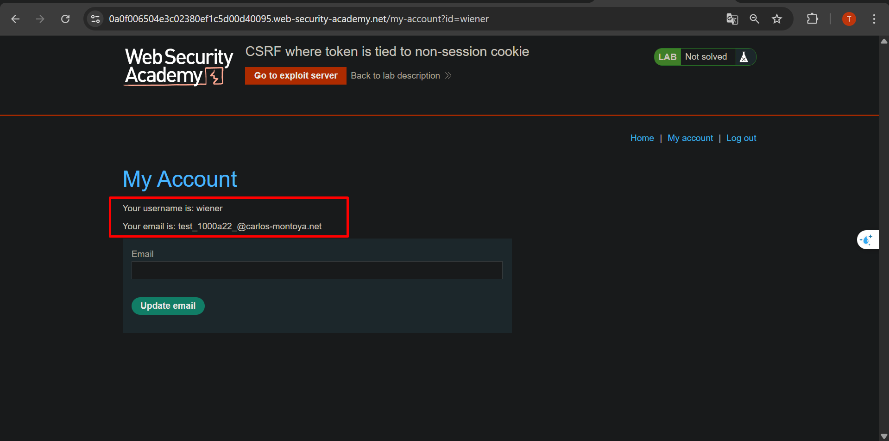

Khi vào bằng link của server kiểm soát, email đã được thay đổi


Tiếp tục lấy `csrf` và `csrfKey` thay vào và gửi cho victim\
Solve lab\
Lab này cho thấy mã `CSRF` không được liên kết với `Session cookie`
--> Không có ý nghĩa

## Lab 6: CSRF where token is duplicated in cookie

__Lỗi CSRF khi token được lưu trùng lặp trong cookie__

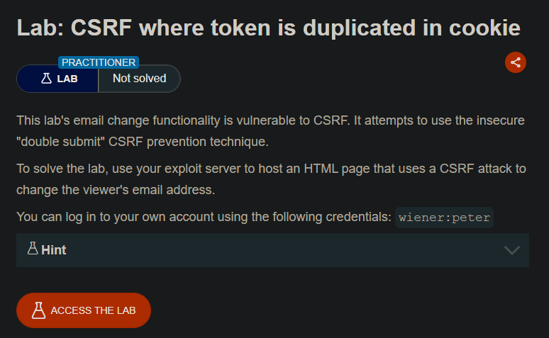

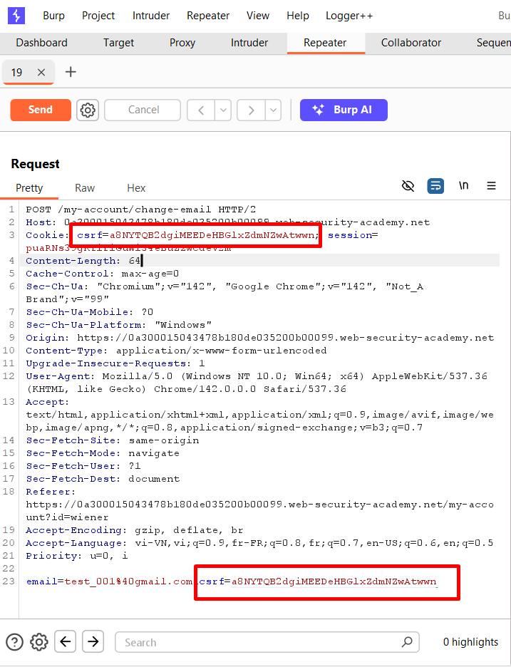

Đổi email một lần và thấy mã `CSRF` được xuất hiên ở 2 nơi:
- Cạnh `Session Cookie`
- Dưới phần tham số gửi đi\
--> Đặc điểm là chứng giống hệt nhau


Thử thay đổi `csrf` thành một giá trị bất kì\
Server: `"Invalid CSRF token"`\
Nhưng khi đổi lại thành `CSRF` cũ thì lại được\
--> Server chỉ chấp nhận những mã hợp lệ trên server

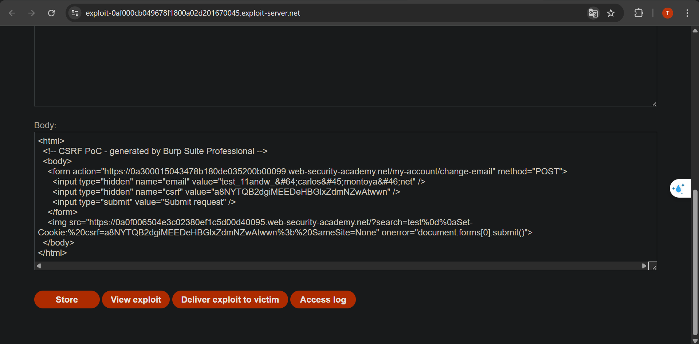

Viết mã HTML để lưu trữ trên server kiểm soát\
Thay thế `CSRF` bằng giá trị của `wiener`\

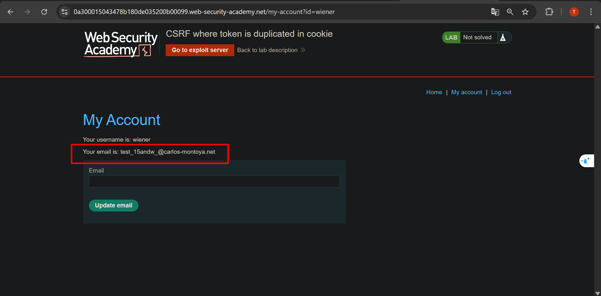

Khi truy cập vào link thì thấy email đã được thay đổi


Nhưng khi gửi cho victim thì chưa thấy solve


Bởi vì chức năng search của web không có mã `CSRF` nên lợi dụng nó để set cho nó trước rồi sử dụng nó sau bằng đoạn injection:\
`test%0d%0aSet-Cookie:%20csrf=fake%3b%20SameSite=None`
Lúc này `CSRF` đã có giá trị banwfh `fake`


Dùng lại `CSRF=fake` để đổi email\
Server đã cho đổi\
Ý tưởng: set cho mã `CSRF` của victim một giá trị cụ thể mà có thể biết, sau đó dùng chính nó để có thể đổi mật khẩu

```HTML
<html>
  <!-- CSRF PoC - generated by Burp Suite Professional -->
  <body>
    <form action="https://0a300015043478b180de035200b00099.web-security-academy.net/my-account/change-email" method="POST">
      <input type="hidden" name="email" value="test_1111_&#64;carlos&#45;montoya&#46;net" />
      <input type="hidden" name="csrf" value="fake123" />
      <input type="submit" value="Submit request" />
    </form>
    
  </body>
</html>
```

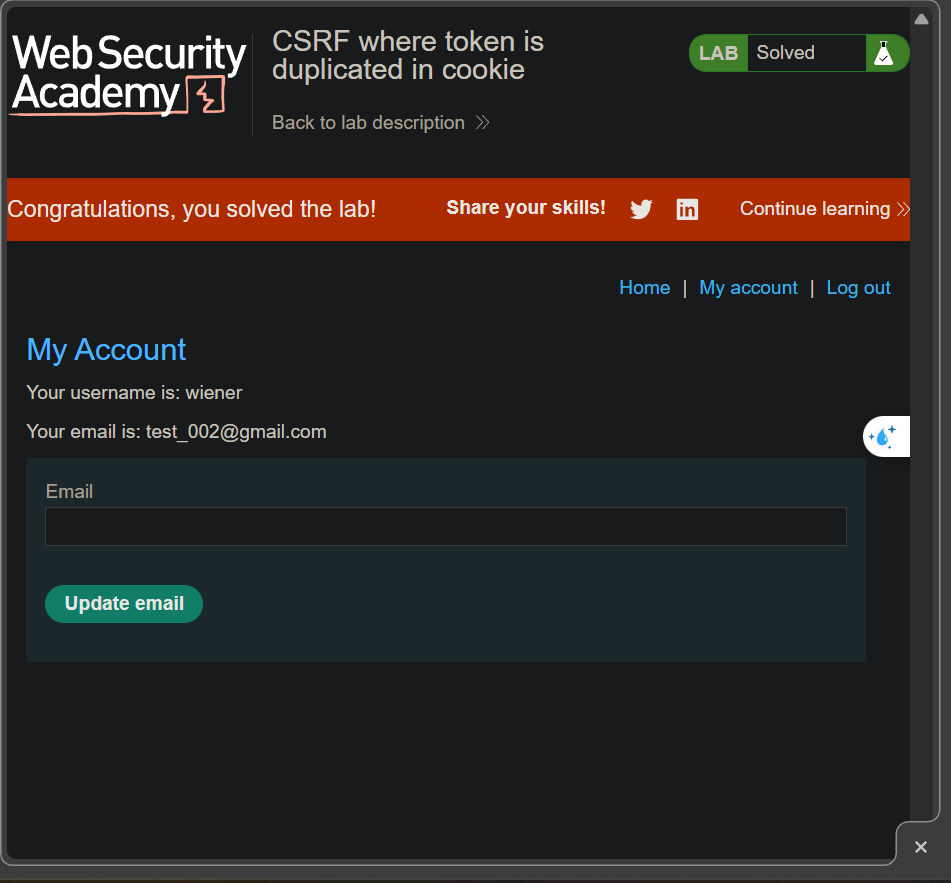

## Lab 7: SameSite Lax bypass via method override

__Vượt qua bảo vệ SameSite=Lax bằng cách giả vờ đổi method request__


Lab yêu cầu đổi email của victim

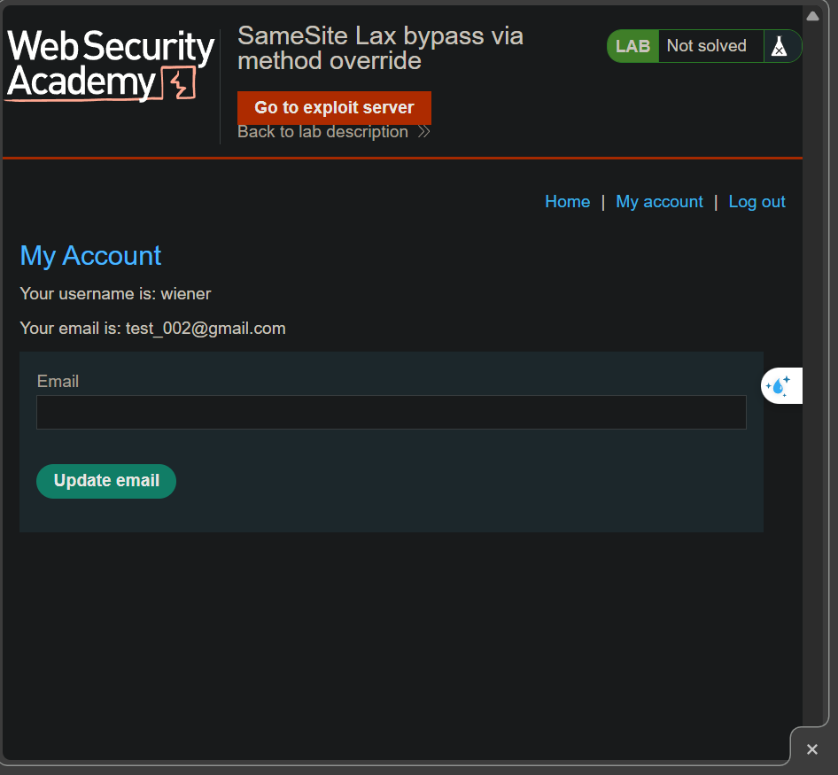

Đổi mail ở tài khoản có thể truy cập rồi lấy request mẫu

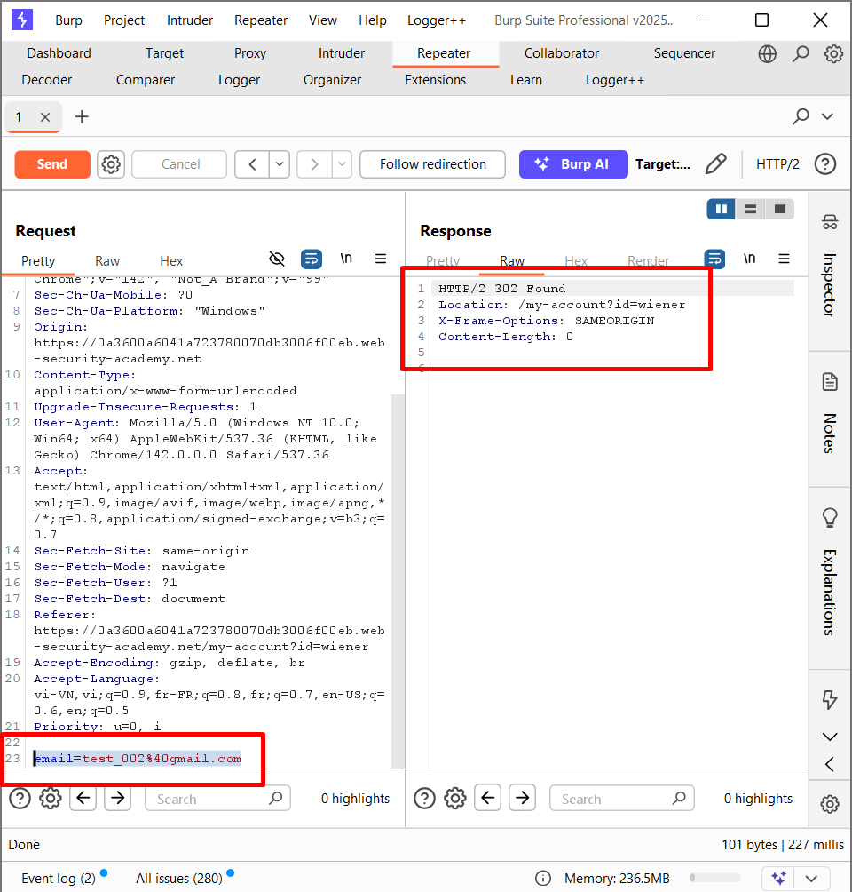

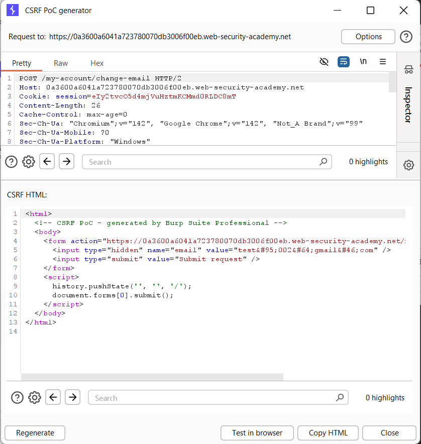

Tạo một đoạn mã HTML để lưu trữ trên server


Khi lưu trữ rồi thử truy cập link thì thấy tài khoản đã bị đẩy logout


Đổi method thành `GET` thì server không chấp nhận method `GET` cho thao tác đổi email

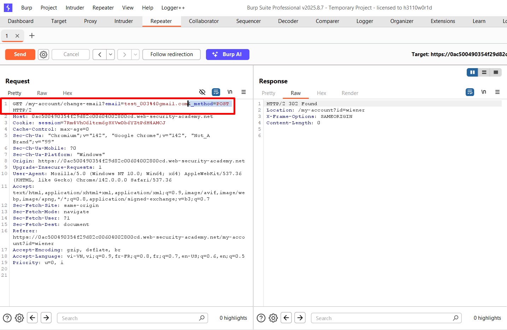

Bypass ghi đè method bằng cách thêm tham số `_method`\
--> Server trả về `302`

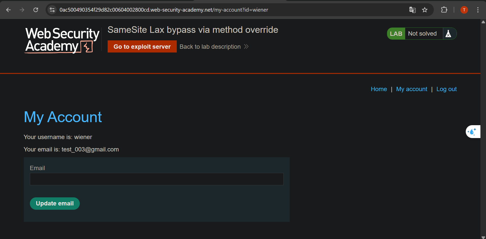

Kiểm tra tài khoản và thấy email đã được thay đổi


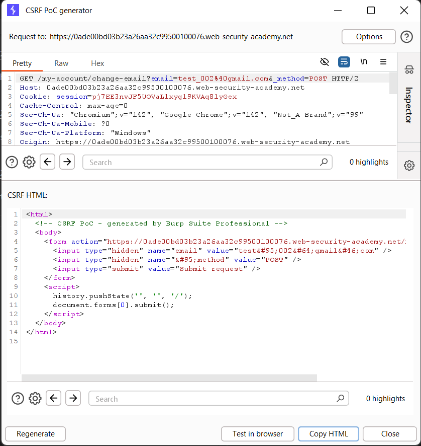

Từ request đó ta sẽ gen một đoạn mã HTML để lưu trữ trên server
```HTML
<html>
  <!-- CSRF PoC - generated by Burp Suite Professional -->
  <body>
    <form action="https://0ade00bd03b23a26aa32c99500100076.web-security-academy.net/my-account/change-email">
      <input type="hidden" name="email" value="test&#95;002&#64;gmail&#46;com" />
      <input type="hidden" name="&#95;method" value="POST" />
      <input type="submit" value="Submit request" />
    </form>
    <script>
      history.pushState('', '', '/');
      document.forms[0].submit();
    </script>
  </body>
</html>
```
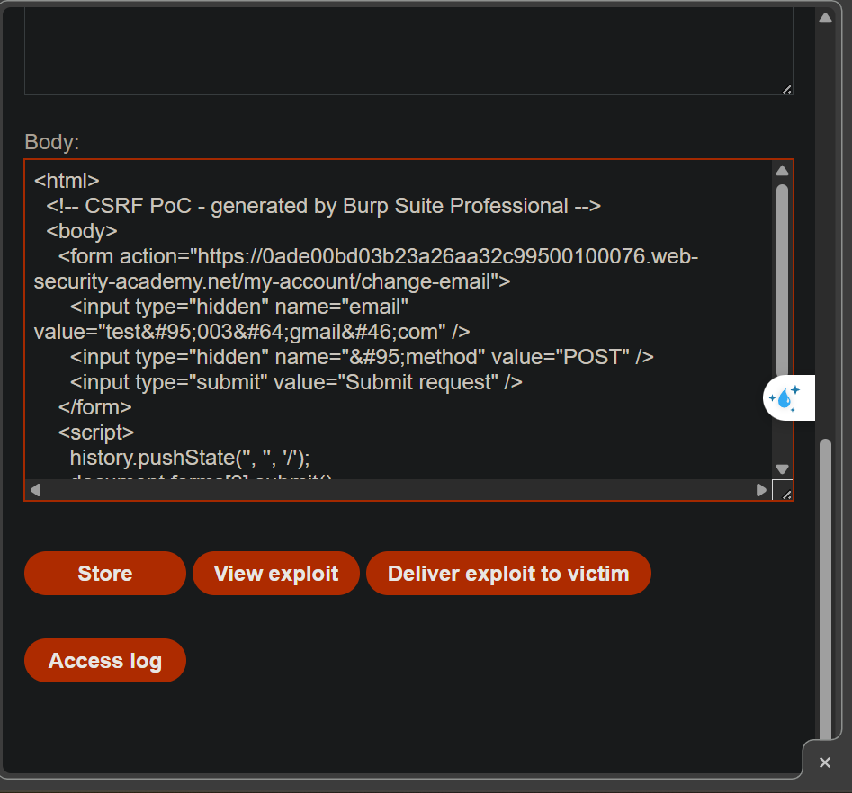

Lưu trữ nó trên server


Truy cập vào link file đó thì thấy email của tài khoản đã được đổi


Gửi cho victim để solve lab

## Lab 8: SameSite Strict bypass via client-side redirect

__Vượt qua bảo vệ SameSite=Strict bằng chuyển hướng phía client__


Lab yêu cầu đổi email của victim

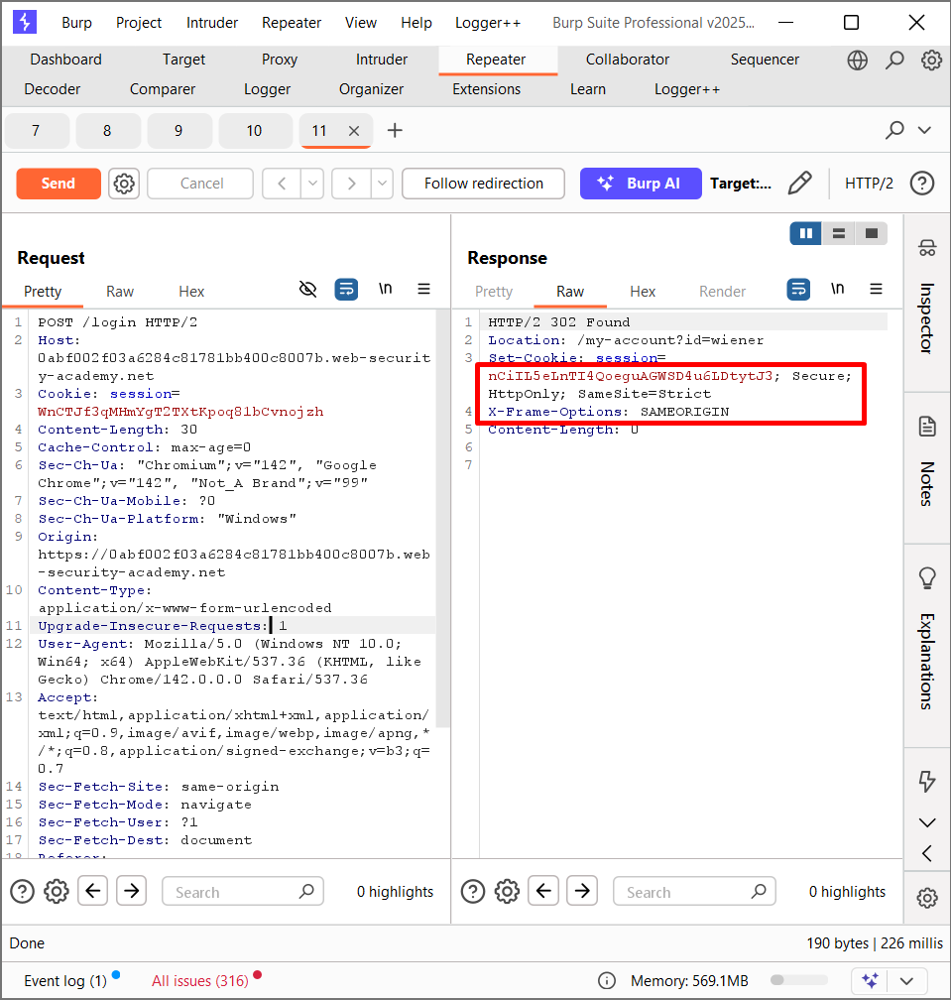

Khi login vào ta thấy web đã được cấu hình `SameSite=Strict`


Đổi thử email một lần --> `302`


Kiểm tra lại thấy email đã thay đổi 


Gen code HMTL 


Sau khi truy cập link của server thì web đã logout tài khoản ra\
--> Failed


Đổi method từ POST sang GET\
--> Server vẫn chấp nhận hành động đổi email bằng method GET\
Nhưng vì web cấu hình `SameSite=Strict` nên dù có chấp nhận GET nhưng phải làm sao để cho web tự động chuyển hướng GET về `/my-account/change-email?email=example@gmail.com`


Xem chức năng bình luận của web\
Ta thấy khi gửi một comment lên thấy web chuyển ta đến một trang xác nhận đã post comment lên, sau đó lại chuyển hướng về bài viết ta vừa bình luận và cho phép ta xem lại bài viết đó và bình luận


Trong `HTTP history` thì đã thấy được flow của chức năng này


Đây chính là đoạn mã giúp web chuyển hướng sau khi xác nhận đã post comment

```JS
redirectOnConfirmation = (blogPath) => {
    setTimeout(() => {
        const url = new URL(window.location);
        const postId = url.searchParams.get("postId");
        window.location = blogPath + '/' + postId;
    }, 3000);
}
```
--> Đoạn code này lấy thẳng giá trị của `postId` để ghép vào rồi chuyển hướng thẳng về URL đó\
--> Có thể lợi dụng chức năng xác nhận comment để có thể khiến web tự chuyển hướng về `/my-account/change-email?email=example@gmail.com`


Khi quét map thì có thể thấy đang ở thư mục `post` và ta đang cần chuyển hướng đến `myaccount` thì ta có thể dùng `Path Travesal`

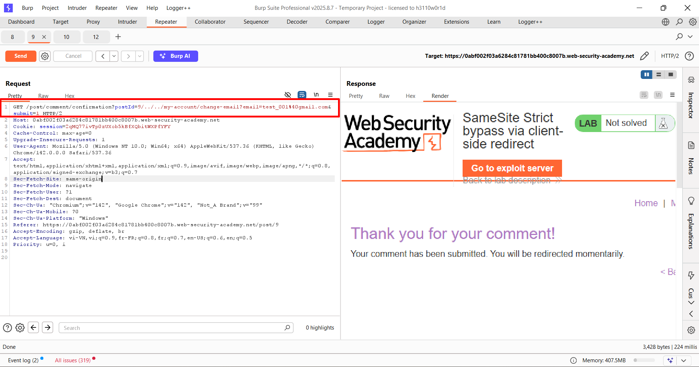

Dù đã thành công với request này nhưng email vẫn chưa bị đổi vì nó không tự động chuyển hướng\
Nên ta lấy URL của request này và chạy thẳng ở trình duyệt để có thể chuyển hướng


Khi chạy ở trình duyệt nó nói thiếu tham số `submit`

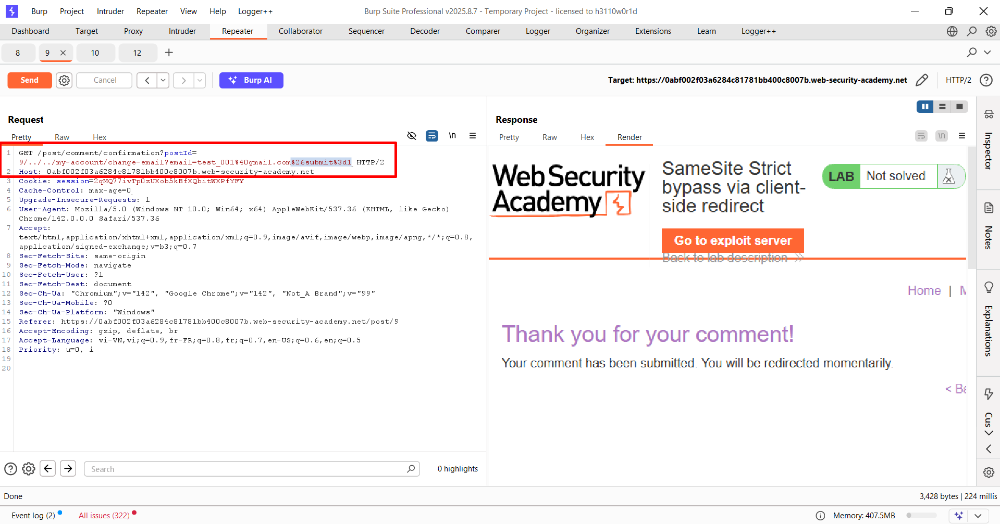

Ta sẽ encode URL của tham số `submit`


Khi chạy đã thấy nó thành công đổi email qua request đó 

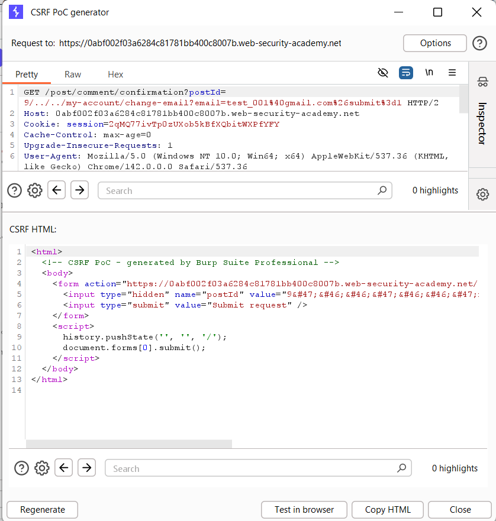

Gen HTML

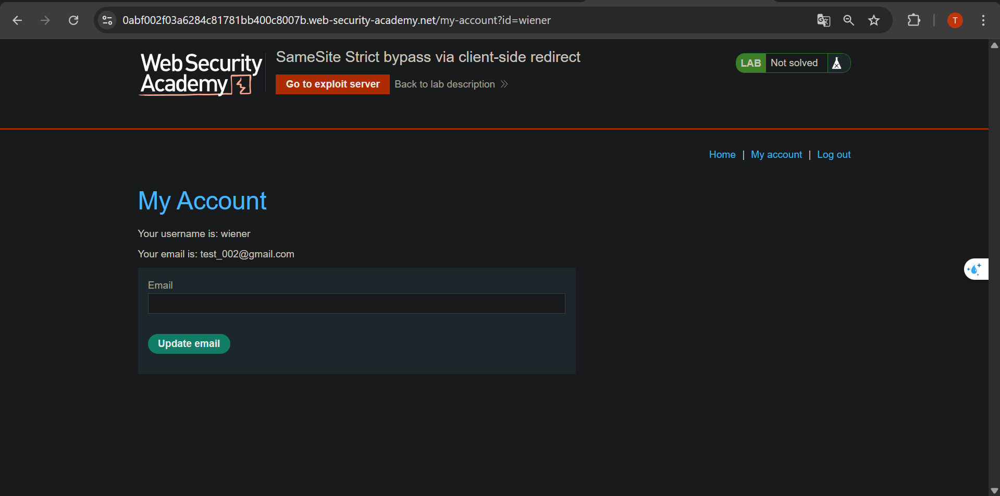

Khi truy cập bằng link của server ta kiểm soát thì thấy đã đổi email thành công


Gửi cho victim để solve lab


--> Để có thể bypass được web cấu hình `SameSite Strict` thì cần có:
- Web cho phép chức năng đó thực hiện bằng method _GET_
- Web có chức năng nào đó có thể chuyển hướng tự động qua lại trong site

## Lab 9: CSRF where Referer validation depends on header being present

__CSRF xảy ra khi việc kiểm tra Referer chỉ được thực hiện khi header này xuất hiện__


Lab yêu cầu đổi email của victim và cho biết trang web không cho phép request được gửi từ domain khác

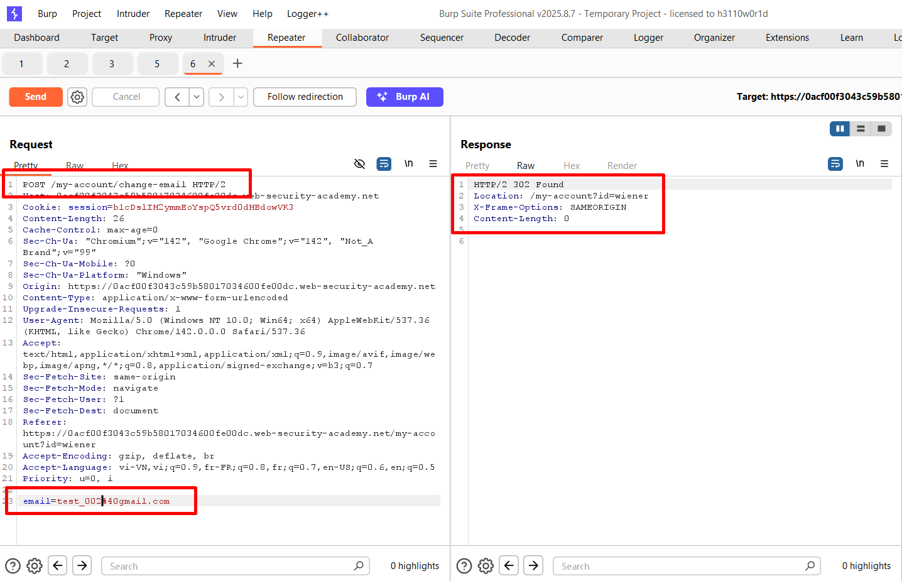

Đổi email thử một lần 

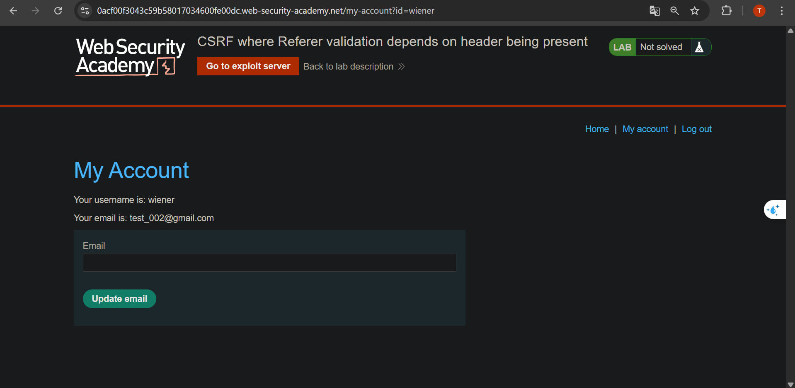

Check email và thấy đã được đổi 


Tạo HTML để lưu trữ trên server


Khi truy cập bằng link của server thì nó đã chặn lại bằng việc kiểm tra Header `Referer`: _"Invalid referer header"_\
--> Phải làm thế nào để server của ta khi gửi request sẽ không gửi Header `Referer`\
--> Thêm thẻ 
```HTML
<meta name="referrer" content="never">
```
--> HTML hiện tại:
```HTML
<html>
  <!-- CSRF PoC - generated by Burp Suite Professional -->
  <body>
    <form action="https://0acf00f3043c59b58017034600fe00dc.web-security-academy.net/my-account/change-email" method="POST">
      <input type="hidden" name="email" value="test&#95;005&#64;gmail&#46;com" />
      <input type="submit" value="Submit request" />
	  <meta name="referrer" content="never">
    </form>
    <script>
      history.pushState('', '', '/');
      document.forms[0].submit(); 
    </script>
  </body>
</html>
```
--> Lưu lên server


Khi truy cập bằng link của server thì thấy email đã được đổi

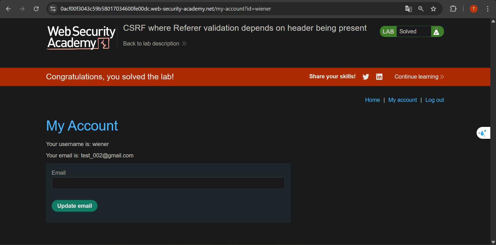

Chỉnh lại email và gửi cho victim để solve lab

## Lab 10: CSRF with broken Referer validation

__CSRF do cơ chế kiểm tra Referer bị lỗi__

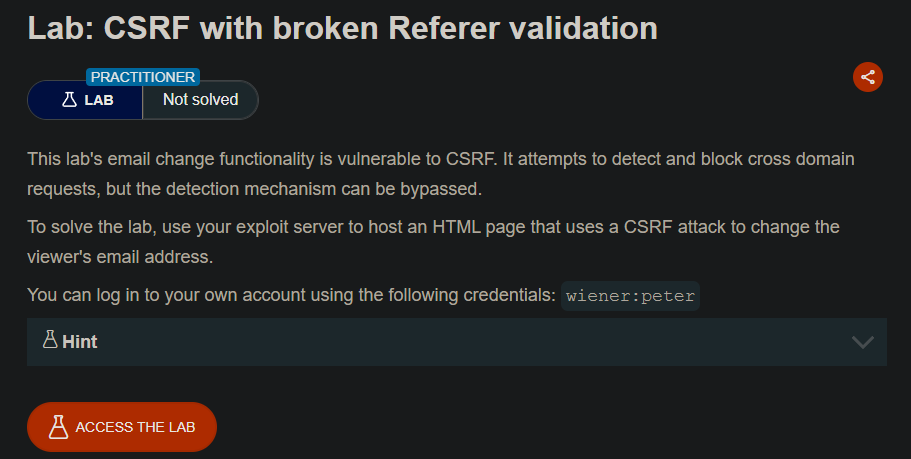

Lab yêu cầu đổi email của victim, cho biết rằng web chặn những request đến từ site khác

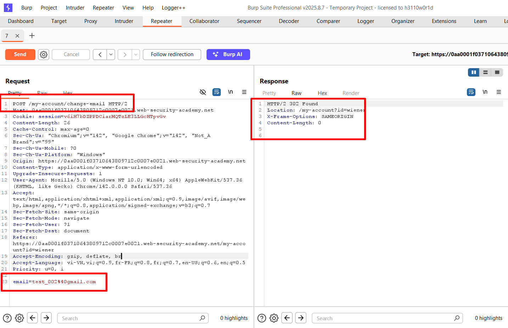

Đổi mật khẩu 1 lần để lấy request


Khi xóa Header `Referer` thì server trả về _"Invalid referer header"_


Khi giữ lại Header `Referer` nhưng đổi thành URL của site khác\
--> Web vẫn chặn


Khi truyền vào Header `Referer: https://example.com/test?https://0aa0001f03710643809712c0007e0021.web-security-academy.net` thì web trả về `302`

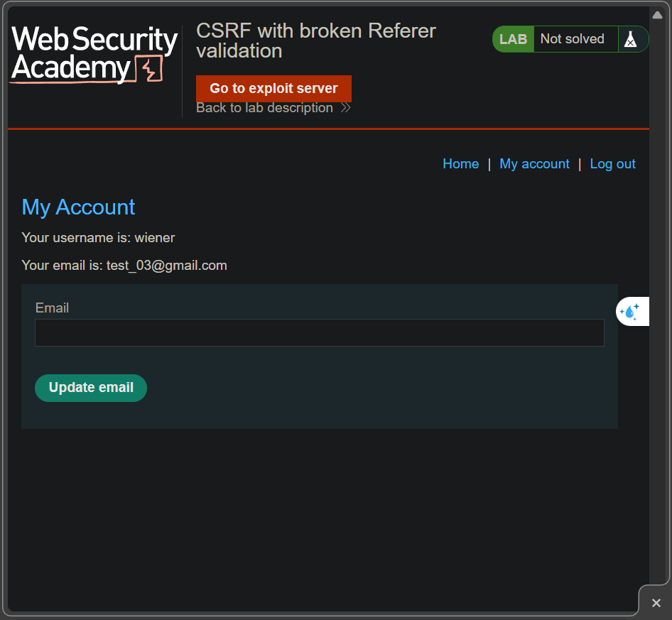

Kiểm tra thì thấy email đã được thay đổi\
--> Web kiểm tra giá trị của Header `Referer` chỉ cần có chuỗi tên miền chính của nó là có thể thực hiện hành động\
--> Bây giờ muốn gửi cho victim mà Header `Referer` có chứa chuỗi tên miền của web thì một là làm một tên miền là subdomain của tên miền chính đó, hai là gửi request mà có chứa chuỗi đó là được


Lưu HTML vào server với file : `/exploit.html/test?=https://0aa0001f03710643809712c0007e0021.web-security-academy.net` và header có `Referrer-Policy: unsafe-url` để có thể gửi full cả đuôi của file 


Nhưng khi truy cập link thì vẫn báo `Invalid referer header"`\
--> Failed\

```JS
history.pushState('', '', '/');
```
--> Bởi vì đoạn JS này đã cắt mất phần `test?https://0aa0001f03710643809712c0007e0021.web-security-academy.net`\
--> Mất chuỗi domain\
--> Failed


Với request đã xóa đi 

```JS
history.pushState('', '', '/');
```
--> Server đã cho phép đổi email 

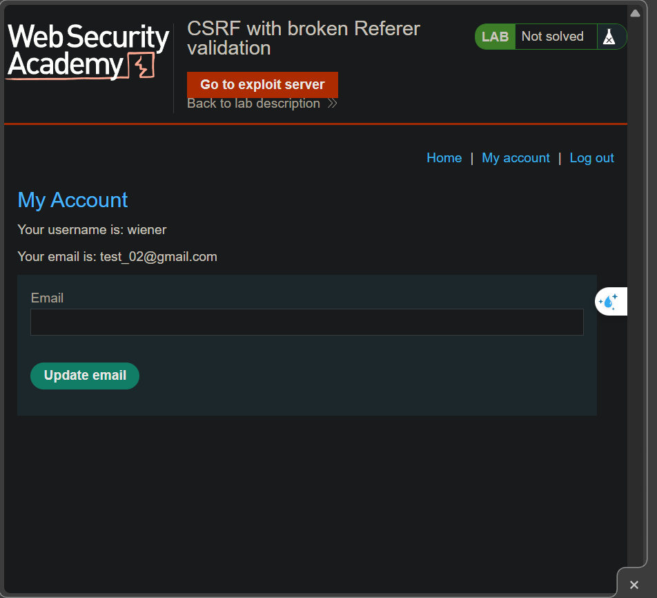

Kiểm tra đã thấy email được đổi

Nhưng khi gửi cho victim thì thấy chưa solve lab\
Xem xét lại chức năng của `history.pushState('', '', '');`\
Nó giúp chúng ta có thêm thêm tham số vào cuối URL mà không cần reload lại trang bằng tham số thứ 3

```HTML
<html>
  <!-- CSRF PoC - generated by Burp Suite Professional -->
  <body>
    <form action="https://0aa0001f03710643809712c0007e0021.web-security-academy.net/my-account/change-email" method="POST">
      <input type="hidden" name="email" value="test&#95;final2&#64;gmail&#46;com" />
      <input type="submit" value="Submit request" />
    </form>
    <script>
         history.pushState('','', '/test?0aa0001f03710643809712c0007e0021.web-security-academy.net')
         document.forms[0].submit();
    </script>
  </body>
</html>
```
--> Vậy nên bây giờ ta sẽ cho chuỗi chứa domain của web vào để có thể bypass filter của web 

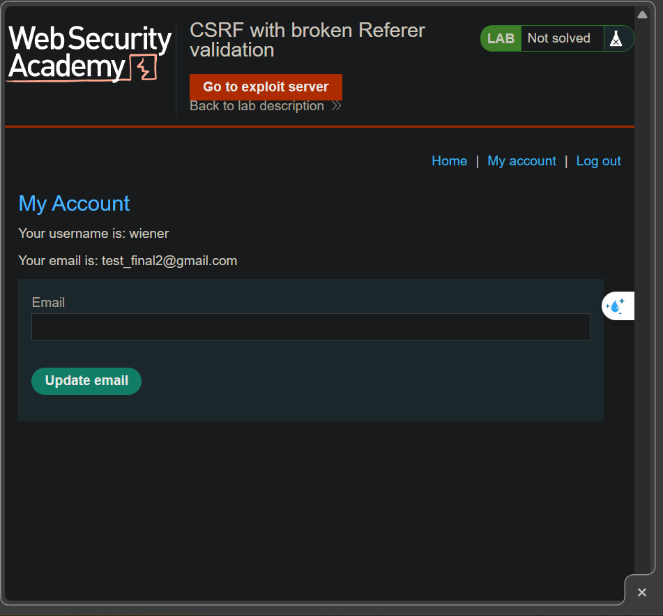

Khi truy cập bằng link của server thì thấy email của user đã được đổi


Thử đổi email và gửi cho victim\
--> Solve lab


