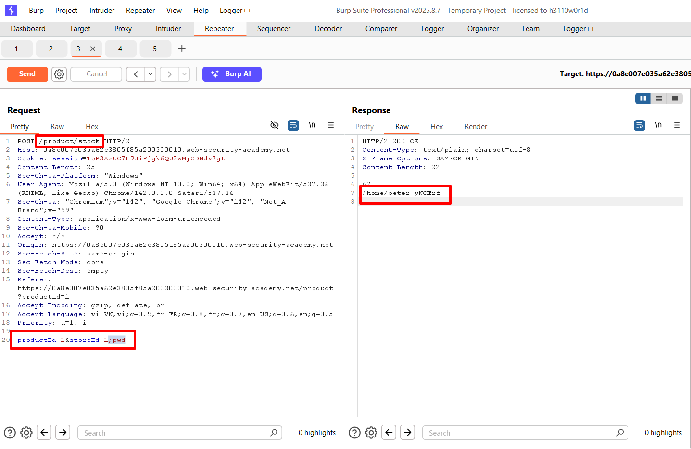
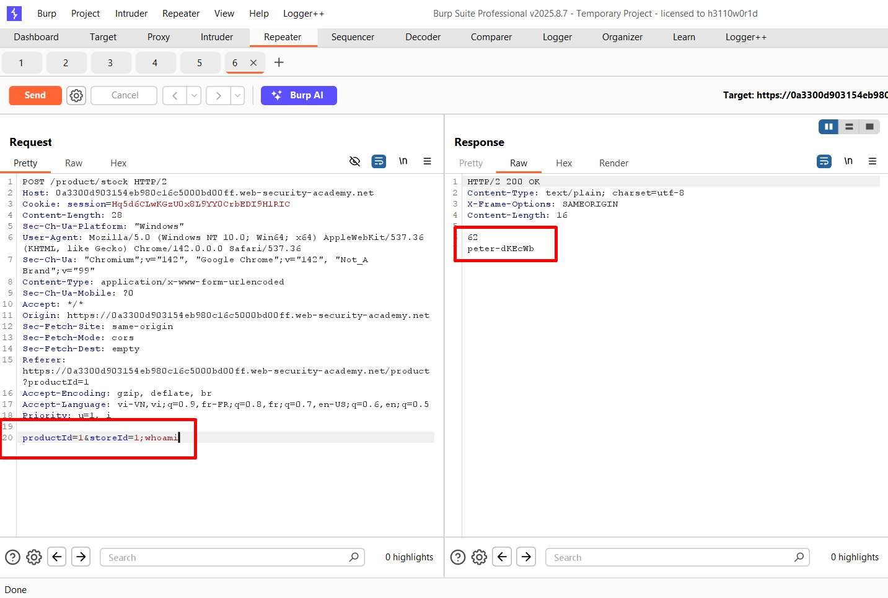
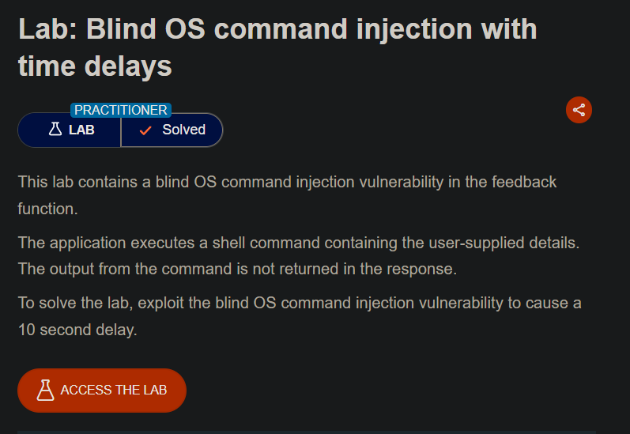
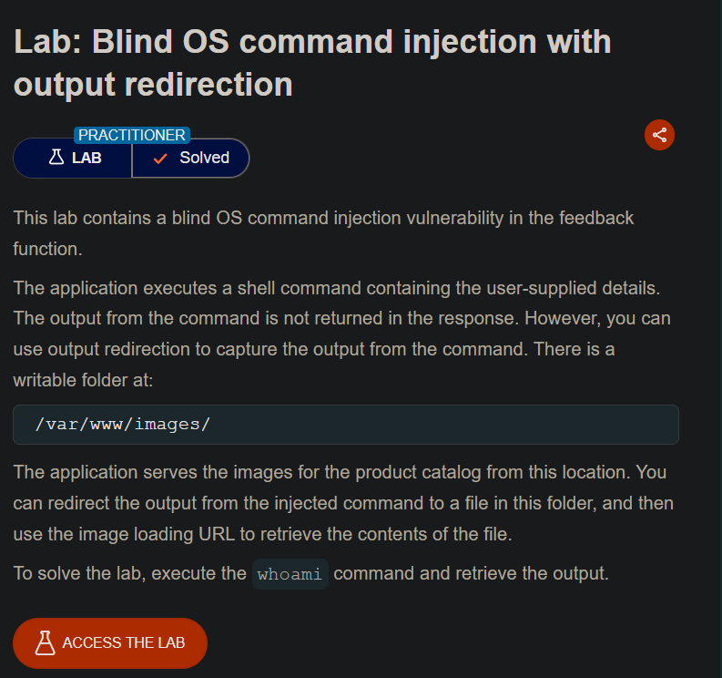
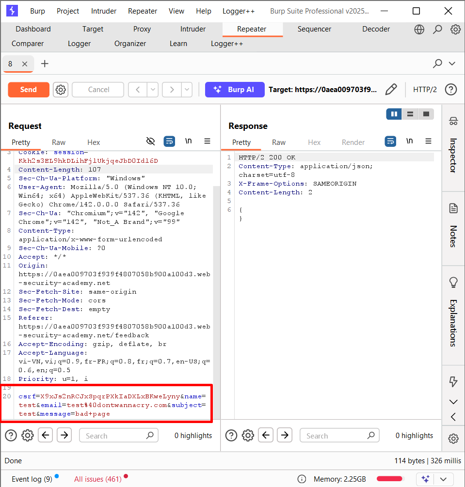
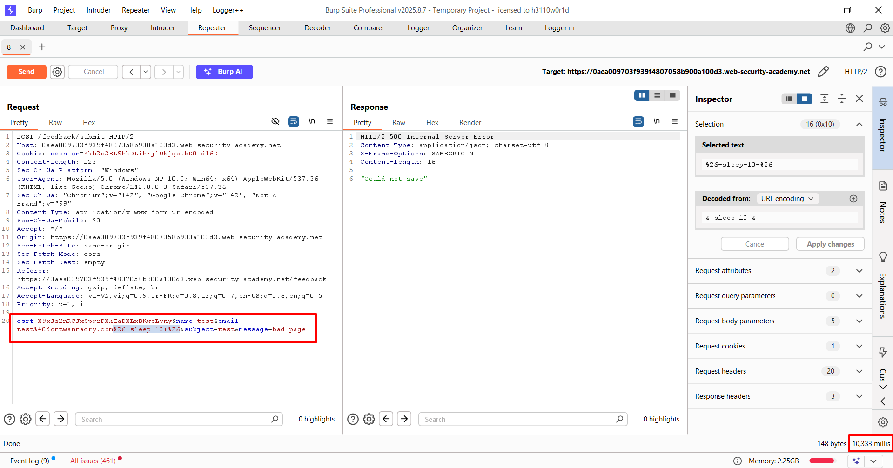
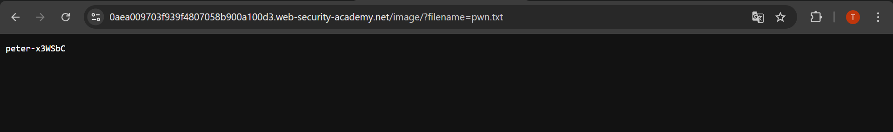
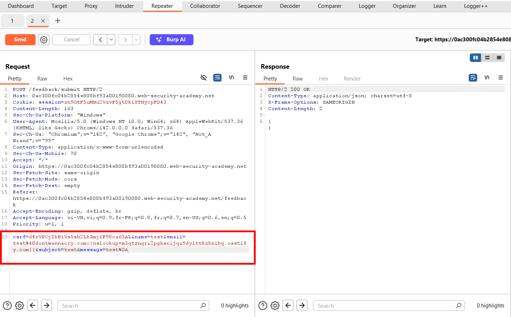
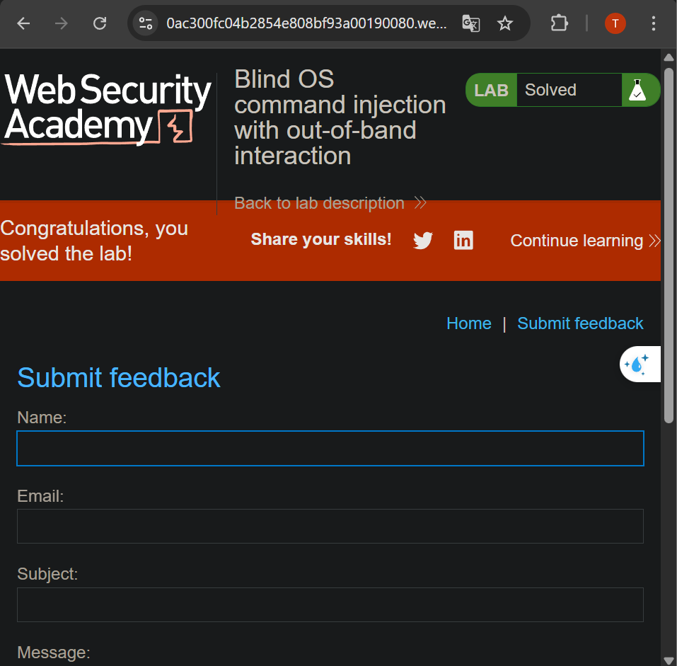
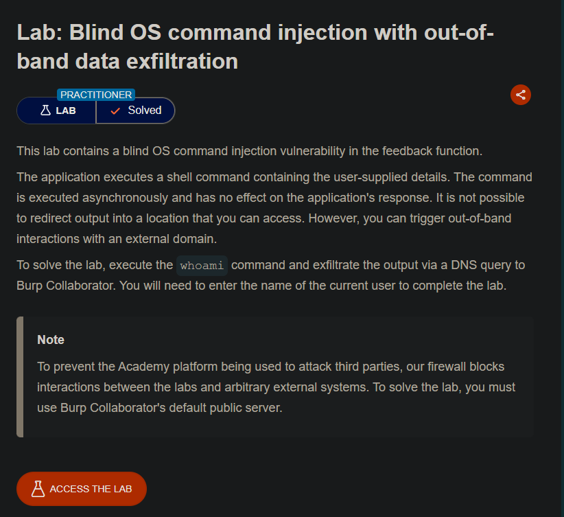

## Lab 1: OS command injection, simple case

__OS command injection trường hợp đơn giản__

---
 
Lab yêu cầu khai thác lỗi `OS command injection` yêu cầu thực thi lệnh `whoami` xác định user hiện tại
 
---

---
 
Thử ở trên `/product` với `/product?productId=1;pwd` để thực thi lệnh `pwd`
--> Nhưng không thành công `"Invalid product ID"`
 
---

---
 
Thử với `/product/stock` thì thành công khi server trả về kết quả của lệnh `pwd`
--> Kết quả: `/home/peter-yNQErf`
 
---

---
 
Thay đổi thành `whoami` để lấy user hiện tại
--> Kết quả: `peter-dKEcWb`
 
---

## Lab 2: Blind OS command injection with time delays

__OS command injection mù với độ trễ thời gian__

---
 
Chèn payload như test `&sleep 10 &` vào trường feedback để ép server chậm phản hồi. Gửi form, thấy phản hồi trễ `10` giây là hoàn thành.
 
---

---
 
Chèn payload `& sleep 10` vào tham số `name`
--> Server gần như phản hồi ngay lập tức\
--> Không thực hiện được lệnh `sleep 10`
 
---

---
 
Chèn payload `& sleep 10` vào tham số `email`
--> Server gần như phản hồi rất lâu\
--> Khi server phản hồi thì thấy thời gian trễ khoảng `10` giây\
--> Thực thi được lệnh `sleep 10`
 
---

## Lab 3: Blind OS command injection with output redirection

__OS command injection mù với chuyển hướng đầu ra__

---
 
Lab này tồn tại lỗ hổng `OS command injection` ở trang `feedback`\
Lab yêu cầu chuyển hướng đầu ra của lệnh `whoami` vào một file để đọc trog `/var/www/images/`\
 
---

---
 
Lấy một rq mẫu
 
---

---
 
Chèn payload vào tham số `email` và thấy web phản hồi chậm hơn
 
---

---
 
Thay bằng payload có thể đẩy nội dung ra file
`; whoami > /var/www/image/pwn.txt ;`
 
---

---
 
Truy cập vào `https://0aea009703f939f4807058b900a100d3.web-security-academy.net/image/?filename=pwn.txt`
--> Lấy được user hiện tại: `peter-x3WSbC`
 
---

## Lab 4: Blind OS command injection with out-of-band interaction

__OS command injection mù với tương tác ngoài băng thông__

---
 
Lab có lỗ hổng `OS command injection` ở trang `feed back`\
Không thể truy cập đến vùng chuyển hướng ra\
Nhưng có thể sử dụng để truy cập OOB

---

---
 
Viết payload chèn lệnh `nslookup ...` để gọi đến domain
 
---

---
 
Sang `Burp Collaborator` xem và thấy có 2 rq `DNS` được gọi về domain
 
---

## Lab 5: Blind OS command injection with out-of-band data exfiltration

__OS command injection mù với rò rỉ dữ liệu ngoài băng thông__

---
 
Lab yêu cầu trích xuất thông tin của user bằng `whoami` và nối vào đầu của domain
 
---

---
 
Gán cho biến `t` là output của lệnh `whoami`\
Sau đó truy vấn đến domain
 
---

---
 
--> `peter-GhaSIO`
 
---

