# CÀI ĐẶT WEB SITE CHỈ VỚI GIAO THỨC HTTP

## CÀI ĐẶT NGINX


Dùng lệnh `sudo dnf install nginx` để cài đặt nginx\
Nhưng lại thông báo là  `'nvngo2c is not in the sudoers file.  This incident will be reported.
'` tức là user `nvngo2c` chưa có trong group `sudoers` để có thể thực hiện được lệnh `sudo`

Thêm thêm `user` vào group `sudoers` bằng lệnh:\
`usermod wheel nvngo2c` (_Với quyền root_)

Update hệ thông bằng lệnh:\
`sudo dnf update`


Sau khi update chạy lại lệnh:\
`sudo dnf install nginx`

## CÀI ĐẶT WEB SITE
### CẤU HÌNH BAN ĐẦU
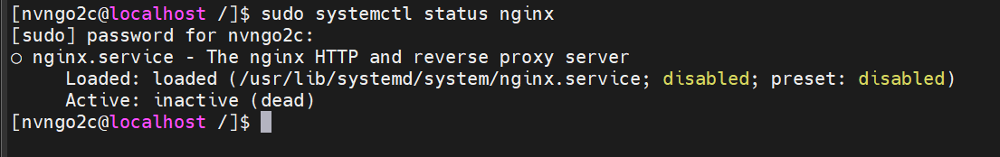

Kiểm tra dịch vụ Nginx:\
`sudo systemctl status nginx`\
Thấy rằng nó đang `disable`

--> Bật lên bằng: `sudo systemctl start nginx`

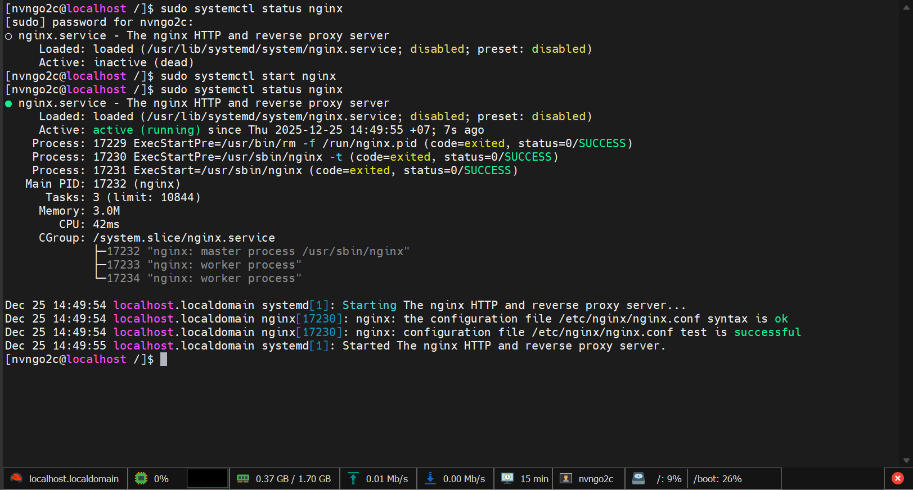

Kiểm tra lại trạng thái thấy đã `active (running)`\
--> Dịch vụ _nginx_ đã được bật

Muốn nó luôn khởi động cũng máy:\
`sudo systemctl enable nginx`

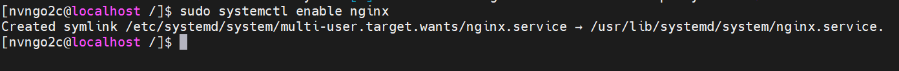

```bash
sudo firewall-cmd --permanent --add-port=80/tcp
```


--> Mở port _80_ HTTP

```bash
sudo firewall-cmd --permanent --add-port=443/tcp
```

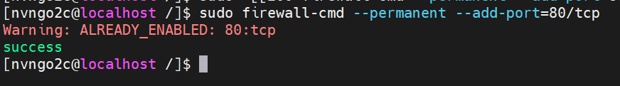

--> Mở port _443_ HTTPS

```bash
sudo firewall-cmd --reload
```


--> Reload

Truy cập bằng _IP_ máy 

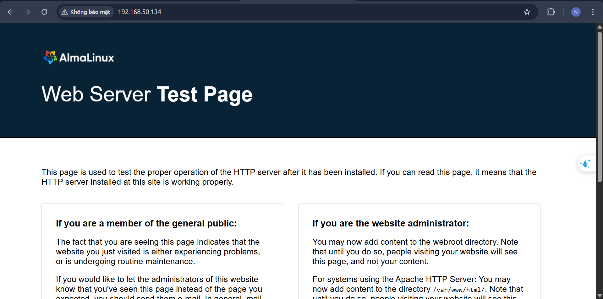


### THÊM CODE CỦA WEB

Thực ra trang web vừa rồi cũng chỉ là một file trong đường đẫn:\
`/usr/share/nginx/html/index.html`


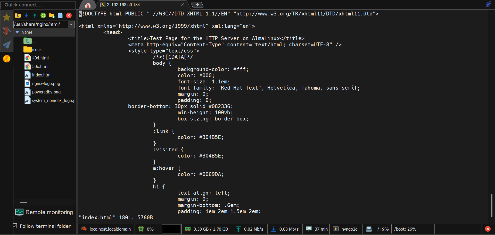

--> Ta có thể thay đổi nội dung file tùy ý

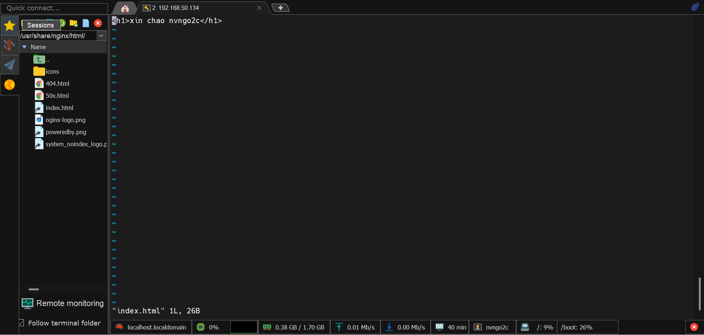

Thay đổi nội dung file thành 

```HTML
<h1>xin chao nvngo2c</h1>
```


Reload lại trang và thấy nội dung của trang test đă được thay đổi:
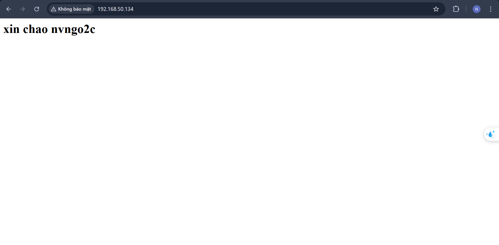

__Tạo site riêng__

Tạo một thư mục cho web riêng của mình\
Tạo thư mục mới `nvngo2c_web` trong thư mục `/usr/share/nginx`\
1. `cd /usr/share/nginx` --> Di chuyển đến thư mục cha
2. `mkdir nvngo2c_web` --> Tạo một thư mục rỗng _nvngo2c_web_
3. `touch index.html` --> Tạo một file index khi vào web

Thêm nội dung cho `index.html`
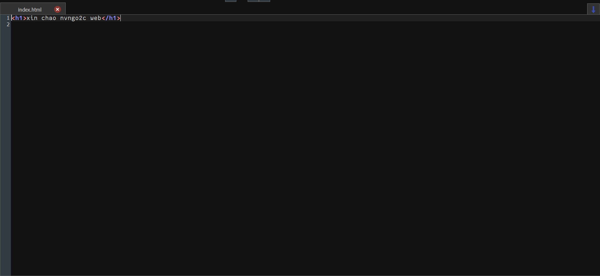

Tạo cấu hình cho web\
Phải vào `/ect/nginx/conf.d`\

Tạo một file _config_ cho web:\
`sudo touch nvngo2c_web` với nội dung:\
```nginx
server{
    listen 80;
    server_name nvngo2c.com;
    root /usr/share/nginx/nvngo2c_web;
    index index.html;

    location / {
        try_files $uri $uri/ =404;
    }
}
```

Kiểm tra cấu hình nginx đã đúng cú pháp:\
`nginx -t`\
Nếu đúng sẽ cho kết quả:
```
nginx: the configuration file /etc/nginx/nginx.conf syntax is ok
nginx: configuration file /etc/nginx/nginx.conf test is successful
```
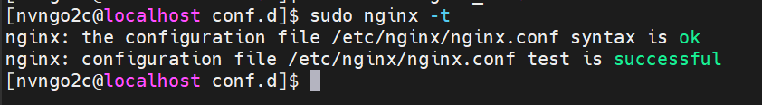

Reload để áp những thứ đã đổi:\
`sudo systemctl reload nginx`    

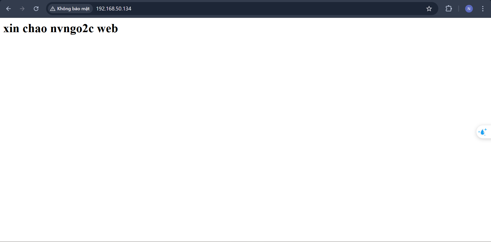

### CÀI ĐẶT TRUY CẬP BẰNG TÊN MIỀN

Truy cập vào file `C:\Windows\System32\drivers\etc\hosts`

Thêm _IP_ của máy _ALMA_ và tên miền vào và lưu 
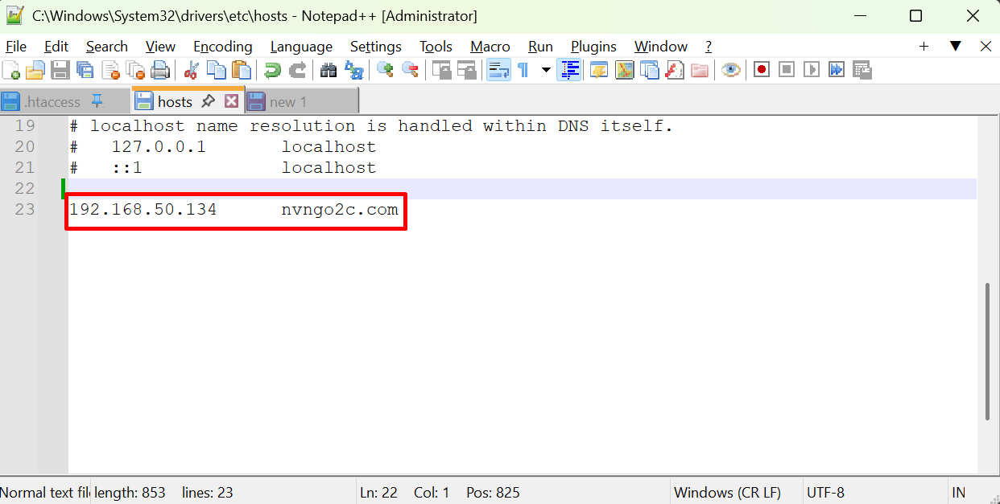

Truy cập bằng tên miền đã tạo: `http://nvngo2c.com`
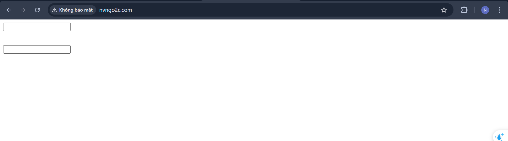