# CÀI ĐẶT WEB SITE VỚI GIAO THỨC HTTPS

Trước tiên tạo 2 folder:\
1. `/etc/ssl/nvngo2c_privates` --> Chứa key
2. `/etc/ssl/nvngo2c_certs` --> Chứa cert

Xin cấp _self cert_ bằng lệnh:\
`sudo openssl req -x509 -nodes -days 365 -newkey rsa:2048 -keyout /etc/ssl/nvngo2c_privates/nginx-selfsigned.key -out /etc/ssl/nvngo2c_certs/nginx-selfsigned.crt
`

--> Đầu ra _key_ là là file  `/etc/ssl/nvngo2c_privates/nginx-selfsigned.key`, đầu ra _cert_ là `/etc/ssl/nvngo2c_certs/nginx-selfsigned.crt`

--> Sau khi chạy lệnh xong thì nó hỏi các thông tin trước khi cấp _cert_
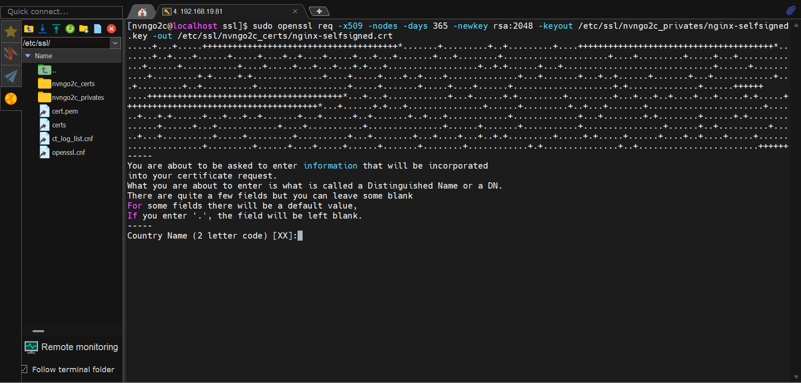

Sau đó cấu hình lại file config `nvngo2c_web.conf`
```
server{
    listen 443 ssl;
    server_name nvngo2c.com;

    ssl_certificate_key /etc/ssl/nvngo2c_privates/nginx-selfsigned.key;
    ssl_certificate /etc/ssl/nvngo2c_certs/nginx-selfsigned.crt;

    location /{
        root /usr/share/nginx/nvngo2c_web;
        index index.html;
    }
}

server{
    listen 80;
    server_name nvngo2c.com;
    return 301 https://$host$request_uri;
}
```
--> Cấu hình thành _HTTPS_ khi truy cập bằng _HTTP_ thì tự động chuyển hướng về _HTTPS_

Sau khi lưu file, kiểm tra bằng:\
`nginx -t`\
Nếu `ok` thì tiếp tục dùng reload để áp dụng những thay đổi:\
`sudo systemctl reload nginx`

Truy câp bằng `https://nvngo2c.com`
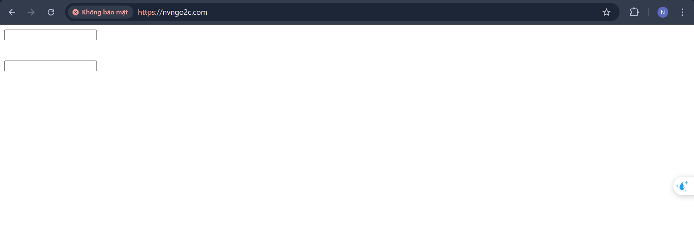

# CÀI ĐẶT WEB SITE VỚI WORDPRESS

## CÀI ĐẶT PHP
Cài đặt `PHP` để thực thi _Wordpress_\
`sudo dnf install -y php php-fpm php-mysqlnd php-gd php-xml php-mbstring php-curl php-zip`

Kích hoạt khởi động cùng hệ thống\
`sudo systemctl enable php-fpm`
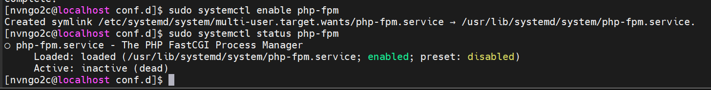

Chỉnh sửa user cho `PHP-fpm`\
`sudo vi /etc/php-fpm.d/www.conf`

Sửa `user`, `group` thành `nginx`
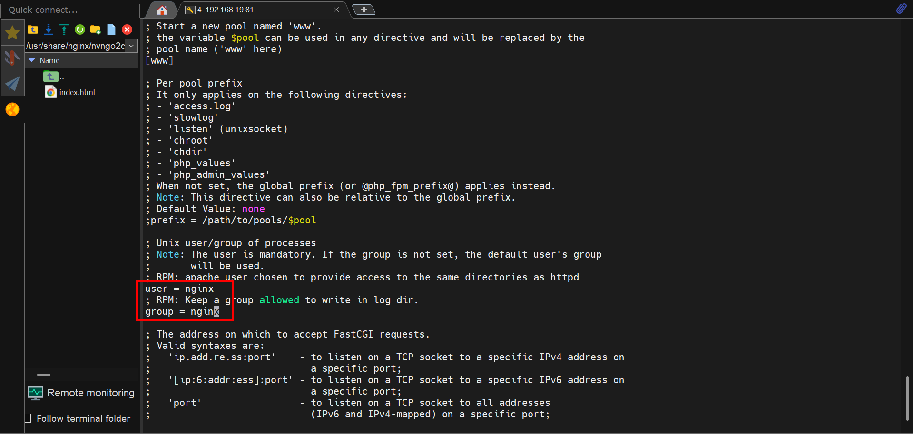

Khởi động lại `PHP-fpm`\
`sudo systemctl restart php-fpm`

## CÀI ĐẶT MARIA_DB

Cài đặt Maria_DB\
`sudo dnf install -y mariadb-server`

Khởi động _MariaDB_\
`sudo systemctl start mariadb`

Khởi động cùng hệ thống\
`sudo systemctl enable mariadb`
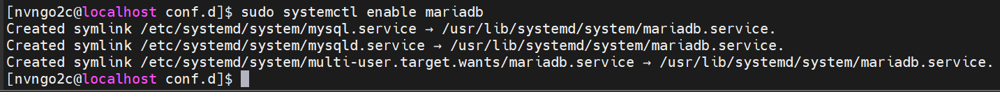

Kiểm tra lại\
`sudo systemctl status mariadb`
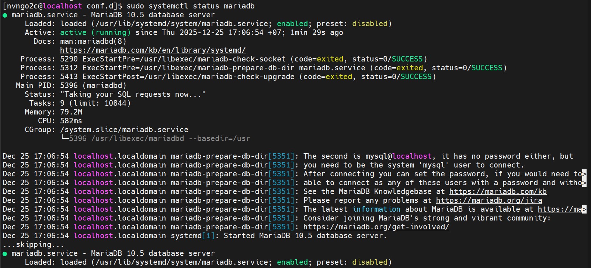

Tạo DB cho _WordPress_\
`sudo mysql -u root -p`

Khởi tạo DB:
```SQL
CREATE DATABASE wpdb CHARACTER SET utf8mb4 COLLATE utf8mb4_unicode_ci;
CREATE USER 'wpuser'@'localhost' IDENTIFIED BY 'matkhau123';
GRANT ALL PRIVILEGES ON wpdb.* TO 'wpuser'@'localhost';
FLUSH PRIVILEGES;
EXIT;
```
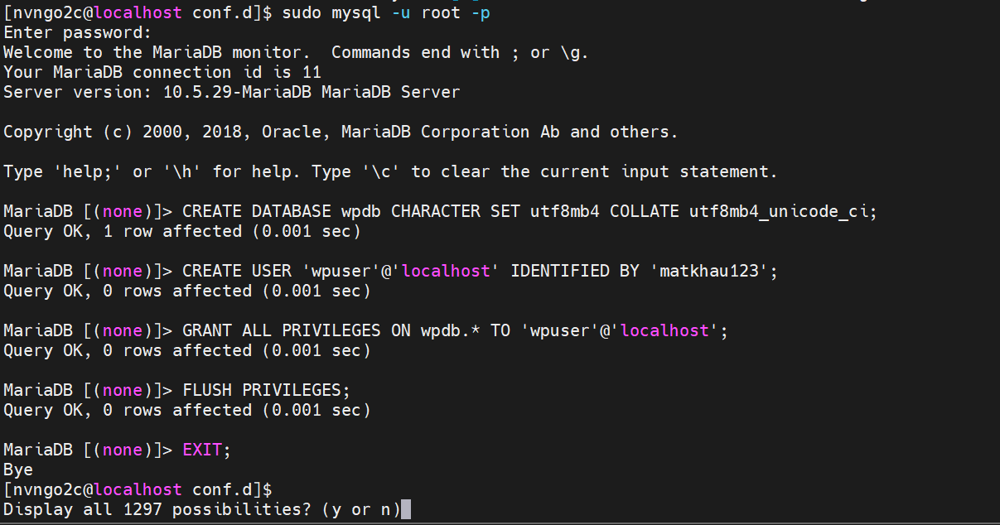

## CÀI ĐẶT WORDPRESS

Di chuyển đến thư mục `/tmp` và tải _WordPress_ về thư mục đó
```bash
cd /tmp
curl -O https://wordpress.org/latest.tar.gz
```
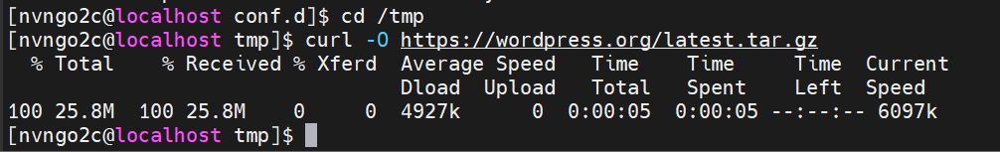

Giải nén\
`tar xzf latest.tar.gz`

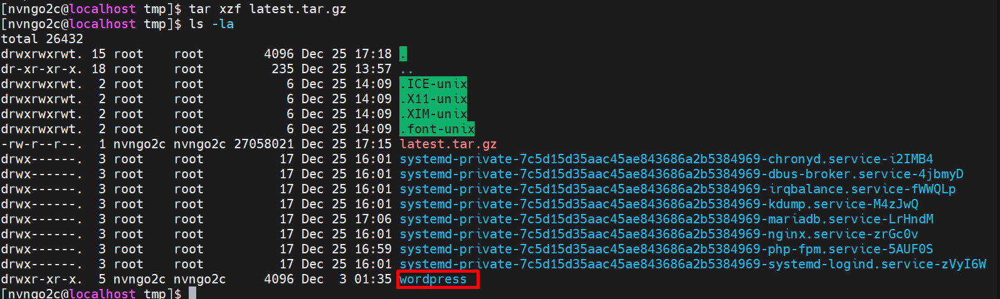


Chuyển hết file từ `/tmp` sang `/usr/share/nginx/nvngo2c_web`\
```sh
sudo mv /tmp/wordpress/* .
``` 

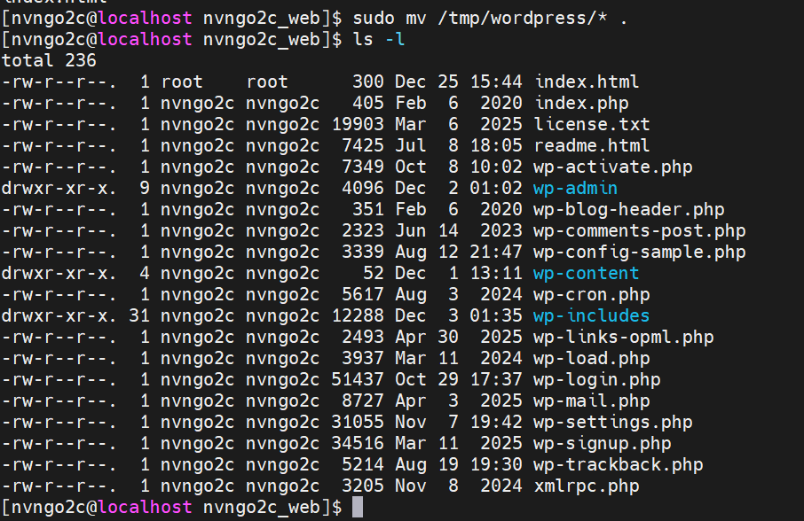

Set người dùng và phân quyền
```sh 
sudo chown -R nginx:nginx /var/www/wordpress
sudo chmod -R 755 /var/www/wordpress
```

Sửa lại file config:
```nginx
server {
    listen 443 ssl;
    server_name nvngo2c.com;

    ssl_certificate     /etc/ssl/nvngo2c_certs/nginx-selfsigned.crt;
    ssl_certificate_key /etc/ssl/nvngo2c_privates/nginx-selfsigned.key;

    root /usr/share/nginx/nvngo2c_web;
    index index.php index.html index.htm;

    # WordPress pretty permalink
    location / {
        try_files $uri $uri/ /index.php?$args;
    }

    # PHP handling
    location ~ \.php$ {
        include fastcgi_params;
        fastcgi_pass unix:/run/php-fpm/www.sock;
        fastcgi_param SCRIPT_FILENAME $document_root$fastcgi_script_name;
    }

    # deny access to hidden files
    location ~ /\. {
        deny all;
    }
}

server{
    listen 80;
    server_name nvngo2c.com;
    return 301 https://$host$request_uri;
}

```

Kiểm tra lại

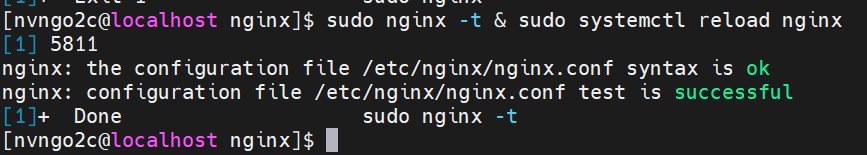
--> OK

Nhưng khi truy cập vào lại báo là `Access denied.`
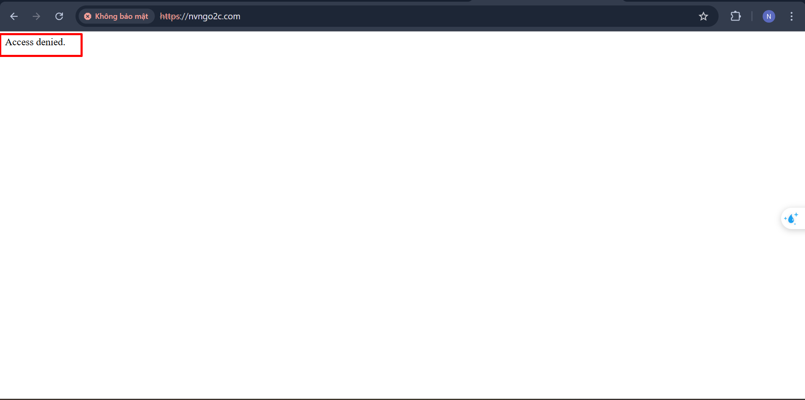

