__CÀI ĐẶT ALMA LINUX__

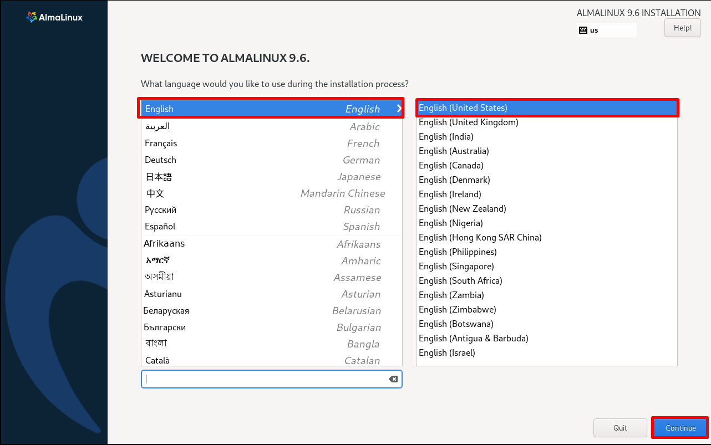

Khởi tạo vùng 

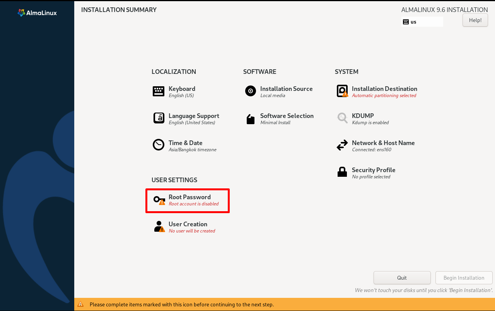
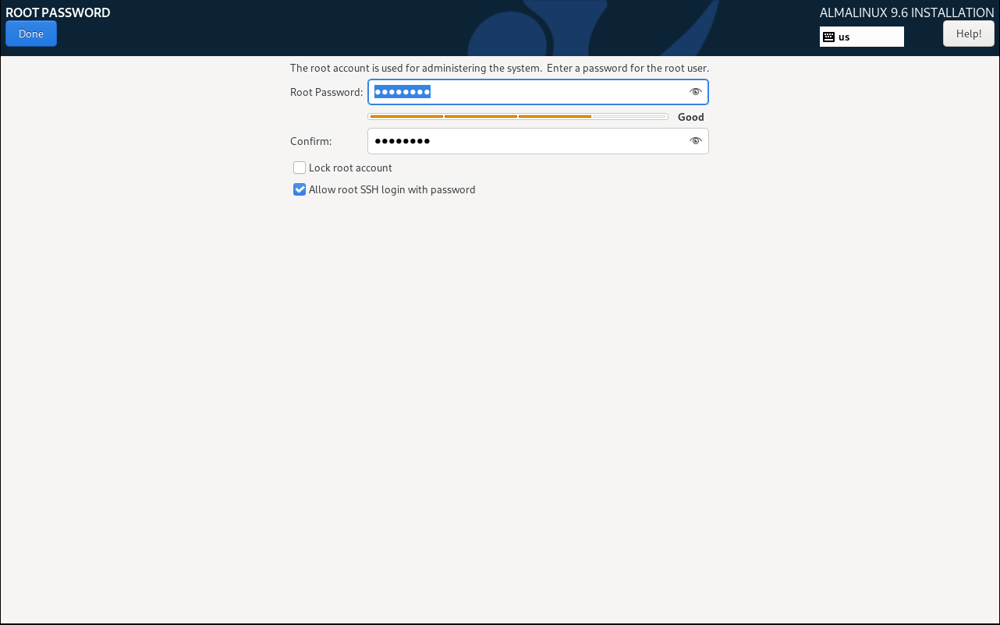

Khởi tạo _root password_

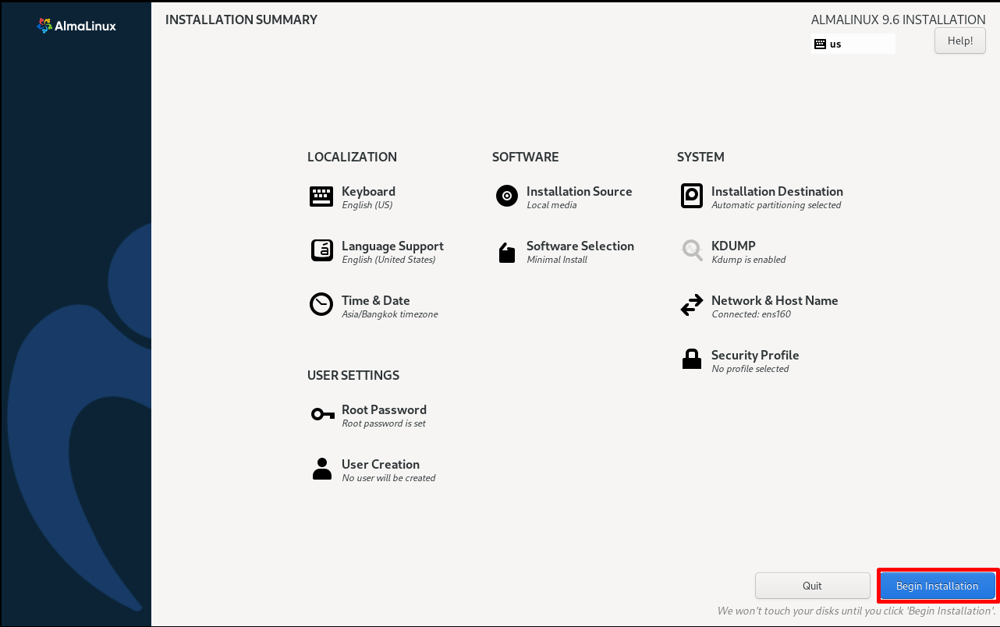
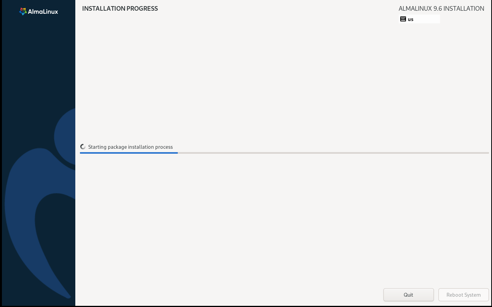

Bắt đầu cài đặt các gói cần thiết

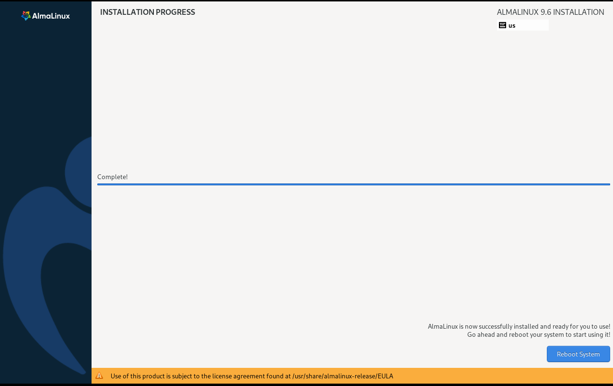

Reboot system

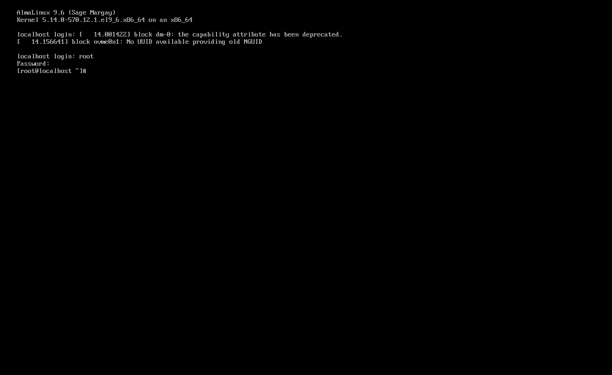

Sau khi reboot, đăng nhập bằng tài khoản `root` và mật khẩu vừa đặt ở bước trước để có thể làm việc

__CÀI ĐẶT MOBAEXTERM__

Để có thể thao tác thuận tiện hơn, ta sử dụng MobaExterm để có thể dùng các thao tác coppy, paste,...

Kết nối _SSH_ sang máy ảo bằng _IP_ để điều khiển máy ảo

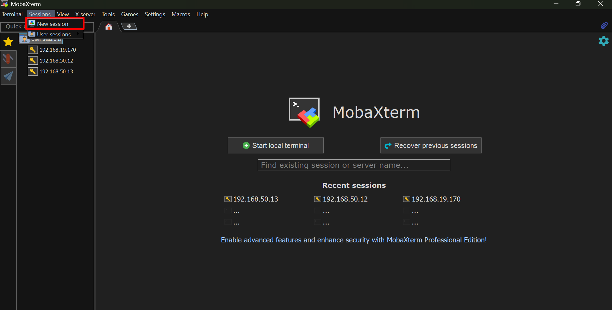

Tạo một phiên làm việc mới

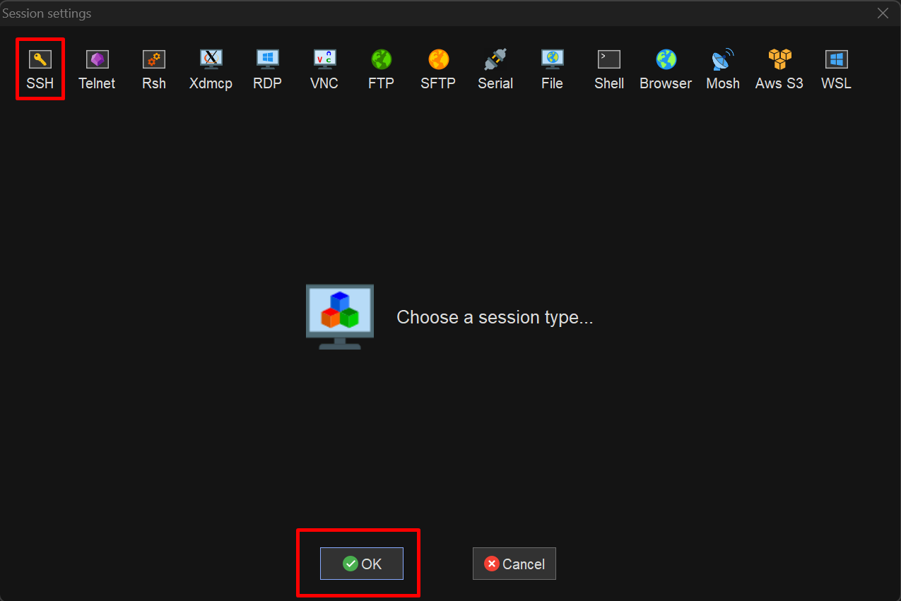

Chọn giao thức SSH

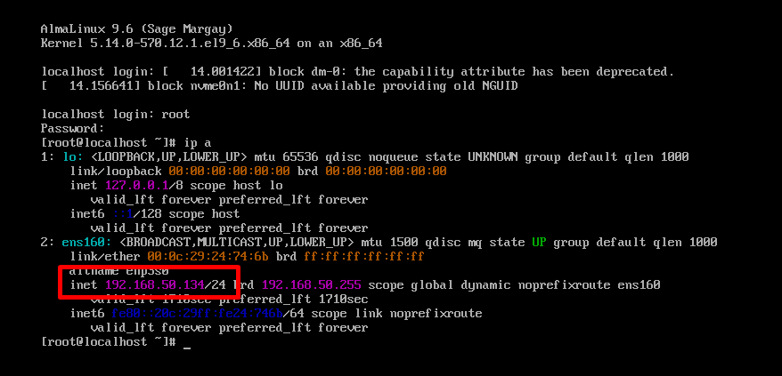

Sang máy ảo để lấy _IP_ 

``192.168.50.134``

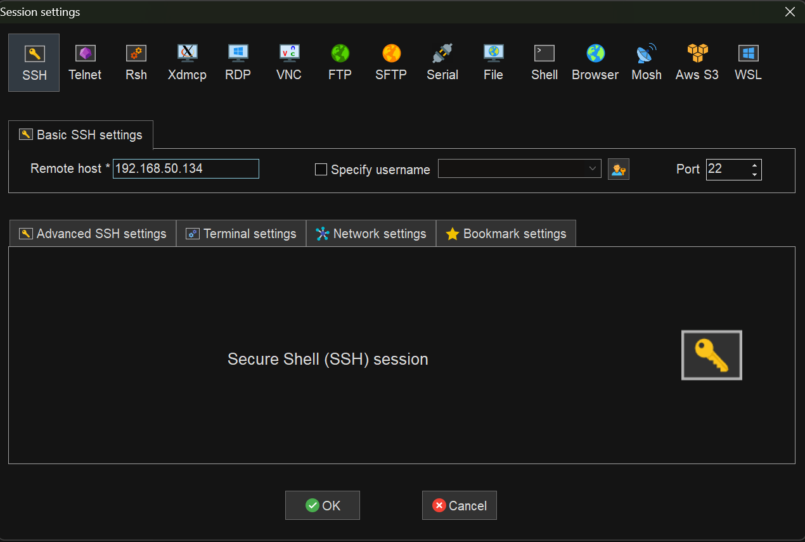

Điền _IP_ vào trường _Remote host_

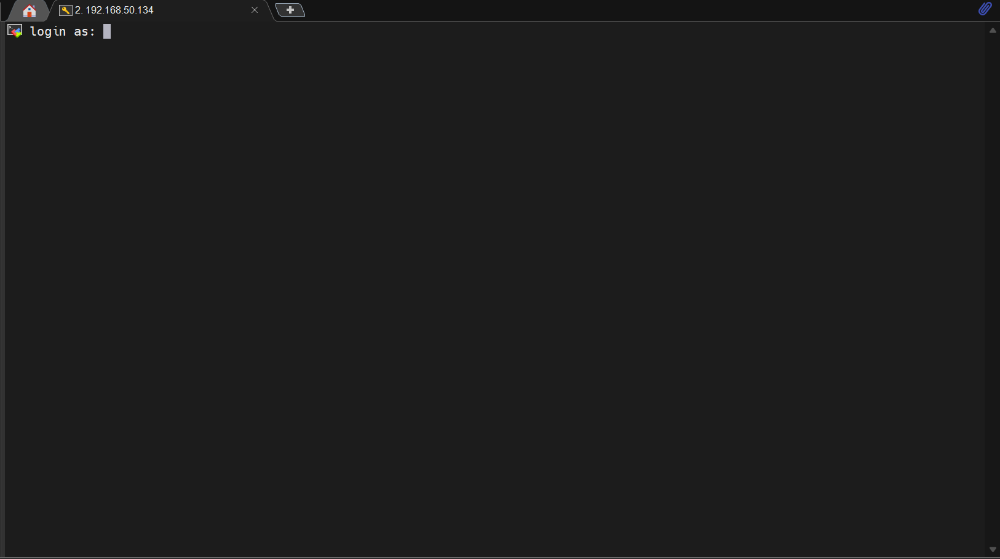

Sau đó sẽ hiện ra ô yêu cầu thông tin đăng nhập

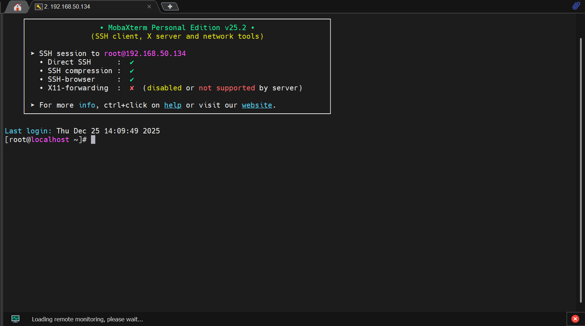

Sau khi điền thông tin đăng nhập sẽ vào được máy và có giao diện như trên

