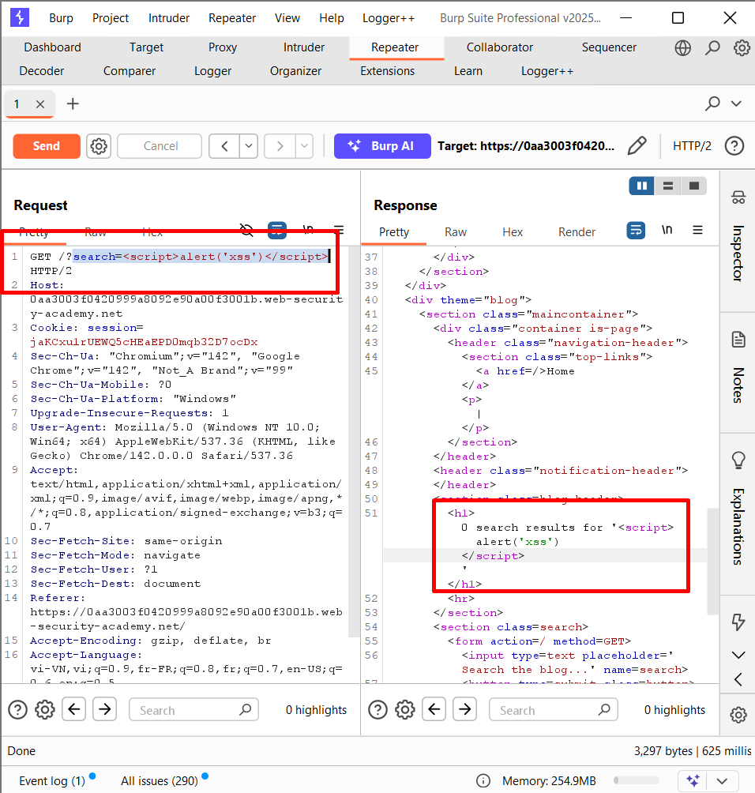
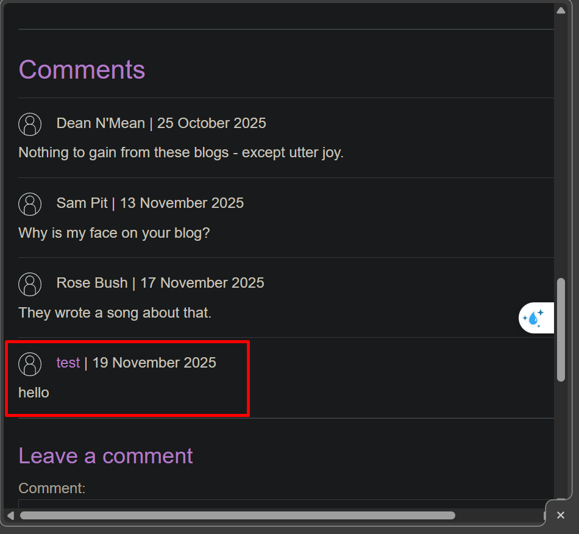
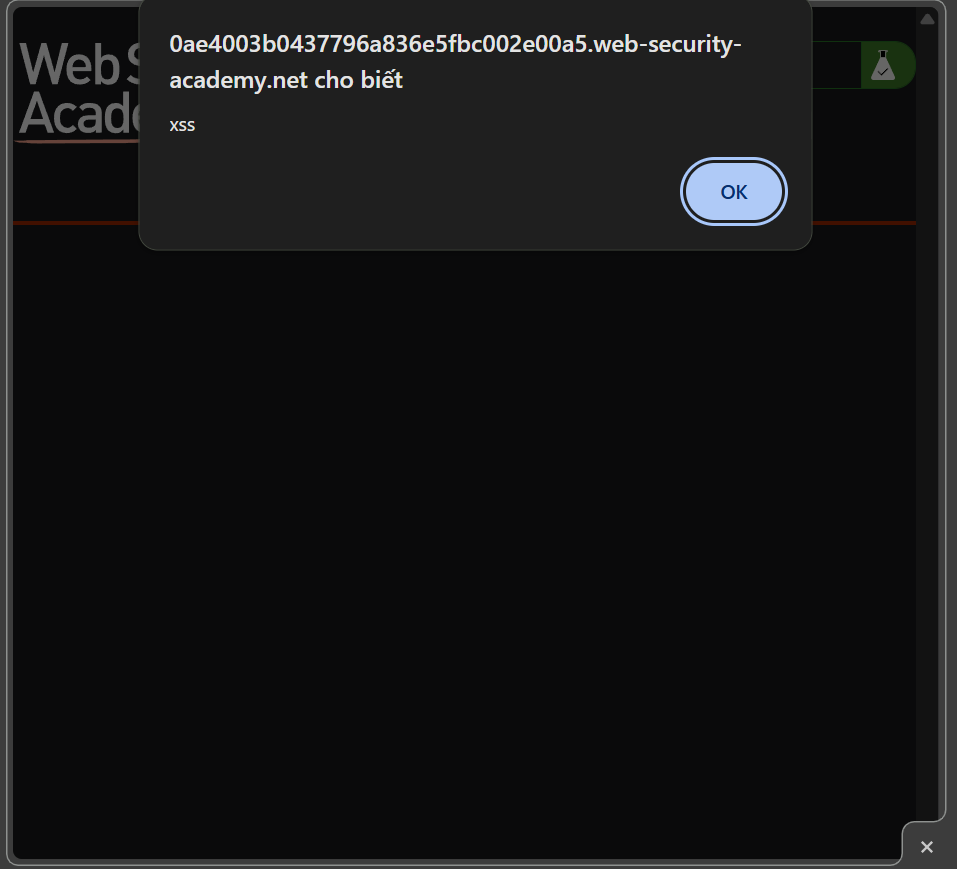
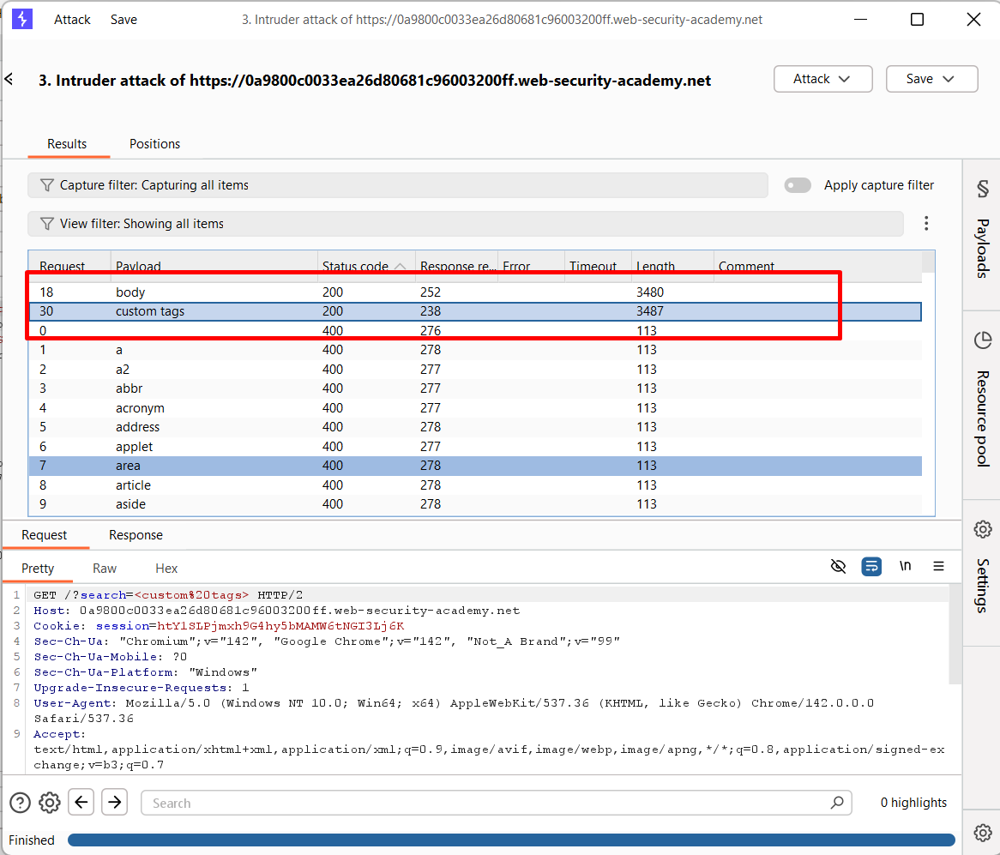

# REFLECTED XSS
## Lab 1: Reflected XSS into HTML context with nothing encoded

__XSS phản hồi, chèn thẳng vào HTML mà không hề được mã hoá__

Lab yêu cầu thực thi hàm `alert` 

Khi search một từ khóa nó sẽ được hiển thị lại 

Khi xem trong DevTool thì thấy từ khóa đó được xuất hiện trong thẻ `h1`

Khi chỉnh sửa payload thành `` thì thấy hàm được nằm ngay trong thẻ `h1`

Hiện popup là kết quả của hàm `alert`

## Lab 2: Stored XSS into HTML context with nothing encoded

__Stored XSS được nhét thẳng vào HTML mà không encode__

Lab yêu cầu chèn code *Java Script* vào phần bình luận và làm nó thực thi mỗi khi có người vào xem bình luận

Post một comment vào bài viết

Khi vào xem comment đó thì thấy nó được hiển thị trong thẻ `h`

Gửi một bình luận với nội dung: ``

Khi vào lại trang bình luận thì thấy popup `XSS` là kết quả của hàm `alert`

## Lab 3: Reflected XSS into HTML context with most tags and attributes blocked

__Reflected XSS trong ngữ cảnh HTML, nhưng hầu hết thẻ và thuộc tính đã bị chặn__

Lab yêu cầu thực hiện hàm `print` trong khi web chặn hầu hết các thẻ và thuộc tính

Khi dùng payload `` thì web chặn: **"Tag is not allowed"**

Chuyển payload sang `Intruder` và lấy list tag ở [XSS CheatSheet](https://portswigger.net/web-security/cross-site-scripting/cheat-sheet)

--> Start attack

Hầu hết tất cả các tag đều bị chặn (`400`) nhưng có tag `body` và `custom tags` trả về `200`

